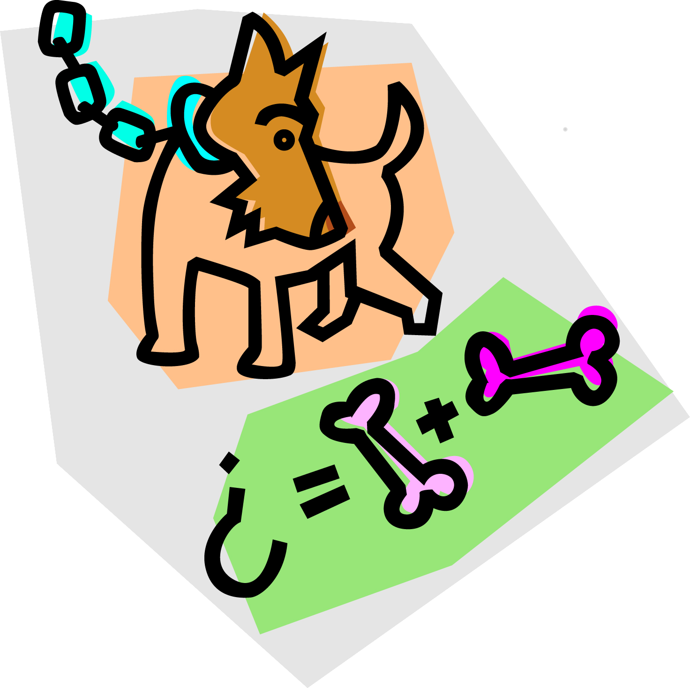

.. image:: ../../_static/Technovation-yellow-gradient-background.png
    :width: 500
    :align: center
    :alt: Technovation logo

Learning to Code
:::::::::::::::::::::::::::::::::::::::::::

Why learn Coding?
---------------------

.. image:: ../../_static/computerScienceClipartKeyDOTcom_3061179.png
    :width: 400
    :align: center
    :alt: image of children and benefits of learning to code (ClipartKey.com 3061179)

* Develop critical thinking skills

* Learn how to *create* --- not just use --- technology

* Fuel innovation and discovery in *all* disciplines 

Terminology
---------------------

*Code* refers to a list of intructions which a computer can follow to complete some job.

Code is commonly also called a *program*. 

*Coding* is the process of writing a program (code).

A computer *runs* a program to complete the job described by the program.

A *programming language* gives the words and the rules to use for writing a program.

The distinctions between these terms can be illustrated by analogy. What do you think?

.. image:: ../../_static/cooking-clipart-libraryDOTcomClipart26transparent.png
    :width: 300
    :align: center
    :alt: image of teens following a recipe (clipart-library.com/clipart/26)

.. dragndrop:: dnd-terminology-recipe
    :match_1: Rules for writing down recipes|||Programming language
    :match_2: A pizza recipe|||A program (code)
    :match_3: Cooking a cheese pizza|||Running the program
    :match_4: Writing down the recipe for your favorite pizza|||Programming (coding)

    Drag the phrase on the left to the coding concept it is most analogous to.

.. dragndrop:: dnd-terminology-pet-tricks
    :match_1: The gestures and sounds that your dog understands|||Programming language
    :match_2: A series of gestures and sounds that you can give your dog to get it to perform a stupid pet trick|||A program (code)
    :match_3: Commanding your dog to perform a stupid pet trick|||Running the program
    :match_4: Writing an email message telling a friend how to get your dog to perform a stupid pet trick|||Programming (coding)

    Drag the phrase on the left to the coding concept it is most analogous to.

.. image:: ../../_static/teachingDogTricksClipartsDOTzoneClipart675010.png
    :width: 300
    :align: center
    :alt: image of a trainer trying to get a dog to jump through a hoop (Cliparts.zone/clipart/675010)

Python Turtle Graphics
------------------------

You'll be learning coding using *Python Turtle Graphics*, which is a dialect
of the Python programming language intended for teaching programming. 

Think of a (Python Turtle Graphics) ``turtle`` as your new (virtual) pet. 
Instead of using words and gestures
to teach it to roll over or sit, you'll be writing computer programs
to teach it how to draw pictures on a *screen*.

For example, the code in the box below instructs the ``turtle`` to draw a square. 

.. activecode:: turtle_square
    :language: python
    :nocodelens:

    To run the code, press the green "Run" button. The result will be shown below this *Active Code* window. So you may need
    to scroll the browser window up to see it.
    ~~~~
    import turtle

    turtle.forward(100)
    turtle.left(90)

    turtle.forward(100)
    turtle.left(90)

    turtle.forward(100)
    turtle.left(90)

    turtle.forward(100)
    turtle.left(90)

.. reveal:: re-turtle-square
    :showtitle: Show a line-by-line explanation of this code
    :hidetitle: Hide the line-by-line explanation

    ``import turtle``

        *Import* the code from the ``turtle`` module, 
        which is a library program that comes with Python. 
        Importing a program allows you to use code from that program in writing your own program.

    ``turtle.forward(100)``

        Move the ``turtle`` forward (i.e., in the direction of the arrow) by 100 pixels

    ``turtle.left(90)``

        Rotate the ``turtle`` towards the left (i.e., counter-clockwise) by 90 degrees
    
    Repeat last two instructions three more times.   

What happens when you modify these instructions by changing the numbers in the 
parenthesis? Give it a shot!

Code-Along
-------------------

A *code-along* is when an instructor thinks out-loud in order to illustrate how they would 
create code to solve some problem. 
But instead of just listening and watching, 
you copy what they are writing into an Active Code window in your own book, so you
can experiment with running the code and your will have a copy of the working program when
it's done. 

The challenge for our first code-along is to
instruct the ``turtle`` to draw an equilateral triangle instead of a square: 

.. image:: ../../_static/equilateral_triangle.png
    :align: center
    :width: 200
    :alt: Image of an equilateral triangle drawn using Python turtle

.. activecode:: turtle_triangle
    :language: python
    :nocodelens:

    Write a program to instruct the ``turtle`` to draw a triangle.
    ~~~~
    # instruct turtle to draw an equilateral triangle like that shown above
   
    # your code here

That wasn't so bad, was it?

Now try your hand at writing a program to draw a hexagon:

.. image:: ../../_static/hexagon100.png
    :align: center
    :width: 200
    :alt: Image of a hexagon drawn using Python turtle

.. activecode:: turtle_hexagon
    :language: python
    :nocodelens:

    Write a program to instruct the ``turtle`` to draw a hexagon.
    ~~~~
    # draw a hexagon
    
    # your code here

A (Python Turtle Graphics) ``turtle`` knows many more *commands* than just ``forward`` and ``left``.
Following are some that will be useful in the remaining exercises for this week. 

See if you can guess what each command does before revealing our explanation.

``turtle.up()``

.. reveal:: re-turtle-up
    :showtitle: Show our explanation
    :hidetitle: Hide the explanation

    Commands ``turtle`` to stop drawing as it moves.

    Why the name ``up``? 
    Think of attaching a felt-tip marker or a paint brush to the tail of the ``turtle`` so that,
    when its tail is up, it moves without making any mark and, when its tail is down, it makes a solid line
    as it moves. 

    By convention, the ``turtle`` starts out with its tail down.

``turtle.down()``

.. reveal:: re-turtle-down
    :showtitle: Show our explanation
    :hidetitle: Hide the explanation

    Commands the ``turtle`` to draw as it moves.

    You need this command for the ``turtle`` to start drawing again if you ever tell it to stop drawing.
    In otherwords, after a ``turtle.up()`` command, if you ever want the ``turtle`` to start drawing again,
    you have
    to give it a ``turtle.down()`` command.

``turtle.backward(L)``

.. reveal:: re-turtle-backward
    :showtitle: Show our explanation
    :hidetitle: Hide the explanation

    Commands the ``turtle`` to move backwards 
    (i.e., in the opposite direction of the arrow) by ``L`` pixels.

    (For simplcity, we use ``L`` in these explanations to represent a (non-negative) length.)

``turtle.right(D)``

.. reveal:: re-turtle-right
    :showtitle: Show our explanation
    :hidetitle: Hide the explanation

    Commands the ``turtle`` to rotate towards the right (i.e., in the clockwise direction) by ``D`` degrees.

    (For simplcity, we use ``D`` in these explanations to represent a (non-negative) number
    of degrees.)

``turtle.circle(L)``

.. reveal:: re-turtle-circle
    :showtitle: Show our explanation
    :hidetitle: Hide the explanation

    Commands the ``turtle`` to draw a circle of radius ``L`` pixels.

    The ``turtle`` draws the circle *tangent* to 
    the straight line determined by the arrow (i.e., just touching this line in a point) 
    and curving left from the direction of travel (i.e., the direction of the arrow). 

    (For simplcity, we use ``L`` in these explanations to represent a (non-negative) length.)

``turtle.goto(X, Y)``

.. reveal:: re-turtle-goto
    :showtitle: Show our explanation
    :hidetitle: Hide the explanation

    Commands the ``turtle`` go straight to the position with *coordinates* ``(X, Y)`` on the screen.

    By convention, positions are indicated using a Cartesian coordinate system with the center
    of the screen at the origin (i.e., position ``(0, 0)``) and units measured in pixels.
    
    (For simplcity, we use ``X`` and ``Y`` in these explanations to represent decimal numbers.)

``turtle.color(S)``

.. reveal:: re-turtle-color
    :showtitle: Show our explanation
    :hidetitle: Hide the explanation

    Commands the ``turtle`` to use the color ``C`` for drawing lines. 

    (For simplicity, we use ``C`` in these explanations to represent a color name.
    You can find the color names that ``turtle`` knows at |trinket|.
    They must be enclosed in either single or double quotes, i.e., ``"red"`` or ``'green'``.)

.. |trinket| raw:: html

    <a href="https://trinket.io/docs/colors" target="_blank">trinket.io/docs/colors</a>

We'll introduce more ``turtle`` commands as we go along. 
But if you are curious, you can learn all about |turtleGraphics|, 
including all of the commands that the ``turtle`` understands, |here|.

.. |turtleGraphics| raw:: html

     <a href="https://docs.python.org/3.7/library/turtle.html#module-turtle" target="_blank">Turtle Graphics</a>

.. |here| raw:: html

     <a href="https://docs.python.org/3.7/library/turtle.html#module-turtle" target="_blank">here</a>

With these small number of commands, we can command the ``turtle``
to draw a lot more interesting diagrams than just shapes.

For example, here's a program that starts drawing a snowman. 

.. activecode:: turtle_snowman_start
    :language: python
    :nocodelens:

    Run the program and scroll down to see what the ``turtle`` draws.
    ~~~~
    import turtle

    # draw the bottom snowball
    turtle.up()
    turtle.goto(0, -175)
    turtle.down()
    turtle.circle(75)

    # draw the middle snowball
    turtle.up()
    turtle.goto(0,-25)
    turtle.down()
    turtle.circle(50)

    #draw the top snowball
    turtle.up()
    turtle.goto(0,75)
    turtle.down()
    turtle.circle(35)

Now try your hand at adding a hat and some features to the snowman. 