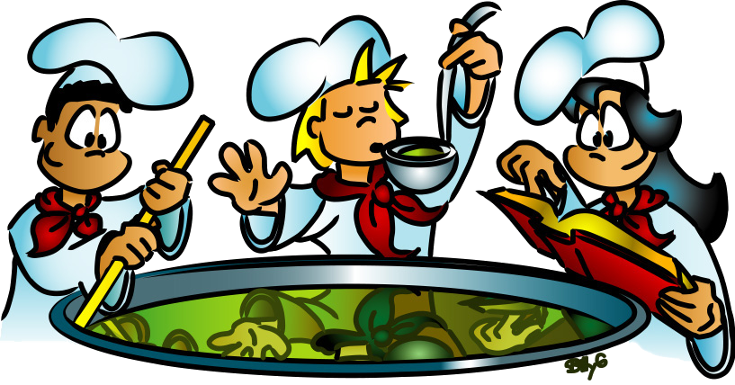
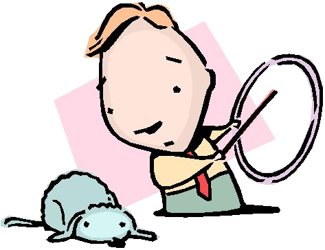
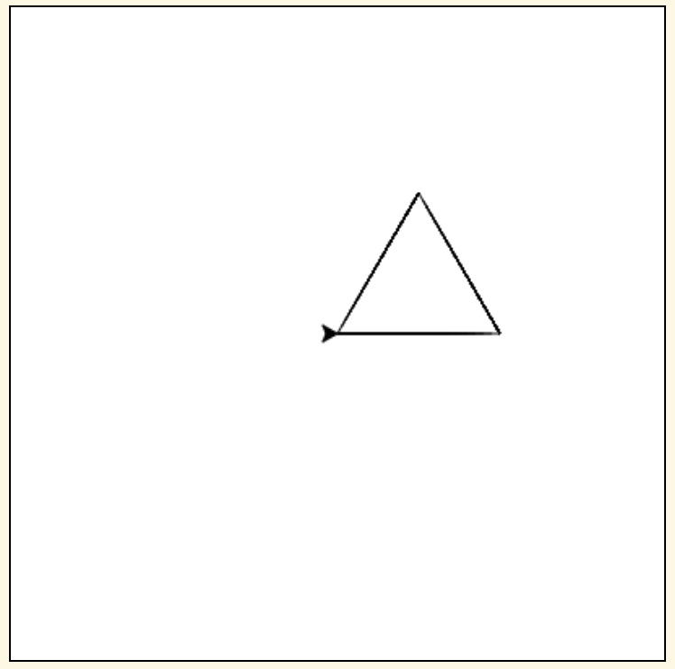
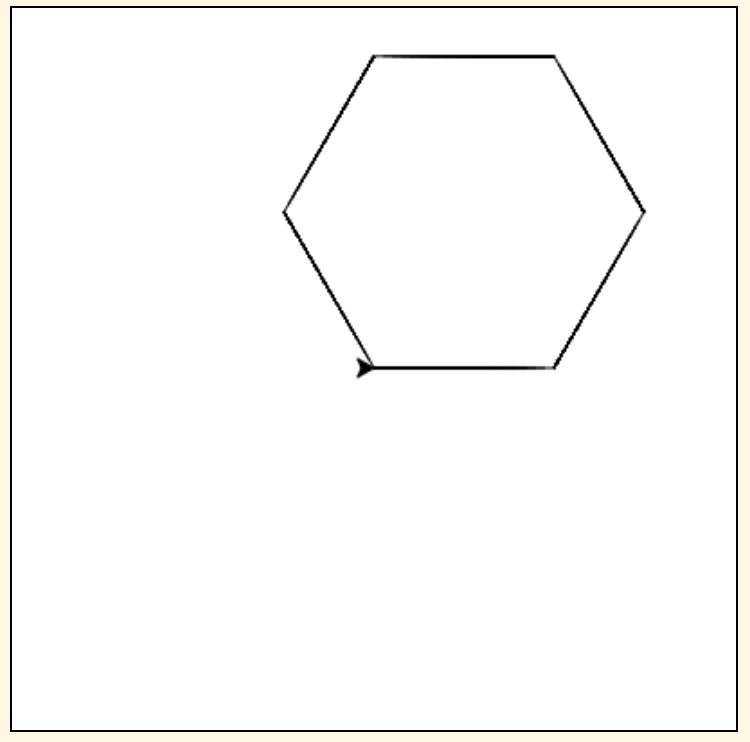
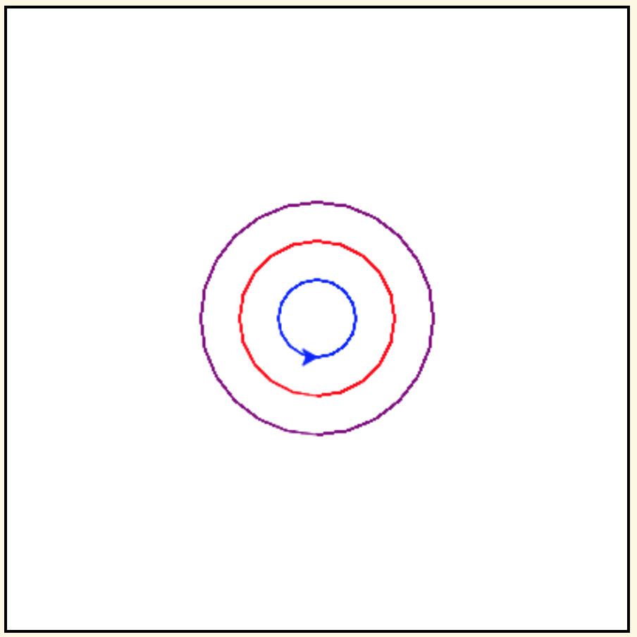

.. image:: ../img/Technovation-yellow-gradient-background.png
    :width: 500
    :align: center
    :alt: Technovation logo

Learning to Code
:::::::::::::::::::::::::::::::::::::::::::

Why learn Coding?
---------------------

What are some reasons to learn to code?

.. reveal:: re-reasonToCode1
    :showtitle: Become a master problem solver!
    :hidetitle: Hide

    Become a master problem solver!

    .. raw:: html

        

        <iframe src="https://giphy.com/embed/U7mh7CJjk2ewKPDybK" width="50%" height="100%"
        style="position:absolute" frameBorder="0" class="giphy-embed">
        </iframe>

        
<a href="https://giphy.com/gifs/digitelco-digi-digilah-digigifs-U7mh7CJjk2ewKPDybK">
        via GIPHY</a>

.. reveal:: re-reasonToCode2
    :showtitle: Expand your creativity with new ways of thinking!
    :hidetitle: Hide

    Expand your creativity with new ways of thinking!
    
    .. raw:: html
        
        “A computer is a bicycle for your mind” – Steve Jobs
            
        
<iframe src="https://giphy.com/embed/jRS66R62HFzRK5qXQd" width="50%" height="100%" style="position:absolute" frameBorder="0" class="giphy-embed" allowFullScreen></iframe>

<a href="https://giphy.com/gifs/design-idea-ideas-jRS66R62HFzRK5qXQd">via GIPHY</a>

               

.. reveal:: re-reasonToCode3
    :showtitle: Practice resilience
    :hidetitle: Hide
    
    Practice resilience
    
    .. raw:: html
    
        

.. reveal:: re-reasonToCode4
    :showtitle: Code is a superpower!!
    :hidetitle: Hide
    
    Code is a superpower!! 
    
    .. raw:: html
    
        
<iframe src="https://giphy.com/embed/4GaHBQh3f4jBEpbQvP" width="50%" height="100%" style="position:absolute" frameBorder="0" class="giphy-embed" allowFullScreen></iframe>

<a href="https://giphy.com/gifs/shecodesio-swipe-up-computer-congratulations-4GaHBQh3f4jBEpbQvP">via GIPHY</a>

    
.. reveal:: re-reasonToCode5
    :showtitle: Your reasons
    :hidetitle: Hide

    .. shortanswer:: sa-reasons
       :optional:

       What reasons can you think of for learning to code?

Terminology
---------------------

In this video, Mike answers some questions about code: What is code?
Who writes code? Where is code? 

.. raw:: html

    

        <iframe title="Video from Mike Likes Science. Always Be Coding #1: Let's Code"
        width=560em height=315em src="https://www.youtube.com/embed/ebh0kQwwYBw"
	frameborder="0" allow="accelerometer; autoplay; clipboard-write; encrypted-media; gyroscope;
	picture-in-picture" allowfullscreen></iframe>
    

.. reveal:: re-slow-down-video
    :showtitle: Want to slow Mike down?
    :modal:
    :modaltitle: How to slow down a video

    After pressing play, stop the video and click on the gear icon in the
    bottom right of the video frame.
    Then click *Playback Speed*.
    Finally, click a speed (number) less than 1.
    (The smaller the number, the slower it plays.)

Other terminology you should become familiar with:

.. reveal:: re-define-program
    :showtitle: A 'computer program'
    :modal:
    :modaltitle: Definition
    
    Computer program: another name for 'code'.
    
.. reveal:: re-define-coding-programming
    :showtitle: 'Coding' or 'computer programming'
    :modal:
    :modaltitle: Definition
    
    Coding: writing code.
    
    Computer programming: writing a computer program.
    
.. reveal:: re-define-executing-running
    :showtitle: 'Execute code' or 'execute a program'
    :modal:
    :modaltitle: Definition
    
    Execute code: process of performing the instructions in the code.
    
    Execute a program: process of performing the instructions in the computer program.
    
.. reveal:: re-define-running
    :showtitle: 'Running code' or 'running a program'
    :modal:
    :modaltitle: Definition
    
    Running: another way to say 'executing'. 
    
    For example, 'the computer is running the code' means that the computer is performing the instructions in the code--or,
    in other words, it is 'executing the code'.
    
.. reveal:: re-define-language
    :showtitle: 'Programming language' or 'coding language'
    :modal:
    :modaltitle: Definition
    
    Coding language: the vocabulary and grammar rules for writing code.
    
    Programming language: the vocabulary and grammar rules for writing a program.
    

Check your understanding.

.. mchoice:: mc-program-definition
   :random:    

   What do "a computer program" and "code" mean? (Select the best description.) 

   - A series of instructions that a computer can follow to perform some task. 

     + Yes, but not just any old instructions---the instructions must be written using the vocabulary and the grammar rules of a programming language.

   - A TV show

     - No, "a program" sometimes refers to a TV show, but "code" and a "computer program"
       do not

   - A secret language that only some people understand

     - No, "code" sometimes refers to a secret language, but a "computer program" does not

   - All of the above

     - No, only one of the answers is a correct definition of both terms.

The distinctions between these terms can be illustrated by analogy. 

.. dragndrop:: dnd-terminology-recipe
    :match_1: The rules for writing down recipes|||Programming language
    :match_2: A recipe for a pepperoni pizza|||A program (code)
    :match_3: Cooking a cheese pizza|||Executing (or running) the program
    :match_4: Writing down the recipe for your favorite pizza|||Programming (coding)

    Drag the phrase on the left to the coding concept it is most similar to.

.. image:: img/teachingDogTricksCoolCLIPS_vc016297.png
    :width: 300
    :align: center
    :alt: clipart of dog pondering an equation involving bones (CoolCLIPS_vc016297)

.. dragndrop:: dnd-terminology-pet-tricks
    :match_1: The movements and words that your dog understands|||Programming language
    :match_2: A list of movements and sounds that will make your dog play dead|||A program (code)
    :match_3: Commanding your dog to play dead|||Executing (or running) a program
    :match_4: Writing down a list of movements and sounds that will make your dog fetch the newspaper|||Programming (coding)

    Drag the phrase on the left to the coding concept it is most similar to.

Python Turtle Graphics
------------------------

You'll be learning coding using *Python Turtle Graphics*, a library
of code that is written in the Python Programming Language and intended for teaching programming.

To whet your appetite, here's an example. Don't worry about understanding this code
yet. Just click the "Run it" tab to see what it draws when it is executed.

.. tabbed:: tab-python-code-example

   .. tab:: The code
   
        .. code-block:: python
        
                import turtle

                def drawTriangle(points,color,myTurtle):
                    myTurtle.fillcolor(color)
                    myTurtle.up()
                    myTurtle.goto(points[0][0],points[0][1])
                    myTurtle.down()
                    myTurtle.begin_fill()
                    myTurtle.goto(points[1][0],points[1][1])
                    myTurtle.goto(points[2][0],points[2][1])
                    myTurtle.goto(points[0][0],points[0][1])
                    myTurtle.end_fill()

                def getMid(p1,p2):
                    return ( (p1[0]+p2[0]) / 2, (p1[1] + p2[1]) / 2)

                def sierpinski(points,degree,myTurtle):
                    colormap = ['blue','red','green','white','yellow',
                                'violet','orange']
                    drawTriangle(points,colormap[degree],myTurtle)
                    if degree > 0:
                        sierpinski([points[0],
                                        getMid(points[0], points[1]),
                                        getMid(points[0], points[2])],
                                   degree-1, myTurtle)
                        sierpinski([points[1],
                                        getMid(points[0], points[1]),
                                        getMid(points[1], points[2])],
                                   degree-1, myTurtle)
                        sierpinski([points[2],
                                        getMid(points[2], points[1]),
                                        getMid(points[0], points[2])],
                                   degree-1, myTurtle)

                def main():
                   myTurtle = turtle.Turtle()
                   myWin = turtle.Screen()
                   myPoints = [[-100,-50],[0,100],[100,-50]]
                   sierpinski(myPoints,3,myTurtle)
                   myWin.exitonclick()

                main()

   .. tab:: Run it

      .. activecode:: ac-example-sierpinski-triangle
        :nocodelens:
        :autorun:
        :hidecode:

        Computers execute code pretty quickly.  Chances are that it had already executed 
        the code by the time you pressed the ``Run it`` tab. 
        
        Press the ``Run`` button to make it run a second time.
        ~~~~
        import turtle

        def drawTriangle(points,color,myTurtle):
            myTurtle.fillcolor(color)
            myTurtle.up()
            myTurtle.goto(points[0][0],points[0][1])
            myTurtle.down()
            myTurtle.begin_fill()
            myTurtle.goto(points[1][0],points[1][1])
            myTurtle.goto(points[2][0],points[2][1])
            myTurtle.goto(points[0][0],points[0][1])
            myTurtle.end_fill()

        def getMid(p1,p2):
            return ( (p1[0]+p2[0]) / 2, (p1[1] + p2[1]) / 2)

        def sierpinski(points,degree,myTurtle):
            colormap = ['blue','red','green','white','yellow',
                        'violet','orange']
            drawTriangle(points,colormap[degree],myTurtle)
            if degree > 0:
                sierpinski([points[0],
                                getMid(points[0], points[1]),
                                getMid(points[0], points[2])],
                           degree-1, myTurtle)
                sierpinski([points[1],
                                getMid(points[0], points[1]),
                                getMid(points[1], points[2])],
                           degree-1, myTurtle)
                sierpinski([points[2],
                                getMid(points[2], points[1]),
                                getMid(points[0], points[2])],
                           degree-1, myTurtle)

        def main():
           myTurtle = turtle.Turtle()
           myWin = turtle.Screen()
           myPoints = [[-100,-50],[0,100],[100,-50]]
           sierpinski(myPoints,3,myTurtle)
           myWin.exitonclick()

        main()

Let's see what you can learn about this complex code just from experimenting with it.

Experiment #1

- Show the code (press ``Show Code``) to get an "Active Code Editor", which will let you modify the code and then re-run it.
    
- Scroll down to line 39 and change the ``3`` in that line to ``4``. 
    
- Run the code again. (You may have to hide the code first to enable the ``Run`` button.)
    

Experiment #2
    
- Change the ``4`` that you entered in line 39 to ``2`` and run the code another time.
    
.. shortanswer:: sa-reflect-sierpinski1
    :optional:
    
    Based on these experiments and any other experiments that you care to run, 
    what do you think is the purpose of the number in line 39? 
    
Experiment #3

- If the number in line 39 isn't still ``2``, change it to be ``2``
    
- In line 38, the first number in the second pair of numbers is ``0``; change this ``0`` to ``-100``.  (This will make the middle pair be ``[-100,100]``.)

- Run the program again.
        
Experiment #4

- In line 38, change the first number in the middle pair of numbers to ``150``.  (This will make the middle pair of numbers be ``[150,100]``.

.. shortanswer:: sa-reflect-sierpinski2
    :optional:
    
    Based on these experiments and any others that you care to run, 
    what do you think is the purpose of the middle pair of numbers in line 38? 

Think of a (Python Turtle Graphics) ``turtle`` as your new (virtual) pet.
Instead of using words and gestures
to teach it to roll over or sit, you'll be writing computer programs
that tell it how to draw pictures on a *screen*.

For example, the code in the box below instructs the ``turtle`` to draw a square.

.. activecode:: turtle_square
    :language: python
    :nocodelens:

    To run the code, press the green ``Run`` button. The result will be shown below this *Active Code* box. So you may need
    to scroll the browser view up to see it.
    ~~~~
    # a square with side-length 100 pixels

    import turtle

    turtle.forward(100)
    turtle.left(90)

    turtle.forward(100)
    turtle.left(90)

    turtle.forward(100)
    turtle.left(90)

    turtle.forward(100)
    turtle.left(90)

.. reveal:: re-turtle-square
    :showtitle: Show a line-by-line explanation of this code
    :hidetitle: Hide the line-by-line explanation

    ``# a square with side-length 100 pixels``

        Lines that start with ``#`` are *comments*. The ``turtle`` ignores all comments.
        Comments help someone reading the code understand what the code does.

    ``import turtle``

        *Import* the code from the ``turtle`` module,
        which is a library program that comes with Python.
        Importing a program allows you to use code from that program in writing your own program.

    ``turtle.forward(100)``

        Move the ``turtle`` forward (i.e., in the direction of the arrow) by 100 pixels.

        The number in the parenthesis is called an *argument* or, more informally, an *input* to the command.

    ``turtle.left(90)``

        Rotate the ``turtle`` towards the left (i.e., counter-clockwise) by 90 degrees.

        The number in the parenthesis is called an *argument* or, more informally, an *input* to the command.

    Repeat last two instructions three more times.

.. shortanswer:: sa-turtle-forward
   :optional:

   What happens if you change the input to one or more of the ``turtle.forward(100)`` commands
   (i.e. you replace the ``100``  with a different number)? (Hint: Try it -- replace one or more of them
   and then run the program again!)

.. shortanswer:: sa-turtle-left
   :optional:

   What happens if you change the input to one or more of the ``turtle.left(90)`` commands
   (i.e. you replace the ``90`` with a different number)? (Hint: Try it!)

.. shortanswer:: sa-history
   :optional:

   If you haven't changed the inputs and run the program several times, do that now.
   After changing and running the code in an Active Code box, what does the
   *slider* next to the ``Run`` button let you do?

Code-Along
-------------------

A *code-along* is when an instructor thinks out-loud in order to illustrate how they would
create code to solve some problem.
But instead of just listening and watching,
you copy what they are writing into an Active Code window in your own book, so you
can experiment with running the code and you will have a copy of the working program
in your own book when
it's completed.

The challenge for our first code-along is to
instruct the ``turtle`` to draw an equilateral triangle instead of a square:

.. activecode:: turtle_triangle
    :language: python
    :nocodelens:

    Write a program to instruct the ``turtle`` to draw an equilateral triangle like the one shown above.
    ~~~~
    # instruct turtle to draw an equilateral triangle

    # your code here

It's logical, right?

Now try your hand at writing a program to draw a hexagon:

.. activecode:: turtle_hexagon
    :language: python
    :nocodelens:

    Write a program to instruct the ``turtle`` to draw a hexagon.
    ~~~~
    # draw a hexagon

    # your code here

A (Python Turtle Graphics) ``turtle`` knows many more *commands* than just ``forward`` and ``left``.
Following are some that will be useful in the remaining exercises for this week.

See if you can guess what each command does before revealing our explanation.

``turtle.up()``

.. reveal:: re-turtle-up
    :showtitle: Show our explanation
    :hidetitle: Hide the explanation

    Commands the ``turtle`` to stop drawing as it moves.

    Why the name ``up``?
    Think of attaching a felt-tip marker or a paint brush to the tail of the ``turtle`` so that,
    when its tail is up, it moves without making any mark and, when its tail is down,
    it makes a solid line as it moves.

    By convention, the ``turtle`` starts out with its tail down.

``turtle.down()``

.. reveal:: re-turtle-down
    :showtitle: Show our explanation
    :hidetitle: Hide the explanation

    Commands the ``turtle`` to draw as it moves.

    You need this command for the ``turtle`` to start drawing again if you ever tell it to stop drawing.
    In otherwords, after a ``turtle.up()`` command, if you ever want the ``turtle`` to start drawing again,
    you have
    to give it a ``turtle.down()`` command.

``turtle.backward(L)``

.. reveal:: re-turtle-backward
    :showtitle: Show our explanation
    :hidetitle: Hide the explanation

    Commands the ``turtle`` to move backwards
    (i.e., in the opposite direction of the arrow) by ``L`` pixels.

    (For simplcity, we use ``L`` in these explanations to represent a (non-negative) length.)

``turtle.right(D)``

.. reveal:: re-turtle-right
    :showtitle: Show our explanation
    :hidetitle: Hide the explanation

    Commands the ``turtle`` to rotate towards the right (i.e., in the clockwise direction) by ``D`` degrees.

    (For simplcity, we use ``D`` in these explanations to represent a (non-negative) number
    of degrees.)

``turtle.circle(L)``

.. reveal:: re-turtle-circle
    :showtitle: Show our explanation
    :hidetitle: Hide the explanation

    Commands the ``turtle`` to draw a circle of radius ``L`` pixels.

    The ``turtle`` draws the circle *tangent* to
    the straight line determined by the arrow (i.e., just touching this line in a point)
    and curving left from the direction of travel (i.e., the direction of the arrow).

    (For simplcity, we use ``L`` in these explanations to represent a (non-negative) length.)

``turtle.goto(X, Y)``

.. reveal:: re-turtle-goto
    :showtitle: Show our explanation
    :hidetitle: Hide the explanation

    Commands the ``turtle`` to go straight to the position with *coordinates* ``(X, Y)`` on the screen.

    By convention, positions are indicated using a Cartesian coordinate system with the center
    of the screen at the origin (i.e., position ``(0, 0)``) and units measured in pixels.

    (For simplcity, we use ``X`` and ``Y`` in these explanations to represent decimal numbers.)

``turtle.color(C)``

.. reveal:: re-turtle-color
    :showtitle: Show our explanation
    :hidetitle: Hide the explanation

    Commands the ``turtle`` to use the color ``C`` for drawing lines.

    (For simplicity, we use ``C`` in these explanations to represent a color name.
    You can find some of the color names that ``turtle`` knows at |trinket|.
    The names must be enclosed in either single or double quotes, e.g., ``"red"`` or ``'green'``.

.. |trinket| raw:: html

    <a href="https://trinket.io/docs/colors" target="_blank">trinket.io/docs/colors</a>

We'll introduce more ``turtle`` commands as we go along.
But if you are curious, you can learn all about |turtleGraphics|,
including all of the commands that the ``turtle`` understands, |here|.

.. |turtleGraphics| raw:: html

     <a href="https://docs.python.org/3.7/library/turtle.html#module-turtle" target="_blank">Turtle Graphics</a>

.. |here| raw:: html

     <a href="https://docs.python.org/3.7/library/turtle.html#module-turtle" target="_blank">here</a>

.. reveal:: re-turtle-state
    :showtitle: Show Pro tip
    :hidetitle: Hide Pro tip

    A Python Graphics ``turtle`` is an example of what computer scientists call a *data object*.
    A data object is a computer representation of an *abstraction*---something
    tangible in the problem domain---such as a turtle that understands drawing commands |greensmile|.

    .. |greensmile| image:: img/green-smiley-face-clip-art-emotions-green-smiley-face-md.png
       :width: 15

    An important property of a data object is that it has a *state*, which affects what it does when
    you give it a command.
    For example, the state of a ``turtle`` determines whether it will draw a
    line when it moves or not.
    Before any ``turtle.up()`` commands, a ``turtle.forward(100)`` command both draws a line
    and changes the position of the ``turtle``;
    but after a ``turtle.up()`` command, a ``turtle.forward(100)`` command only changes the ``turtle``'s
    position (where it will start from on the next command).

    Computer scientists refer to commands, like ``turtle.up()`` and ``turtle.down()``, that change
    the state of the data object they are applied to (in the examples, the commands are
    applied to the ``turtle``) as
    having *side effects*.

    .. clickablearea:: cli-state
       :question: Click on the commands that you think may have a side-effect (change the state of the turtle).
       :table:
       :correct: 1,1;1,2;2,1;2,2;3,1
       :incorrect: 3,2

       +-----------------------+---------------------+
       |   turtle.forward(45)  | turtle.backward(90) |
       +-----------------------+---------------------+
       |    turtle.left(30)    |   turtle.right(90)  |
       +-----------------------+---------------------+
       |  turtle.color("red")  |  turtle.circle(75)  |
       +-----------------------+---------------------+

With these commands, we can instruct the ``turtle`` to draw more interesting diagrams.

For example, here's a program that draws a six-pointed star in blue and green.

.. activecode:: turtle_6_point_star
    :language: python
    :nocodelens:

    Run the program and scroll down to see what the ``turtle`` draws.
    ~~~~
    import turtle

    # draw the base triangle in green
    turtle.up()
    turtle.goto(-100, -50)
    turtle.color("green")
    turtle.down()
    turtle.forward(200)
    turtle.left(120)
    turtle.forward(200)
    turtle.left(120)
    turtle.forward(200)
    turtle.left(120)

    # draw a rotated triangle in blue
    turtle.up()
    # eye ball how far down to go
    turtle.goto(0, -110)
    turtle.left(60)
    turtle.color("blue")
    turtle.down()
    turtle.forward(200)
    turtle.left(120)
    turtle.forward(200)
    turtle.left(120)
    turtle.forward(200)
    turtle.left(120)

The ``turtle`` runs the commands in your code exactly as you have
written them and in the exact order (your dog probably is not as obedient!).

Sometimes the order doesn't matter and sometimes it is crucial.

.. shortanswer:: sa-turtle-order1
   :optional:

   What happens if you reverse the order of the ``turtle.up()`` and the
   ``turtle.goto(-100, -50)`` commands? (Hint: Try it.)

.. shortanswer:: sa-turtle-order2
   :optional:

   What happens if you reverse the order of the ``turtle.down()`` and the
   ``turtle.forward(200)`` commands?  (Hint: Try it.)

.. parsonsprob:: pa-turtle-circles
   :adaptive:

   Arrange the commands below into a program draws three nested circles in
   the following order:
   
   - First, a purple circle of radius 75. 
   
   - Then, a red circle of radius 50. 
   
   - Finally, a blue circle of radius 25.
   
   (Drop them into the yellow rectangular region.)
   -----
   import turtle

   =====
   turtle.up()
   =====
   turtle.goto(0, -75)
   turtle.color("purple")
   =====
   turtle.down()
   =====
   turtle.circle(75)
   =====
   turtle.up()
   =====
   turtle.goto(0, -50)
   turtle.color("red")
   =====
   turtle.down()
   =====
   turtle.circle(50)
   =====
   turtle.up()
   =====
   turtle.goto(0, -25)
   turtle.color("blue")
   =====
   turtle.down()
   =====
   turtle.circle(25)
