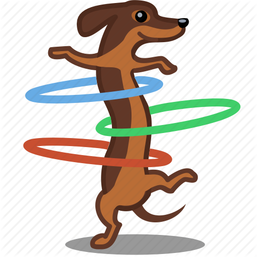
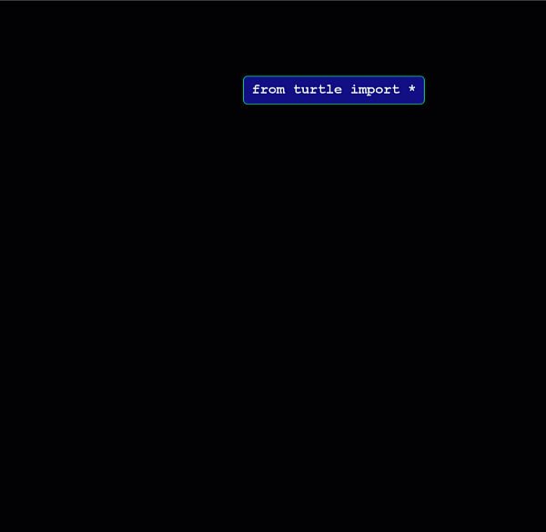

.. raw:: html

    
    
    
    

.. role:: red

.. role:: green

.. role:: blue

.. role:: purple

.. image:: ../img/Technovation-yellow-gradient-background.png
    :width: 500
    :align: center
    :alt: Technovation logo

Why learn Coding?
:::::::::::::::::::::::::::::::::::::::::::

Here are some reasons that **we** think you should learn to code. (Click on the buttons to see more.)

.. reveal:: re-reasonToCode1
    :showtitle: Become a master problem solver!
    :modal:
    :modaltitle: Become a master problem solver!
    
    Learn how to break big problems into smaller, more manageable ones. Hone your reasoning skills.

    .. raw:: html

        

        <iframe src="https://giphy.com/embed/U7mh7CJjk2ewKPDybK" width="50%" height="100%"
        style="position:absolute" frameBorder="0" class="giphy-embed">
        </iframe>

        
<a href="https://giphy.com/gifs/digitelco-digi-digilah-digigifs-U7mh7CJjk2ewKPDybK">
        via GIPHY</a>

.. reveal:: re-reasonToCode2
    :showtitle: Expand your creativity with new ways of thinking!
    :modal:
    :modaltitle: Expand your creativity with new ways of thinking!
    
    Test out new ideas quickly and cheaply. Easy experimentation leads
    to new discoveries. 
    
    “A computer is a bicycle for your mind” – Steve Jobs

    .. raw:: html

        
<iframe src="https://giphy.com/embed/jRS66R62HFzRK5qXQd" width="50%" height="100%" style="position:absolute" frameBorder="0" class="giphy-embed" allowFullScreen></iframe>

<a href="https://giphy.com/gifs/design-idea-ideas-jRS66R62HFzRK5qXQd">via GIPHY</a>

.. reveal:: re-reasonToCode3
    :showtitle: Practice resilience
    :modaltitle: Practice resilience
    :modal:
    
    A key to programming is learning from failed tests: Get an idea. Test it out.
    Think about how you might fix it. Then try again! This same recipe works for
    many overcoming many of life's obstacles.

    .. raw:: html

        

.. reveal:: re-reasonToCode4
    :showtitle: Code fuels discovery in all fields
    :modal:
    :modaltitle: Code fuels discovery in all fields
    
    Code is now used to solve problems in almost all disciplines and sectors.

    .. raw:: html

        

.. reveal:: re-reasonToCode5
    :showtitle: Code is a superpower!!
    :modal:
    :modaltitle: Code is a superpower!!
    
    The sky is the limit when it comes to what you can do with code!

    .. raw:: html

        
<iframe src="https://giphy.com/embed/4GaHBQh3f4jBEpbQvP" width="50%" height="100%" style="position:absolute" frameBorder="0" class="giphy-embed" allowFullScreen></iframe>

<a href="https://giphy.com/gifs/shecodesio-swipe-up-computer-congratulations-4GaHBQh3f4jBEpbQvP">via GIPHY</a>

.. shortanswer:: sa-reasons
   :optional:

   List some of **your** reasons for wanting to learn to code.

What is Coding?
:::::::::::::::::::::::::::::::::::::::::::

Listen to Mike's rap about coding to learn his answers to:

- :red:`What` is code?

- :green:`Where` is code?

- :blue:`Who` codes?

- :purple:`Why` learn code?

.. raw:: html

    

        <iframe title="Video from Mike Likes Science. Always Be Coding #1: Let's Code"
        width=560em height=315em src="https://www.youtube.com/embed/ebh0kQwwYBw"
	frameborder="0" allow="accelerometer; autoplay; clipboard-write; encrypted-media; gyroscope;
	picture-in-picture" allowfullscreen></iframe>
    

.. reveal:: re-slow-down-video
    :showtitle: Want change how fast Mike raps?
    :modal:
    :modaltitle: How to change a video's speed

    After pressing play, stop the video and click on the gear icon in the
    bottom right of the video frame.
    Then click *Playback Speed*.
    Finally, click a speed (number) less than 1.
    (The smaller the number, the slower the video plays.)
 
Think for a minute about what each of the following means in a dicussion of computing. 
Then click on the buttons to compare our definitions with yours:

.. reveal:: re-define-program
    :showtitle: Computer program
    :modal:
    :modaltitle: Definition

    **Computer program:** A list of instructions that is written in a language a computer can interpret to perform some task.

    So a *computer program* is just another name for *code*.

    :blue:`"I wrote a computer program that plays my favorite card game."`
    
    :blue:`"She wrote code that calculates the minumum, maximum, and average temperatures recorded each month."` 

.. reveal:: re-define-coding-programming
    :showtitle: Coding, Programming
    :modal:
    :modaltitle: Definition

    **Coding:** In the process of creating code.

    **Programming:** In the process of creating a computer program.
    
    So *programming* is just another way of saying *coding*.

    :blue:`"I am coding a new mobile app."`

    :blue:`"I am programming a simulation of the known universe."`

.. reveal:: re-define-executing-running
    :showtitle: Run, Execute
    :modal:
    :modaltitle: Definition

    **Run [code]**: Carry out the instructions in the code.
   
    **Execute [a program]**: Carry out the instructions in the program.
    
    So *run the code* is just another way of saying *execute the program*. 

    :blue:`"To see what code does, just execute it."`
    
    :blue:`"The program crashed when I tried to run it.`
    
    (This last sentence is something you will eventually get used to!)

.. reveal:: re-define-language
    :showtitle: Programming language, Coding language
    :modal:
    :modaltitle: Definition

    **Programming language:** The vocabulary and grammar rules for writing a program.

    **Coding language:** The vocabulary and grammar rules for code.
    
    So a *programming language* is just another way of saying a *coding language*.

    :blue:`"Once you learn one programming language, it is relatively easy to teach yourself others."`
    
    :blue:`"What is your favorite coding language to program in?"`

Check your understanding.

.. mchoice:: mc-program-definition
   :random:

   What do *a program* and *code* mean when used in computing? 
   (Select the best description.)

   - A series of instructions that a computer can carry out to perform some task.

     + Yes, but not just any old instructions---the instructions must be written using the vocabulary and the grammar rules of a programming language.

   - A TV show

     - No, *a program* sometimes refers to a TV show, but not in computing; and *code* does not; and *code* certainly does not refer to a TV show.

   - A secret language that only some people understand

     - No, *a program* does not refer to a secret language; and although *code* sometimes refers to a secret language, in computing it generally means the same as *a program*. 
     
   - A task that a computer can perform.

     - No &mdash; You run a program to perform a task, but the *program* is not the task that is to be completed.

To understand the distinctions between these terms, it can help to draw 
analogies with activities that you are already familiar with. 

.. figure:: img/cooking-clipart-libraryDOTcomClipart26transparent.png
    :width: 300
    :align: center
    :alt: image of teens following a recipe (clipart-library.com/clipart/26)
    :class: with-border
    
    Cooking from a Recipe

.. dragndrop:: dnd-terminology-recipe
    :match_1: The rules for writing down recipes|||Programming language
    :match_2: A recipe for a pepperoni pizza|||A program
    :match_3: Cooking a Hawaiian pizza|||Executing the program
    :match_4: Writing down the recipe for your favorite pizza|||Programming
    
    Match up the phrase on the left with the coding concept on the right
    that it is most similar to, thereby illustrating an analogy between coding and 
    cooking.

    
    Pet Tricks

.. dragndrop:: dnd-terminology-pet-tricks
    :match_1: The movements and words that make up the commands that your dog understands|||Coding language
    :match_2: A series of commands that will make your dog play dead|||The code
    :match_3: Commanding your dog to play dead|||Running the code
    :match_4: Inventing a series of commands for your dog to get it to fetch a toy|||Coding

    Match up the phrase on the left with the coding concept on the right
    that it is most similar to, thereby illustrating an analogy between teaching
    tricks to a pet and coding.

Python Turtle Graphics
:::::::::::::::::::::::::::::::::::::::::::

    
    Animation of a Turtle following a series of instructions

You'll be learning coding using *Python Turtle Graphics*, a library
of code that is written in the Python Programming Language.

To whet your appetite, here's an example program in a Runestone *active code* widget.

.. activecode:: ac-example-sierpinski-triangle
  :nocodelens:
  :above:
  :enabledownload:
  :caption: Sierpinski Triangle
  :chatcodes:

  Don't worry about understanding this code
  just yet.
  But notice what it looks like --- the code has odd-looking words, punctuation, numbers,
  and math-like symbols. They all mean something to the computer.
  So does the indentation.
  We'll learn the rules for writing code like this in the weeks ahead.

  The white area in the active code widget is an *editor*. You can scroll through
  the code if you place your cursor into editor. You can change the size of the
  editor by dragging the bottom-left corner up and down.
  You can also modify the code.
  But don't do that just yet!

  For now, just scroll the contents in the window and resize the editor so
  the ``Run`` button is at the top of the window and you can see a
  good four inches or more below the editor. (To scroll the window contents,
  place your cursor outside the editor.)

  Then click the ``Run`` button to see what running the code produces.
  After pressing ``Run``, you need to scroll down below the code editor to see
  what the program draws.
  ~~~~
  import turtle

  def drawTriangle(points,color,myTurtle):
      myTurtle.fillcolor(color)
      myTurtle.up()
      myTurtle.goto(points[0][0],points[0][1])
      myTurtle.down()
      myTurtle.begin_fill()
      myTurtle.goto(points[1][0],points[1][1])
      myTurtle.goto(points[2][0],points[2][1])
      myTurtle.goto(points[0][0],points[0][1])
      myTurtle.end_fill()

  def getMid(p1,p2):
      return ( (p1[0]+p2[0]) / 2, (p1[1] + p2[1]) / 2)

  def sierpinski(points,degree,myTurtle):
      colormap = ['blue','red','green','white','yellow',
                  'violet','orange']
      drawTriangle(points,colormap[degree],myTurtle)
      if degree > 0:
          sierpinski([points[0],
                          getMid(points[0], points[1]),
                          getMid(points[0], points[2])],
                     degree-1, myTurtle)
          sierpinski([points[1],
                          getMid(points[0], points[1]),
                          getMid(points[1], points[2])],
                     degree-1, myTurtle)
          sierpinski([points[2],
                          getMid(points[2], points[1]),
                          getMid(points[0], points[2])],
                     degree-1, myTurtle)

  def main():
    p1 = [-100,-50]
    p2 = [0,100]
    p3 = [100,-50]
    bisect_num = 3

    myWin = turtle.Screen()
    myPoints = [p1,p2,p3]
    sierpinski(myPoints,bisect_num,turtle)
    myWin.exitonclick()

  main()

To get practice running code and see what you can learn by doing so, perform
the following experiments.

Experiment #1

- Scroll down in the editor (white area containing the program) to line 39.
  Then change the ``3`` in this line to ``4``.

- Run the code again.

- Notice the differences between the what the first program draws and what the
  modified program draws. (Use the slider at the top of the active code editor
  to go back and forth between the two programs and re-run them as needed. This
  slider keeps a *history* of all the code you execute so you can always go back
  to an earlier version if you make a mistake or just want to remember what
  it looks like.)

Experiment #2

- Change the ``4`` that you entered in line 39 to ``2`` and run the code another time.

- Notice the differences between the three versions of the program. (Again, you
  can use the slider to go back and re-run any of the versions that you'd like.)

.. shortanswer:: sa-reflect-sierpinski1
    :optional:

    Based on these experiments,
    what do you think the computer uses the number in line 39 for?

Experiment #3

- If the number in line 39 isn't still ``2``, change it to be ``2``

- In line 37, change the ``0`` to ``-100``.  (This will make the instruction be ``p2 = [-100,100]``.)

- Run the program again.

- Notice how this modification changes what the program draws.

Experiment #4

- In line 37, change the ``-100`` to ``150``.  (This will make the instruction be ``p2 = [150,100]``.)

- Run the program again.

- Notice how this modification changes what the program draws.

.. shortanswer:: sa-reflect-sierpinski2
    :optional:

    Based on these experiments,
    what do you think the computer uses
    the pair of numbers in line 37 for?
    (Suggestion: Use the slider above the editor and re-run the earlier
    versions of the code to remind yourself what each version does.)

Other Experiment suggestions:

- Experiment with changing the pairs of numbers in lines 36 and 38.

- Experiment with changing the names of the colors in lines 18 and 19.

.. shortanswer:: sa-reflect-sierpinski3
    :optional:

    What did you learn from your additional experiments?

Isn't it amazing how much you can learn about code just by playing around with it?

By the end of club, you will be able to design and code diagrams like this yourself!  |smiley-heart-eyes|

