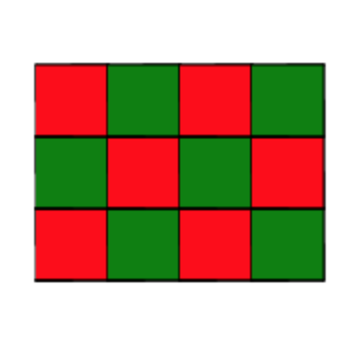
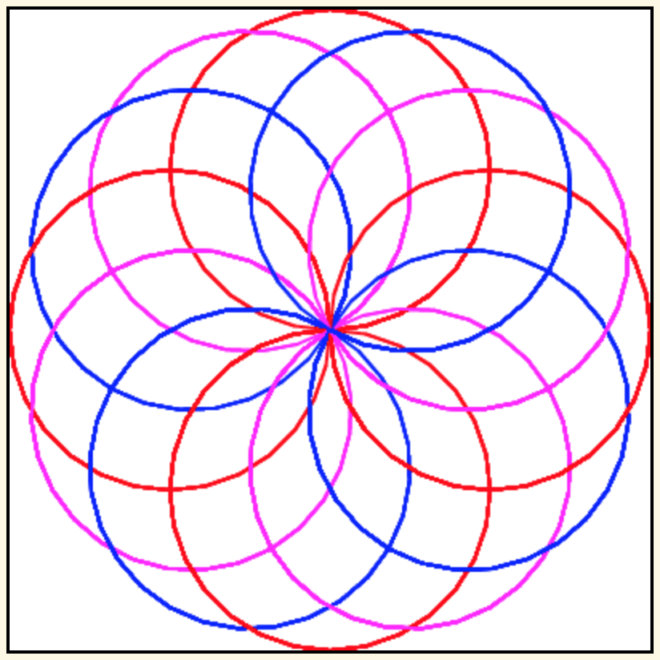
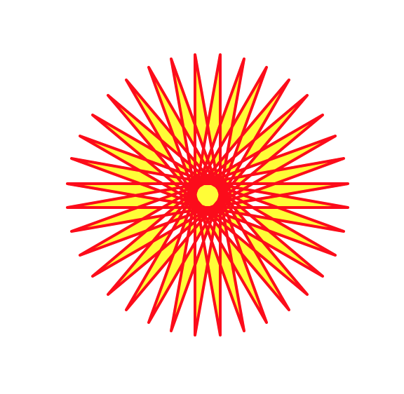

.. image:: ../img/Technovation-yellow-gradient-background.png
    :width: 500
    :align: center

Practice Makes Perfect
:::::::::::::::::::::::::::::::::::::::::::

The only way to become comfortable coding is to practice.

In the next meeting, we'll start teaching you the rules of coding in Python.
But for now, you can practice running and experimenting with programs
that others have written.

We've included some programs for you to run and experiment
with below.

Checker Board
--------------

.. activecode:: checker_board
    :language: python
    :above:
    :nocodelens:
    :caption: Checker Board Program
    :enabledownload:
    :chatcodes:
    :timelimit: 200000

    Scroll the window contents and resize the editor so you can see
    the ``Run`` button and also a good 4 inches or so below the editor.
    Then run the program.
    ~~~~

    # Import the turtle library
    import turtle
    # Set the speed to 10 (fast)
    turtle.speed(10)

    unit = 20
    rnum = 8
    cnum = 8

    last_col_color = last_row_color = "black"
    next_col_color = next_row_color = "white"

    # Move into the starting position (lower left corner)
    turtle.up()
    turtle.goto(-rnum*unit/2, -cnum*unit/2)
    turtle.down()

    # Draw the board
    for i in range(rnum):

        # Draw row i
        for j in range(cnum):
            # Draw square j of row i
            turtle.color("black", next_col_color)

            turtle.begin_fill()
            for k in range(4):
                turtle.forward(unit)
                turtle.left(90)

            turtle.end_fill()

            # Get ready to draw the next square
            turtle.forward(unit)
            next_col_color, last_col_color = last_col_color, next_col_color

        # Get ready to draw the next row
        turtle.up()
        turtle.goto(turtle.xcor()-cnum*unit, turtle.ycor()+unit)
        turtle.down()

        next_row_color, last_row_color = last_row_color, next_row_color
        next_col_color, last_col_color = next_row_color, last_row_color

    turtle.hideturtle()

The instructions in lines 7--9 are *assignment instructions*.
Executing these three assignments creates three *variables*,
``unit``, ``rnum``, and ``cnum``, and assigns them the *values* ``20``, ``8``, and ``8``,
respectively.

We'll learn more about variables and values in our next
meeting. Today, we just want to develop some intuition about how
programmers them.

Run some experiments in which you change the values assigned to these variables.
For example, try changing the value (number) ``20`` in line 7 to, say, ``10`` and
rerun the program to see how changing the value assigned to ``unit`` affects
what the program draws. Also run some experiments in which you change
the values (numbers) in the other assignment instructions.

.. fillintheblank:: fitb-vars-1

    The value of one of these variables determines how
    how many columns the program draws. Based on your experiments, which variable
    do you think it is? (Use the slider to go back and re-run earlier experiments.)

    - :unit: No, run the program. Then change the value (number) in line 7 and run it again. What changed between the runs?
      :rnum: No, run the program, then change the value (number) in line 8 and run it again. What changed between the runs?
      :cnum: Correct! For example, if ``cnum`` is assigned 3 in line 9, the program will draw  a board with just 3 columns.
      :x: Try again. (Variables names are case-sensitive. So be sure you type then exactly as in the program.)

.. fillintheblank:: fitb-vars-2

    The value of another of these variables determines how
    how many rows the program draws. Based on your experiments, which variable
    do you think it is? (Use the slider to go back and re-run earlier experiments.)

    - :unit: No, run the program. Then change the value (number) in line 7 and run it again. What changed between the runs?
      :cnum: No, run the program. Then change the value (number) in line 9 and run it again. What changed between the runs?
      :rnum: Correct! For example, if ``rnum`` is assigned 2 in line 8, the program will draw  a board with just 3 columns.
      :x: Try again. (Variables names are case-sensitive. So be sure you type them exactly as in the program.)

.. fillintheblank:: fitb-vars-3

    The value of another of these variables determines
    the size of the squares in the board. Based on your experiments, which variable
    do you think it is? (Use the slider to go back and re-run earlier experiments.)

    - :unit: Correct! For example, if ``unit`` is assigned 10 in line 7, then each square will be 10 pixels on each side (half of the size drawn by the original program).
      :cnum: No, run the program. Then change the value (number) in line 9 and run it again. What changed between the runs?
      :rnum: No, run the program, then change the value (number) in line 8 and run it again. What changed between the runs?
      :x: Try again. (Variables names are case-sensitive. So be sure you type them exactly as in the program.)

The instructions in lines 11 and 12 are also assignments. Executing line 11
creates **two** variables, ``last_col_color`` and ``last_row_color``, and assigns
them both the *string* value ``"black"``. Similarly, executing line 12 creates
variables ``next_col_color`` and ``next_row_color`` and assigns them both the string
value ``"white"``.

Run some experiments in which you change the color strings in lines 11 and 12.
(They need to be legal `Turtle Graphics color strings <https://trinket.io/docs/colors>`_,
for example, ``"red"``, ``"green"``,
``"blue"``, ``"yellow"``.
In Python, strings are characters that are surrounded by quotes.)

What values would you assign to the variables in lines 7---12 of this program to
get it to draw the following board (the small squares should be 40 pixels on each side)?

.. fillintheblank:: fitb-vars-4

    Value to assign to ``unit`` in line 7:

    - :40: Correct! Assigning ``unit`` the value 40 will make the program draw each small square 40 pixels wide and 40 pixels high
      :x: Use the slider to go back to and rerun experiments that assign different values to ``unit``. What difference do you see in the drawings the programs make?

.. fillintheblank:: fitb-vars-5

    Value to assign to ``rnum`` in line 8:

    - :3: Correct! Assigning ``rnum`` the value 3 will make the program draw a board with 3 rows.
      :x: Use the slider to go back to and rerun experiments that assign different values to ``rnum``. What difference do you see in the drawings the programs make?

.. fillintheblank:: fitb-vars-6

    Value to assign to ``cnum`` in line 9:

    - :4: Correct! Assigning ``cnum`` the value 4 will make the program draw a board with 4 columns.
      :x: Use the slider to go back to and rerun experiments that assign different values to ``cnum``. What difference do you see in the drawings the programs make?

.. fillintheblank:: fitb-vars-7

    Value to assign to ``last_col_color`` and ``last_row_color`` in line 11:

    - :"green": Correct! Assigning ``last_col_color`` and ``last_row_color`` the value ``"green"`` will make the program draw a board where all even numbered squares in the first row are green.
      :x: Use the slider to go back to and rerun experiments that assign different values to ``last_col_color`` and ``last_row_color``. What difference do you see in the drawings the programs make?

.. fillintheblank:: fitb-vars-8

    Value to assign to ``next_col_color`` and ``next_row_color`` in line 12:

    - :"red": Correct! Assigning ``next_col_color`` and ``next_row_color`` the value ``"red"`` will make the program draw a board where all odd numbered squares in the first row are red.
      :x: Use the slider to go back to and rerun experiments that assign different values to ``next_col_color`` and ``next_row_color``. What difference do you see in the drawings the programs make?

Try one last experiment with the Checker Board program: Add a hash symbol
(``#``) to the front of the ``turtle.hideturtle()`` instruction (the last line
of the program). Then run the program again.

.. shortanswer:: sa-hash-symbol
    :optional:

    The hash symbol in Python has a special meaning:
    It means that the rest of the line is a *comment* and not a Python instruction.
    When you run a program, comments are ignored---a programmer adds comments to
    their code to help someone reading their code understand it.

    So the ``#`` at the front of the ``turtle.hideturtle()`` instruction makes it a comment,
    which means that the instruction is ignored (not executed).

    Based on your experiment and this explanation of comments, what do you think
    executing a ``turtle.hideturtle()`` instruction does?

Spirograph
-----------

.. activecode:: spirograph
    :language: python
    :above:
    :nocodelens:
    :enabledownload:
    :caption: Spirgraph Program
    :chatcodes:

    Run the program.
    ~~~~

    # Import the turtle library
    import turtle

    # Set the pensize as 2 and speed of drawing as 10
    turtle.pensize(2)
    turtle.speed(10)

    size = 100
    rotate_amt = 15
    times_around = 8

    # Repeat a total of times_around number of times, 8 here
    for i in range(times_around):

        # Repeat for each color
        for color_name in ('red', 'magenta', 'blue'):

            turtle.color(color_name)

            # Draw a circle of choosen size, 100 here
            turtle.circle(size)

            # Move rotate_amt pixels left to draw another circle, 15 here
            turtle.left(rotate_amt)

    # Hide the turtle
    turtle.hideturtle()

Experiment with changing the values assigned to the variables in lines 9--11 and notice how their values affect what the program draws.

**Challenge:** What values would you assign to these variables to
get the program to draw the following picture?

.. fillintheblank:: fitb-vars-9

    Value to assign to ``size`` in line 9:

    - :100: Correct! You can tell the circles are the same size as in the original program because they go just to the edges of the *canvas* (the drawing space).
      :x: Try again.

.. fillintheblank:: fitb-vars-10

    Value to assign to ``rotate_amt`` in line 10:

    - :30: Correct! The new program needs to draw half as many circles as the original one, so each circle needs to be rotated twice as far---so 30 degrees.
      :x: Try again. Compare the number of circles in the new drawing to the number in the drawing created by running the original program (use the slider to go back to the original program)? How is the number of circles related to the amount each is rotated?

.. fillintheblank:: fitb-vars-11

    Value to assign to ``times_around`` in line 11:

    - :4: Correct! The value  of ``times_around`` is always the same as the number of circles of each color, and the new drawing has 4 circles of each color.
      :x: Try again. How many circles of each color are there? How is the value of ``times_around`` related to the number of circles of each color that the program draws?

Turtle Star
-----------

.. activecode:: turtle_star
    :language: python
    :above:
    :nocodelens:
    :timelimit: 20000
    :enabledownload:
    :caption: Turtle Star Program
    :chatcodes:

    Run the program.
    ~~~~

    # Import the turtle library
    import turtle
    turtle.speed(10)

    size = 200

    # Go to the starting point
    turtle.up()
    turtle.goto(-(size//2), 0)
    turtle.down()

    # Set the pen color as red and the
    # fill color as yellow
    turtle.color("red", "yellow")

    # draw a 36-pointed star
    turtle.begin_fill()
    for i in range(37):
        turtle.forward(size)
        turtle.left(170)
    turtle.end_fill()

    turtle.hideturtle()

This program is equivalent to the example program in the
`Turtle Graphics docs <https://docs.python.org/3/library/turtle.html>`_.
The Runestone active code windows provide just one platform for running
Python programs. Many other platforms can be used to run Python code.
When this program is run on one popular platform (Idle), it produces
the drawing shown below.

Compare this picture to the one that is produced when you run the program
in the active code window. What differences do you notice?

.. shortanswer:: sa-portability
    :optional:

    Can you think of reasons why the same program might produce different
    results when executed on different platforms? |feminine-confused|

.. |feminine-confused| image:: https://www.smileysapp.com/emojis/uncertain-emoji.png
    :width: 50
    :alt: clipart of a clock with wings
