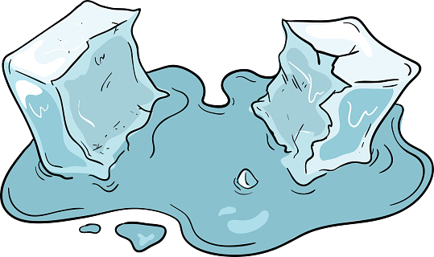

.. image:: ../img/Technovation-yellow-gradient-background.png
    :width: 500
    :align: center

**Icebreaker (cont.)** |brokenice|

..

A mentor in your breakout room will assign you a page on our |gettoknowyou|.

They will then give you 5 minutes to upload your images
and add at least the following information to your page.

1. Your preferred name
2. Your grade
3. Where you go to school

Other things you might add (time permitting):

4. What your images mean to you
5. What you're most excited for in Technovation

When time is up (Julie is done singing), your mentor will give you a few more minutes to browse the pages of others from your breakout room.

Be ready to ask a question or two about some other pages and to respond to
questions others may ask about yours.

.. |gettoknowyou| raw:: html

   <a href="https://docs.google.com/presentation/d/1IJaxWGMmHlWqCm4NRzZNI4aXHdmUI6QmcKJkGUBpyt8/edit?usp=sharing" target="_blank">Getting To Know You Presentation</a>

..

**Stay on this Runestone page until you are invited to return to the main Zoom room.**

.. youtube:: BbbYY-pAmlY
   :align: center
   :width: 250
