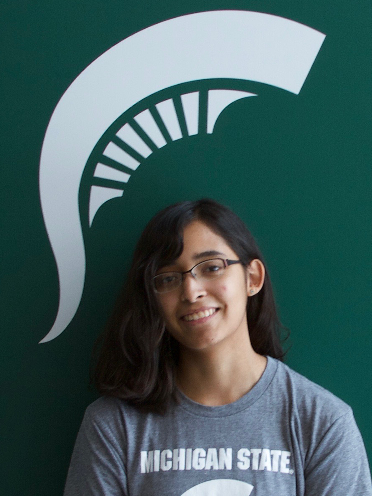

Spotlight: Katie Sydlik-Badgerow
:::::::::::::::::::::::::::::::::::::::::::

Some Quick Facts

* Graduated from Michigan State University in 2019 with her B.S. in Computer Science and Engineering. 
* Was the lead mentor of the very first Technovation Club in Fall 2018.
* Helped lead Spartan Girls Who Code in Spring 2019.
* Now works at Target.

Katie joins us today via Zoom to tell you a little bit about

* Why she chose to study computer science
* What she enjoys about her job
* What she wishes she knew when she was in your shoes

**Type questions for Katie into the Zoom chat for a short Q&A after her intro.**

* What are you curious about in the world of computer science? 
* What are you concerned or confused about?
* What do you want to hear more about?

Next, we'll be kicking off today's *code-along*.

**Stay on this page until a mentor says it's time to move on!**