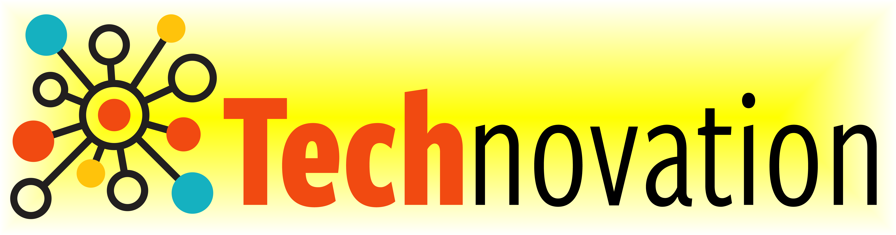
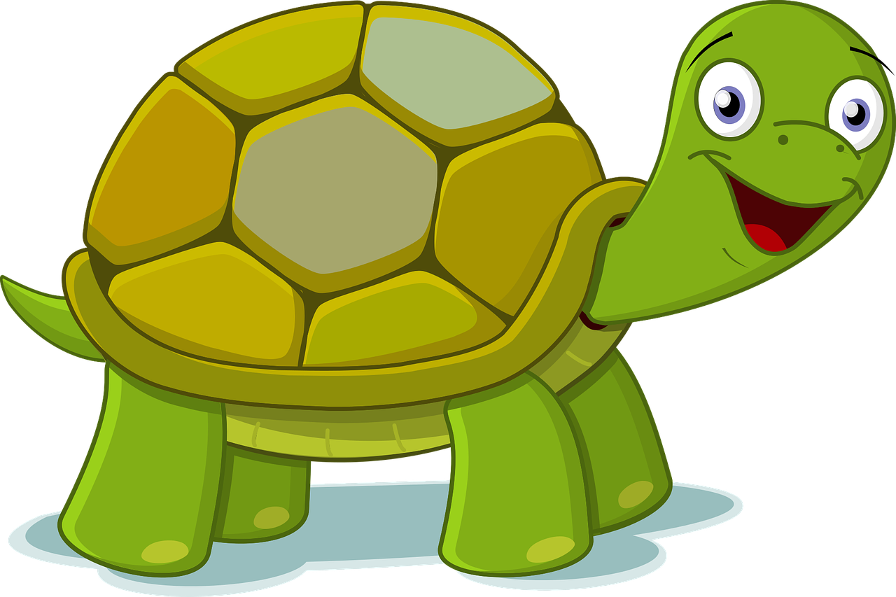
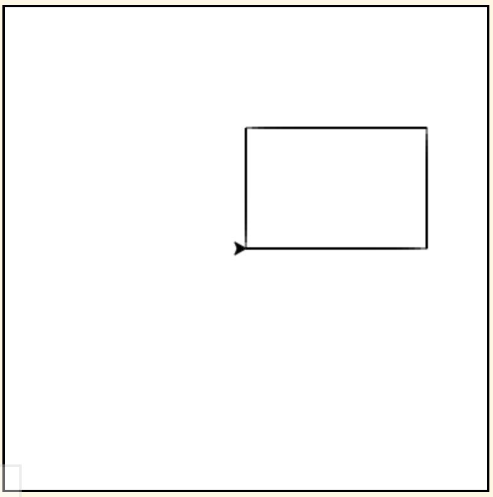
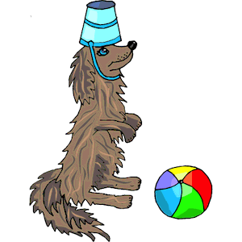
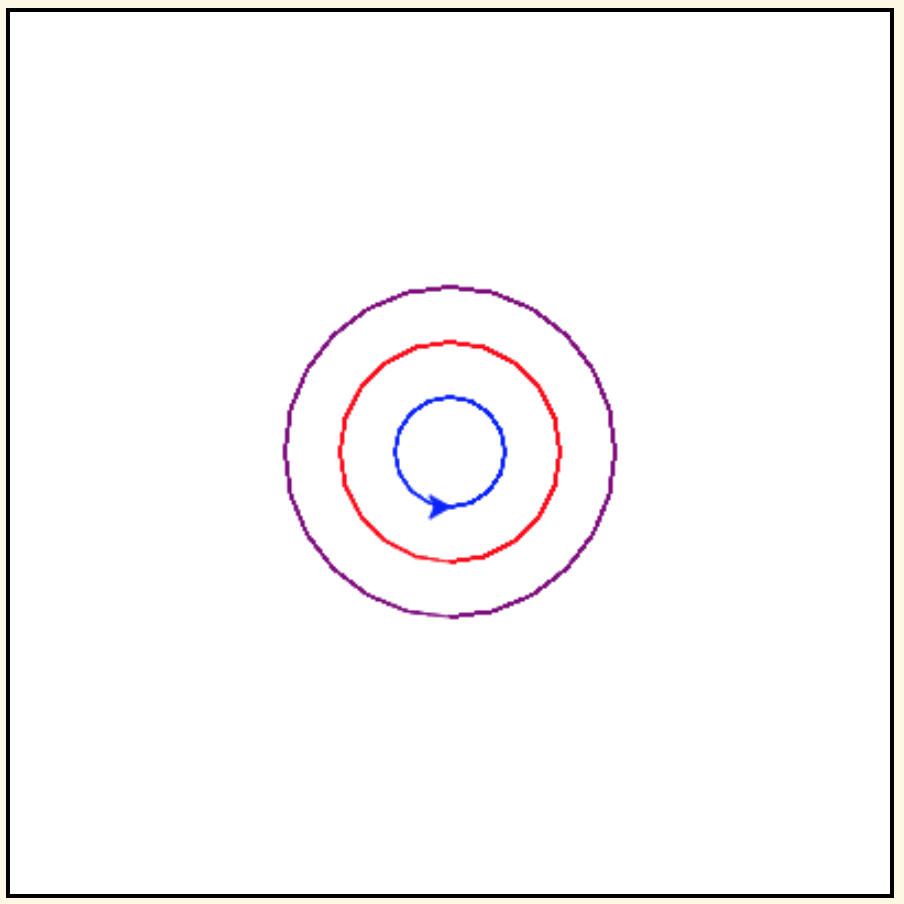
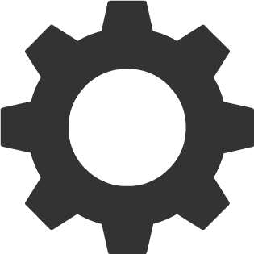
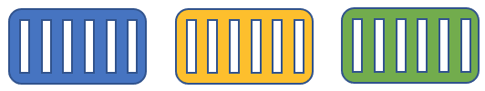

Learning to Code
:::::::::::::::::::::::::::::::::::::::::::

Python Turtle |aturtle|
-----------------------------------------

Think of a Python ``turtle`` as your new (virtual) pet.
Instead of using words and gestures
to teach it to roll over or sit, you write computer programs containing instructions
that tell it how to draw pictures on a *screen*.

For example, the code in the box below instructs the ``turtle`` to draw a square.

.. activecode:: turtle_square
    :language: python
    :above:
    :caption: Square Program
    :nocodelens:

    Press the ``Run`` button. You may need to scroll the window to see
    the screen below the editor window.
    ~~~~
    # a square with side-length 100 pixels
    import turtle

    turtle.forward(100)
    turtle.left(90)
    turtle.forward(100)
    turtle.left(90)
    turtle.forward(100)
    turtle.left(90)
    turtle.forward(100)
    turtle.left(90)

.. reveal:: re-turtle-square
    :showtitle: Read an explanation of this code
    :modal:
    :modaltitle: Code for drawing a square measuring 100 pixels on each side

    1 ``# a square with side-length 100 pixels``

    Lines that start with ``#`` are *comments*. The computer ignores all comments.
    Comments help someone reading the code understand what the code does.

    This comment tells the reader that the program draws a square measuring
    100 pixels on each side.

    2 ``import turtle``

    *Imports* the ``turtle`` *module* that comes with Python. A module defines
    one or more data objects and instructions.
    Importing the module allows you to use these data objects and instructions
    in your own program.

    4 ``turtle.forward(100)``

    Moves the ``turtle`` forward (i.e., in whatever direction it is facing)
    by 100 pixels.

    The ``100`` is an *input* to the instruction---the computer
    reads this number to know how many pixels to move forward. Since the ``turtle``
    is facing right, this instruction will move it 100 pixels to the right.

    5 ``turtle.left(90)``

    Rotates the ``turtle``  ``90`` degrees to the left (counter-clockwise).

    The ``left`` instruction needs one input---the computer reads the input (``90`` in
    this instruction) to know how many degrees to rotate through.

    The final two instructions are repeated three times to complete the other
    three sides of the square.

    Notice that:

    - After the line 5 ``turtle.left(90)`` instruction, the ``turtle`` is facing up.
      So the line 6 ``turtle.forward(100)`` instruction moves it *up* by 100 pixels.

    - The line 7 ``turtle.left(90)`` then rotates the ``turtle`` so it faces left
      and so the line 8 ``turtle.forward(100)`` instruction moves the ``turtle``
      left by 100 pixels.

    - The line 9 ``turtle.left(90)`` then rotates the ``turtle`` so it faces down and so the line 10
      ``turtle.forward(100)`` instruction moves the ``turtle`` back down to where it started.

    - Finally, the line 11 ``turtle.left(90)`` instruction rotates the ``turtle`` back to
      the start position---making it again face to the right.

Check your understanding of this program.

.. dragndrop:: dnd-check-understanding-1
    :match_6: 1 #  a square with side-length 100 pixels|||does not move or turn the turtle
    :match_1: 2 import turtle|||allows you to use data objects and instructions from the turtle module
    :match_2: 4 turtle.forward(100)|||moves the turtle 100 pixels to the right
    :match_7: 6 turtle.forward(100)|||moves the turtle 100 pixels up
    :match_3: 8 turtle.forward(100)|||moves the turtle  100 pixels to the left
    :match_4: 9 turtle.left(90)|||makes the turtle  face down
    :match_5: 11 turtle.left(90)|||makes the turtle face to the right

    Match each line from the Square Program (above) with the effect that executing it has
    on the turtle.
    (Line numbers are shown on the left.)

    Rectangle Image

.. parsonsprob:: pa-rectangle-program
    :language: python
    :adaptive:

    Arrange the instructions into a program that draws a rectangle
    150 pixels wide and 100 pixels high, like the Rectangle Image shown above.
    -----
    import turtle

    turtle.forward(150)
    turtle.left(90)
    turtle.forward(100)
    turtle.left(90)
    turtle.forward(150)
    turtle.left(90)
    turtle.forward(100)
    turtle.left(90)

You can instruct a (Python) ``turtle`` to do much more than just to move ``forward`` and turn ``left``.
Following are some other instructions that you can give it.

See if you can guess what each does. Then press the button to check if you guessed correctly.

.. reveal:: re-turtle-backward
    :modaltitle: turtle.backward(L)
    :modal:
    :showtitle: turtle.backward(L)

   Iinstructs the ``turtle`` to move ``L`` pixels backwards
    (i.e., opposite to the direction that the turtle is facing).

    The input, ``L``, tells the computer how many pixels to move.

.. reveal:: re-turtle-right
    :showtitle: turtle.right(D)
    :modaltitle: turtle.right(D)
    :modal:

    Instructs the ``turtle`` to rotate ``D`` degrees towards the right
    (i.e., clockwise).

    The input, ``D``, tells the computer how many  degrees to rotate through.

.. reveal:: re-turtle-goto
    :showtitle: turtle.goto(X, Y)
    :modaltitle: turtle.goto(X, Y)
    :modal:

    Instructs the ``turtle`` to go straight to the position with *coordinates* ``(X, Y)``
    on the screen.

    Positions are indicated using a Cartesian coordinate system with the center
    of the screen at position ``(0, 0)`` and units are measured in pixels.
    The default screen-size in an active code widget is 400 pixels wide and 400 pixels high.

    The inputs, ``X`` and ``Y``, tell the computer what position to move to.

.. reveal:: re-turtle-circle
    :showtitle: turtle.circle(R)
    :modaltitle: turtle.circle(R)
    :modal:

    Instructs the ``turtle`` to draw a circle of radius ``R`` pixels.

    The ``turtle`` draws the circle starting at its current location
    and curving left from the direction of travel (the direction the turtle is
    facing).

    The input, ``R``, tells the computer how many pixels long to make the circle's radius.

.. reveal:: re-turtle-color
    :showtitle: turtle.color(C)
    :modaltitle: turtle.color(C)
    :modal:

    Instructs the ``turtle`` to use the color ``C`` for drawing.

    The initial ``turtle`` color is ``black``.

    The input, ``C``, tells the computer what color to use.

.. reveal:: re-turtle-up
    :modaltitle: turtle.up()
    :modal:
    :showtitle: turtle.up()

    Instructs the ``turtle`` to stop drawing as it moves.

    **Why ``up``?**
    Think of attaching a felt-tip marker or a paint brush to the tail of the ``turtle`` so that,
    when its tail is up, it moves without making any mark and, when its tail is down,
    it makes a solid line as it moves.

    The ``turtle`` always starts with its tail down. So if you want to move it
    without drawing anything, you have to first instruct it
    to lift it's tail up (i.e., to execute ``turtle.up()``).

.. reveal:: re-turtle-down
    :modaltitle: turtle.down()
    :modal:
    :showtitle: turtle.down()

    Instructs the ``turtle`` to draw as it moves.

    After executing a ``turtle.up()`` instruction, if you ever want the
    ``turtle`` to start drawing again, you have
    to first execute a ``turtle.down()`` instruction.

.. reveal:: re-turtle-fill
    :showtitle: turtle.begin_fill() ... turtle.end_fill()
    :modaltitle: turtle.begin_fill() ... turtle.end_fill()
    :modal:

    Instructs the computer to fill the figure drawn by executing the code between
    the ``turtle.begin_fill()`` and ``turtle.end_fill()`` instructions.

    Because the initial ``turtle``color is ``black``, the shape will be filled with black
    unless you instruct the ``turtle`` to use a different color first (i.e., execute a
    ``turtle.color(C)`` instruction with a different input color).

.. |trinket| raw:: html

    <a href="https://trinket.io/docs/colors" target="_blank">trinket.io/docs/colors</a>

..

.. mchoice:: mc-read-code
    :answer_a: top left
    :answer_b: top right
    :answer_c: bottom left
    :answer_d: bottom right
    :correct: a
    :feedback_d: No. Draw lines between the points that the turtle goes to on a graph paper to form the boundary. Then color every point that lies between two points on the boundary.
    :feedback_a: Correct! The turtle starts drawing at (-100, 0), goes up to (-100,100), then over to (100,100), and then down to (100,0), forming three sides of a rectangle; filling the shape creates the top-left image, with the turtle still at (100,0) and facing right.
    :feedback_b: No. Draw lines between the points that the turtle goes to on a graph paper to form the boundary. Then color every point that lies between two points on the boundary.
    :feedback_c: No. Draw lines between the points that the turtle goes to on a graph paper to form the boundary. Then color every point that lies between two points on the boundary.

    Pretend to be a ``turtle`` and follow the instructions in the next
    program. (You might want to do it on a graph paper.)

    Which of the shapes shown below will the program draw?

    .. code:: python

        import turtle

        turtle.up()
        turtle.goto(-100, 0)
        turtle.down()

        turtle.color("lightblue")
        turtle.begin_fill()
        turtle.goto(-100, 100)
        turtle.goto(100, 100)
        turtle.goto(100, 0)
        turtle.end_fill()

    .. image:: img/read-code-choices.png
        :alt: four shapes, all 200 pxls wide by 100 pxls high: top left has a light-blue filled rectangle; top right has a light-blue outlined rectangle; bottom left has a light-blue outlined isosceles triangle; bottom right has a light-blue filled isosceles triangle
        :align: center

.. reveal:: re-turtle-state
    :showtitle: Show Pro tip
    :hidetitle: Hide Pro tip

    A Python Graphics ``turtle`` is an example of what computer scientists
    call a *data object*.
    A data object is just a computer representation of something in
    the *application domain*,
    such as a customer in an
    airline reservation system or a pen in a drawing program.

    An important property of a data object is that it has a *state*.
    The state of a data object affects what the object does when it
    receives an instruction.
    For example, the state of a ``turtle`` determines whether it will draw a
    line when it moves or not.
    Before any ``turtle.up()`` instructions, the ``turtle.forward(100)``
    instruction both draws a line
    and changes the position of the ``turtle``;
    but after a ``turtle.up()`` instruction, a ``turtle.forward(100)``
    instruction only changes the ``turtle``'s
    position.

    Computer scientists refer to commands, like ``turtle.up()`` and ``turtle.down()``, that change
    the state of the data object that receives them as
    having *side effects*.

    .. clickablearea:: cli-state
       :question: Click on the commands that you think may have a side-effect (change the state of the turtle).
       :table:
       :correct: 1,1;1,2;2,1;2,2;3,1
       :incorrect: 3,2

       +-----------------------+---------------------+
       |   turtle.forward(45)  | turtle.backward(90) |
       +-----------------------+---------------------+
       |    turtle.left(30)    |   turtle.right(90)  |
       +-----------------------+---------------------+
       |  turtle.color("red")  |  turtle.circle(75)  |
       +-----------------------+---------------------+

With these commands, we can instruct the ``turtle`` to draw more interesting diagrams.

For example, here's a program that draws a six-pointed star in two colors.

.. activecode:: turtle_6_point_star
    :language: python
    :nocodelens:
    :caption: Six-Pointed Star

    Run the program and scroll down to see what the ``turtle`` draws.
    ~~~~
    import turtle

    # a base triangle in green
    turtle.up()
    turtle.goto(-100, -50)
    turtle.color("green")
    turtle.down()
    turtle.forward(200)
    turtle.left(120)
    turtle.forward(200)
    turtle.left(120)
    turtle.forward(200)
    turtle.left(120)

    # a rotated triangle in blue
    turtle.left(60)
    turtle.up()
    turtle.goto(0, -110)
    turtle.color("blue")
    turtle.down()
    turtle.forward(200)
    turtle.left(120)
    turtle.forward(200)
    turtle.left(120)
    turtle.forward(200)
    turtle.left(120)

The computer executes the instructions in a program exactly as they are
written and in the exact order. Your dog probably is not as obedient! |dogtricks|

Sometimes the order doesn't matter; other times it does.

.. clickablearea:: cli-commuting-instructions
   :question: Click on the pairs of lines from the Six-Pointed Star Program containing instructions that could be swapped without affecting what the program draws.
   :table:
   :correct: 2,1;3,1
   :incorrect: 1,1;1,2;2,2;3,2

   +--------------------------+--------------------------+
   | 1 import turtle &        | 4 turtle.up() &          |
   | 4 turtle.up()            | 5 turtle.goto(-100, -50) |
   +--------------------------+--------------------------+
   | 6 turtle.color("green")  | 8 turtle.forward(200)  & |
   | & 7 turtle.down()        | 9 turtle.left(120)       |
   +--------------------------+--------------------------+
   | 16 turtle.left(60)  &    | 6 turtle.color("green")  |
   | 17 turtle.up()           | & 19 turtle.color("blue")|
   +--------------------------+--------------------------+

   Concentric Circles Image

   ..

.. parsonsprob:: pa-turtle-circles
   :adaptive:

   Arrange the instruction blocks below into a program
   that draws:

   1) First, a purple circle of radius 75.

   2) Then, a red circle of radius 50.

   3) And finally, a blue circle of radius 25.

   The drawing it produces should look like the Concentric Circles Image above.

   (Drag the instruction blocks into the yellow rectangular region in the order
   that the computer should execute them.)
   -----
   import turtle

   =====
   turtle.up()
   =====
   turtle.goto(0, -75)
   turtle.color("purple")
   =====
   turtle.down()
   =====
   turtle.circle(75)
   =====
   turtle.up()
   =====
   turtle.goto(0, -50)
   turtle.color("red")
   =====
   turtle.down()
   =====
   turtle.circle(50)
   =====
   turtle.up()
   =====
   turtle.goto(0, -25)
   turtle.color("blue")
   =====
   turtle.down()
   =====
   turtle.circle(25)

We'll introduce more ``turtle`` instructions as we go along.
But if you are curious, you can look |here| to learn all about |turtleGraphics|,
including all of the instructions that the ``turtle`` understands.

.. |turtleGraphics| raw:: html

    <a href="https://docs.python.org/3.7/library/turtle.html#module-turtle" target="_blank">Turtle Graphics</a>

.. |here| raw:: html

    <a href="https://docs.python.org/3.7/library/turtle.html#module-turtle" target="_blank">here</a>

Keywords, Variables, and Assignment
----------------------------------------

According to the |waybackmachine|:

The `History of Programming Languages (HOPL) <http://hopl.murdoch.edu.au>`_
listed 8,512 different programming languages in January of 2011! No doubt,
there are even more by now!

The animation below gives you an idea of how the popularity of modern programming
languages has fluctuated in just the last 7 years. (With `over 40 *million*
users and hosting more than 190 *trillion* public code bases
<https://en.wikipedia.org/wiki/GitHub>`_, |github-logo|
hosts the largest collection of open-source software in the world.)

You might want to speed this video up before watching: Pause the video and
select the gear icon,
|gearicon|; then change the ``playback speed`` to 2.

.. |github-logo| image:: img/GitHub_Logo.png
    :width: 3.5 em
    :alt: GitHub Logo. By GitHub - https://github.com/logos, Public Domain, https://commons.wikimedia.org/w/index.php?curid=25623155

.. raw:: html

    

    <iframe width="560" height="315" src="https://www.youtube.com/embed/m6xWpf1zemI" title="YouTube video player" frameborder="0" allow="accelerometer; autoplay; clipboard-write; encrypted-media; gyroscope; picture-in-picture" allowfullscreen></iframe>
    

You might think that becoming an expert programmer is hopeless since there are so many
languages---how could you hope to learn even a small fraction of them?
But the good news is that you don't need to.
Almost all of them allow you to do the same basic things. You really only
need to learn one modern programming language well.
Also, most of them are based on the same basic concepts.

The rest of this section introduces three such concepts: Keywords, variables, and assignment.

Keywords |keyword|
~~~~~~~~~~~~~~~~~~~~~~~~~~~~~~~

All but the most primitive programming languages
have words that mean something special to the computer.
Called *keywords*, these words help the computer recognize the instructions
that you want it to execute.
There are 35 keywords in Python.

+----------+----------+----------+----------+----------+
|  Python Keywords                                     |
+==========+==========+==========+==========+==========+
| False    | await    | else     | import   | pass     |
+----------+----------+----------+----------+----------+
| None     | break    | except   | in       | raise    |
+----------+----------+----------+----------+----------+
| True     | class    | finally  | is       | return   |
+----------+----------+----------+----------+----------+
| and      | continue | for      | lambda   | try      |
+----------+----------+----------+----------+----------+
| as       | def      | from     | nonlocal | while    |
+----------+----------+----------+----------+----------+
| assert   | del      | global   | not      | with     |
+----------+----------+----------+----------+----------+
| async    | elif     | if       | or       | yield    |
+----------+----------+----------+----------+----------+

Because these words already mean something to the computer,
you can use them only in special instructions.

.. fillintheblank:: ftb-familiar-keyword

    The example programs given so far in this ebook have used
    just one of these keywords. What keyword is it?

    - :import: Yes! The `import` keyword tells the computer that the next word will be the name of a module and instructs the computer to import all the code in the module.
      :x: Which of the keywords in the table appears at the start of each example program that we have given so far? (Python is case-sensitive, so be sure to type the keyword exactly as shown in the table.)

In later meetings, we'll learn how to use many other keywords.
For now, just know that a keyword is a word that has the
same special meaning in all programs.

Variables |colored-containers-icon|
~~~~~~~~~~~~~~~~~~~~~~~~~~~~~~~~~~~~~~~~

If you did the practice exercises from our last meeting,
you probably guessed that variables are important.
If so, you are right!
Almost all programming languages allow you
to create variables in writing code.

A variable is like a container that you have labeled with a name (the variable name).
When running a program, the computer can store different values (data objects)
in the variable (container).

In Python, the name that you create for a variable has to satisfy
three rules:

- It must consist of one or more *lower case letters* (``a`` to ``z``),
  *upper case letters* (``A`` to ``Z``), *digits* (``0`` to ``9``),
  and/or *underscores* (``_``).

- It cannot start with a digit.

- It cannot be identical to a Python keyword.

.. clickablearea:: ca-variable-names
    :table:
    :question: Click on all that could be used as a variable name
    :correct: 1,1;1,2;1,3;1,4;2,2;2,4;3,2;3,3;3,4
    :incorrect: 2,1;2,3;3,1

    +----------+----------+----------+----------+
    | item3    | _radius  | Length   | A_2_Z    |
    +----------+----------+----------+----------+
    | item 3   | guru     | import   | Import   |
    +----------+----------+----------+----------+
    | 1_a      | true     | True_no  | _103     |
    +----------+----------+----------+----------+

Much like a good container label is one that reminds you what the container contains,
a good variable name is one that reminds you what the values stored in the variable are
used for. For example, you might name a variable ``radius`` if it will be used to store
the length (number of pixels) for the radius of a circle or ``time_left`` if it will
be used to store the number of minutes left in a video you are is watching.

.. clickablearea:: ca-variable-benefits
    :table:
    :question: Click on all that you think are benefits that using good variable names provides
    :correct: 1,1;1,3;2,1;2,3
    :incorrect: 1,2;2,2

    +-------------------------------+------------------------------+---------------------------------+
    | Make the code easier to read  | Make the code execute faster | Make the code easier to modify  |
    +-------------------------------+------------------------------+---------------------------------+
    | Make the logic easier to see  | Make the code more complex   | Make your co-coders happier     |
    +-------------------------------+------------------------------+---------------------------------+

Assignment |assignment-gif|
~~~~~~~~~~~~~~~~~~~~~~~~~~~~~

.. |assignment-gif| raw:: html

        

An assignment instructs the computer to store a value in a variable.
In Python, an assignment has the form

    ``var = exp``

where ``var`` is the name of a variable and ``exp`` is an *expression*---the expression
instructs the computer how to produce a value and the assignment instructs the
computer to store that value in the variable.
For example, if the variable ``x`` stores the value ``5``, then executing
``y = x + 1`` produces the value ``6`` and stores it in the variable ``y``.

An experienced programmer will *not* read ``y = x + 1`` as: *"y equals x plus one"*
|y-equals-xplus1|

Instead, they might read it as: *"assign x plus one to y"*
|assign-xplus1to-y|

Or: *"y is assigned x plus one"*
|y-isassigned-xplus1|

Or even: *"y gets x plus one"*
|y-gets-xplus1|

.. |y-equals-xplus1| raw:: html

    

    <audio controls>
    <source src="https://www.cse.msu.edu/~ldillon/TechnovationBook/y-equals-xplus1-voice-memo.mp3" type="audio/mpeg">
    <source src="https://www.cse.msu.edu/~ldillon/TechnovationBook/y-equals-xplus1-voice-memo.wav" type="audio/wav">
    "y equals x plus one"
    </audio>
    

.. |assign-xplus1to-y| raw:: html

    

    <audio controls>
    <source src="https://www.cse.msu.edu/~ldillon/TechnovationBook/assign-xplus1to-y.mp3" type="audio/mpeg">
    <source src="https://www.cse.msu.edu/~ldillon/TechnovationBook/assign-xplus1to-y.wav" type="audio/wav">
    "assign x plus one to y"
    </audio>
    

.. |y-gets-xplus1| raw:: html

    

    <audio controls>
    <source src="https://www.cse.msu.edu/~ldillon/TechnovationBook/y-gets-xplus1.mp3" type="audio/mpeg">
    <source src="https://www.cse.msu.edu/~ldillon/TechnovationBook/y-gets-xplus1.wav" type="audio/wav">
    "y gets x plus one"
    </audio>
    

.. |y-isassigned-xplus1| raw:: html

    

    <audio controls>
    <source src="https://www.cse.msu.edu/~ldillon/TechnovationBook/y-isassigned-xplus1.mp3" type="audio/mpeg">
    <source src="https://www.cse.msu.edu/~ldillon/TechnovationBook/yy-isassigned-xplus1.wav" type="audio/wav">
    "y is assigned x plus one"
    </audio>
    

This example assignment illustrates the use of ``+`` to mean addition. We won't list
all the Python *operators* here since you can easily 
`look them up <https://www.programiz.com/python-programming/operators>`_ when you need them.

But some arithmetic operators that you might want to be aware of include:

- ``-`` for subtraction or minus.
  For example, executing ``10 - 5`` produces ``-5``.

- ``*`` for multiplication.
  For example, executing ``10 * 5`` produces ``50``.

- ``/`` for division.
  For example, executing ``2 / 10`` produces ``0.2`` while executing ``10 / 2``
  produces ``5.0``.
  (In Python, the division operator always produces a *floating point* number---or,
  essentially, a number shown in decimal notation.)

- ``//`` for quotient (the number of times that the *divisor* (bottom number) goes
  into the *dividend* (top number).
  For example, executing ``13 // 5`` produces ``2`` (since ``5`` goes into ``10``
  twice with a remainder of ``3``).

- ``%`` for remainder. For example, executing ``13 // 5`` produces ``3``
  (since ``5`` goes into ``10`` twice with a remainder of ``3``).
