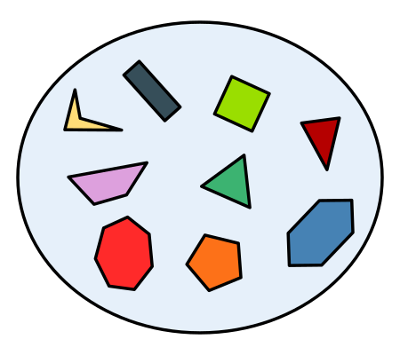
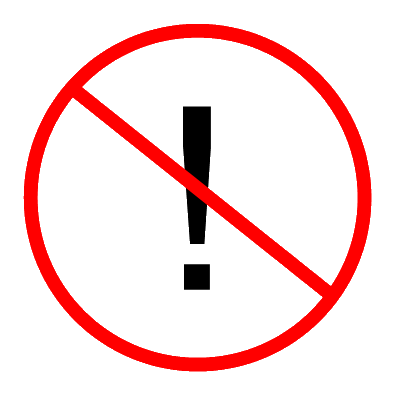

.. image:: ../img/Technovation-yellow-gradient-background.png
    :width: 500
    :align: center
    :alt: Technovation logo

Learning to Code
:::::::::::::::::::::::::::::::::::::::::::

Python Turtle |aturtle|
-----------------------------------------

.. |aturtle| image:: img/animals-1298747_1280.png
    :width: 100
    :alt: small image of a cartoon turtle

Think of a Python ``turtle`` as your new (virtual) pet.
Instead of using words and gestures
to teach it to roll over or sit, you write computer programs containing instructions
that tell it how to draw pictures on a *screen*.

For example, the code in the box below instructs the ``turtle`` to draw a square.

.. activecode:: turtle_square
    :language: python
    :above:
    :caption: Square Program
    :nocodelens:

    Press the ``Run`` button. You may need to scroll the window to see
    the screen below the editor window.
    ~~~~
    # a square with side-length 100 pixels
    import turtle

    turtle.forward(100)
    turtle.left(90)
    turtle.forward(100)
    turtle.left(90)
    turtle.forward(100)
    turtle.left(90)
    turtle.forward(100)
    turtle.left(90)

.. reveal:: re-turtle-square
    :showtitle: Read an explanation of this code
    :modal:
    :modaltitle: Code for drawing a square measuring 100 pixels on each side

    1 ``# a square with side-length 100 pixels``

    A lines that start with a ``#`` is a *comments*. The computer ignores all comments.
    You write comments to help someone reading the code understand what the code does.

    This comment tells the reader that the program creates a square measuring
    100 pixels on each side.

    2 ``import turtle``

    *Imports* the ``turtle`` *module* that comes with Python. A module defines
    one or more data objects and instructions.
    Importing the module allows you to use these data objects and instructions
    in your own program.

    4 ``turtle.forward(100)``

    Moves the ``turtle`` forward (i.e., in whatever direction it is facing)
    by 100 pixels.

    The ``100`` is an *input* to the instruction---the computer
    reads this number to know how many pixels to move forward. Since the ``turtle``
    is facing right, this instruction will move it 100 pixels to the right.

    5 ``turtle.left(90)``

    Rotates the ``turtle``  ``90`` degrees to the left (counter-clockwise).

    The ``left`` instruction needs one input---the computer reads the input (``90`` in
    this instruction) to know how many degrees to rotate through.

    The final two instructions are repeated three times to complete the other
    three sides of the square.

    Notice that:

    - After the line 5 ``turtle.left(90)`` instruction, the ``turtle`` is facing up.
      So the line 6 ``turtle.forward(100)`` instruction moves it *up* by 100 pixels.

    - The line 7 ``turtle.left(90)`` then rotates the ``turtle`` so it faces left
      and so the line 8 ``turtle.forward(100)`` instruction moves the ``turtle``
      left by 100 pixels.

    - The line 9 ``turtle.left(90)`` then rotates the ``turtle`` so it faces down and so the line 10
      ``turtle.forward(100)`` instruction moves the ``turtle`` back down to where it started.

    - Finally, the line 11 ``turtle.left(90)`` instruction rotates the ``turtle`` back to
      the start position---making it again face to the right.

Check your understanding of this program.

.. dragndrop:: dnd-check-understanding-1
    :match_6: 1 #  a square with side-length 100 pixels|||does not move or turn the turtle
    :match_1: 2 import turtle|||allows you to use data objects and instructions from the turtle module
    :match_2: 4 turtle.forward(100)|||moves the turtle 100 pixels to the right
    :match_7: 6 turtle.forward(100)|||moves the turtle 100 pixels up
    :match_3: 8 turtle.forward(100)|||moves the turtle  100 pixels to the left
    :match_4: 9 turtle.left(90)|||makes the turtle  face down
    :match_5: 11 turtle.left(90)|||makes the turtle face to the right

    Match each line from the Square Program (above) with the effect that executing it has
    on the turtle.
    (Line numbers are shown on the left.)

.. figure:: img/rectangle.png
    :alt: image of a rectangle with left corner at the origin, width 150 pixels, and height 100 pixels
    :align: center
    :width: 300

    Rectangle Image

.. parsonsprob:: pa-rectangle-program
    :language: python
    :adaptive:

    Arrange the instructions into a program that draws a rectangle
    150 pixels wide and 100 pixels high, like the Rectangle Image shown above.
    -----
    import turtle

    turtle.forward(150)
    turtle.left(90)
    turtle.forward(100)
    turtle.left(90)
    turtle.forward(150)
    turtle.left(90)
    turtle.forward(100)
    turtle.left(90)

You can instruct a (Python) ``turtle`` to do much more than just to move ``forward`` and turn ``left``.
Following are some other instructions that you can give it.

See if you can guess what each does. Then press the button to check if you guessed correctly.

.. reveal:: re-turtle-backward
    :modaltitle: turtle.backward(L)
    :modal:
    :showtitle: turtle.backward(L)

    Instructs the ``turtle`` to move ``L`` pixels backwards
    (i.e., opposite to the direction that the turtle is facing).

    The input, ``L``, tells the computer how many pixels to move.

.. reveal:: re-turtle-right
    :showtitle: turtle.right(D)
    :modaltitle: turtle.right(D)
    :modal:

    Instructs the ``turtle`` to rotate ``D`` degrees towards the right
    (i.e., clockwise).

    The input, ``D``, tells the computer how many  degrees to rotate through.

.. reveal:: re-turtle-goto
    :showtitle: turtle.goto(X, Y)
    :modaltitle: turtle.goto(X, Y)
    :modal:

    Instructs the ``turtle`` to go straight to the position with *coordinates* ``(X, Y)``
    on the screen.

    Positions are indicated using a Cartesian coordinate system with the center
    of the screen at position ``(0, 0)`` and units are measured in pixels.
    The default screen-size in an active code widget is 400 pixels wide and 400 pixels high.

    The inputs, ``X`` and ``Y``, tell the computer what position to move to.

.. reveal:: re-turtle-circle
    :showtitle: turtle.circle(R)
    :modaltitle: turtle.circle(R)
    :modal:

    Instructs the ``turtle`` to draw a circle of radius ``R`` pixels.

    The ``turtle`` draws the circle starting at its current location
    and curving left from the direction of travel (the direction the turtle is
    facing).

    The input, ``R``, tells the computer how many pixels long to make the circle's radius.

.. reveal:: re-turtle-color
    :showtitle: turtle.color(C)
    :modaltitle: turtle.color(C)
    :modal:

    Instructs the ``turtle`` to use the color ``C`` for drawing.

    The initial ``turtle`` color is ``black``.

    The input, ``C``, tells the computer what color to use.

.. reveal:: re-turtle-up
    :modaltitle: turtle.up()
    :modal:
    :showtitle: turtle.up()

    Instructs the ``turtle`` to stop drawing as it moves.

    **Why ``up``?**
    Think of attaching a felt-tip marker or a paint brush to the tail of the ``turtle`` so that,
    when its tail is up, it moves without making any mark and, when its tail is down,
    it makes a solid line as it moves.

    The ``turtle`` always starts with its tail down. So if you want to move it
    without drawing anything, you have to first instruct it
    to lift it's tail up (i.e., to execute ``turtle.up()``).

.. reveal:: re-turtle-down
    :modaltitle: turtle.down()
    :modal:
    :showtitle: turtle.down()

    Instructs the ``turtle`` to draw as it moves.

    After executing a ``turtle.up()`` instruction, if you ever want the
    ``turtle`` to start drawing again, you have
    to first execute a ``turtle.down()`` instruction.

.. reveal:: re-turtle-fill
    :showtitle: turtle.begin_fill() ... turtle.end_fill()
    :modaltitle: turtle.begin_fill() ... turtle.end_fill()
    :modal:

    Instructs the computer to fill the figure drawn by executing the code between
    the ``turtle.begin_fill()`` and ``turtle.end_fill()`` instructions.

    Because the initial ``turtle``color is ``black``, the shape will be filled with black
    unless you instruct the ``turtle`` to use a different color first (i.e., execute a
    ``turtle.color(C)`` instruction with a different input color).

.. |trinket| raw:: html

    <a href="https://trinket.io/docs/colors" target="_blank">trinket.io/docs/colors</a>

..

.. mchoice:: mc-read-code
    :answer_a: top left
    :answer_b: top right
    :answer_c: bottom left
    :answer_d: bottom right
    :correct: a
    :feedback_d: No. Trace the path that the turtle makes on paper. Then color every point that lies between two points on this path.
    :feedback_a: Correct! The turtle starts drawing at (-100, 0), goes up to (-100,100), then right to (100,100), and then down to (100,0), forming three sides of a rectangle; filling the shape creates the top-left image, with the turtle still at (100,0) and facing right.
    :feedback_b: No. Trace the path that the turtle makes paper. Then color every point that lies between two points on this path.
    :feedback_c: No. Trace the path that the turtle makes on paper. Then color every point that lies between two points on this path.

    Pretend to be a ``turtle`` and follow the instructions in the next
    program. (You might want to do it on a graph paper.)

    Which of the shapes shown below will the program draw?

    .. code:: python

        import turtle

        turtle.up()
        turtle.goto(-100, 0)
        turtle.down()

        turtle.color("lightblue")
        turtle.begin_fill()
        turtle.goto(-100, 100)
        turtle.goto(100, 100)
        turtle.goto(100, 0)
        turtle.end_fill()

    .. image:: img/read-code-choices.png
        :alt: four shapes, all 200 pxls wide by 100 pxls high: top left has a light-blue filled rectangle; top right has a light-blue outlined rectangle; bottom left has a light-blue outlined isosceles triangle; bottom right has a light-blue filled isosceles triangle
        :align: center

.. reveal:: re-turtle-state
    :showtitle: Show Pro tip
    :hidetitle: Hide Pro tip

    A Python Graphics ``turtle`` is an example of what computer scientists
    call a *data object*.
    A data object is just a computer representation of something in
    the *application domain*,
    such as a customer in an
    airline reservation system or a pen in a drawing program.

    An important property of a data object is that it has a *state*.
    The state of a data object affects what the object does when it
    receives an instruction.
    For example, the state of a ``turtle`` determines whether it will draw a
    line when it moves or not.
    Before any ``turtle.up()`` instructions, the ``turtle.forward(100)``
    instruction both draws a line
    and changes the position of the ``turtle``;
    but after a ``turtle.up()`` instruction, a ``turtle.forward(100)``
    instruction only changes the ``turtle``'s
    position.

    Computer scientists refer to commands, like ``turtle.up()`` and ``turtle.down()``, that change
    the state of the data object that receives them as
    having *side effects*.

    .. clickablearea:: cli-state
       :question: Click on the commands that you think may have a side-effect (change the state of the turtle). (If you make a mistake you can click on the value again to unhighlight it.)
       :table:
       :correct: 1,1;1,2;2,1;2,2;3,1
       :incorrect: 3,2

       +-----------------------+---------------------+
       |   turtle.forward(45)  | turtle.backward(90) |
       +-----------------------+---------------------+
       |    turtle.left(30)    |   turtle.right(90)  |
       +-----------------------+---------------------+
       |  turtle.color("red")  |  turtle.circle(75)  |
       +-----------------------+---------------------+

With these commands, we can instruct the ``turtle`` to draw more interesting diagrams.

For example, here's a program that draws a six-pointed star in two colors.

.. activecode:: turtle_6_point_star
    :language: python
    :nocodelens:
    :caption: Six-Pointed Star

    Run the program and scroll down to see what the ``turtle`` draws.
    ~~~~
    import turtle

    # a base triangle in green
    turtle.up()
    turtle.goto(-100, -50)
    turtle.color("green")
    turtle.down()
    turtle.forward(200)
    turtle.left(120)
    turtle.forward(200)
    turtle.left(120)
    turtle.forward(200)
    turtle.left(120)

    # a rotated triangle in blue
    turtle.left(60)
    turtle.up()
    turtle.goto(0, -110)
    turtle.color("blue")
    turtle.down()
    turtle.forward(200)
    turtle.left(120)
    turtle.forward(200)
    turtle.left(120)
    turtle.forward(200)
    turtle.left(120)

The computer executes the instructions in a program exactly as they are
written and in the exact order. Your dog probably is not as obedient! |dogtricks|

.. |dogtricks| image:: img/dogTricksCliparts.png
    :alt: Cartoon of a dog with a bucket on its head and a ball, presumably being instructed to do a trick
    :width: 20 %

Sometimes the order doesn't matter; other times it does.

.. clickablearea:: cli-commuting-instructions
   :question: Click on the pairs of lines from the Six-Pointed Star Program containing instructions that could be swapped without affecting what the program draws. (If you make a mistake you can click on the value again to unhighlight it.)
   :table:
   :correct: 2,1;3,1
   :incorrect: 1,1;1,2;2,2;3,2

   +--------------------------+--------------------------+
   | 1 import turtle &        | 4 turtle.up() &          |
   | 4 turtle.up()            | 5 turtle.goto(-100, -50) |
   +--------------------------+--------------------------+
   | 6 turtle.color("green")  | 8 turtle.forward(200)  & |
   | & 7 turtle.down()        | 9 turtle.left(120)       |
   +--------------------------+--------------------------+
   | 16 turtle.left(60)  &    | 6 turtle.color("green")  |
   | 17 turtle.up()           | & 19 turtle.color("blue")|
   +--------------------------+--------------------------+

.. figure:: img/circles.png
   :width: 80 %
   :alt: A Turtle drawing with three concentric circles centered at the origin--a blue circle of radius 25, a red circle of radius 50, and a purple circle of radius 75
   :align: center

   Concentric Circles Image

   ..

.. parsonsprob:: pa-turtle-circles
   :adaptive:

   Arrange the instruction blocks below into a program
   that draws:

   1) First, a purple circle of radius 75.

   2) Then, a red circle of radius 50.

   3) And finally, a blue circle of radius 25.

   The drawing it produces should look like the Concentric Circles Image above.

   (Drag the instruction blocks into the yellow rectangular region in the order
   that the computer should execute them.)
   -----
   import turtle

   =====
   turtle.up()
   =====
   turtle.goto(0, -75)
   turtle.color("purple")
   =====
   turtle.down()
   =====
   turtle.circle(75)
   =====
   turtle.up()
   =====
   turtle.goto(0, -50)
   turtle.color("red")
   =====
   turtle.down()
   =====
   turtle.circle(50)
   =====
   turtle.up()
   =====
   turtle.goto(0, -25)
   turtle.color("blue")
   =====
   turtle.down()
   =====
   turtle.circle(25)

We'll introduce more ``turtle`` instructions as we go along.
But if you are curious, you can look |here| to learn all about |turtleGraphics|,
including all of the instructions that the ``turtle`` understands.

.. |turtleGraphics| raw:: html

    <a href="https://docs.python.org/3.7/library/turtle.html#module-turtle" target="_blank">Turtle Graphics</a>

.. |here| raw:: html

    <a href="https://docs.python.org/3.7/library/turtle.html#module-turtle" target="_blank">here</a>

Python Basics
----------------------------------------

According to the |waybackmachine|:

The `History of Programming Languages (HOPL) <http://hopl.murdoch.edu.au>`_
listed 8,512 different programming languages in January of 2011! No doubt,
there are even more by now!

The animation below gives you an idea of how the popularity of modern programming
languages has fluctuated in just the last 7 years. (With `over 40 *million*
users and hosting more than 190 *trillion* public code bases
<https://en.wikipedia.org/wiki/GitHub>`_, |github-logo|
hosts the largest collection of open-source software in the world.)

.. reveal:: rv-speed-up-video
    :modal:
    :showtitle: Viewing recommendation
    :modaltitle: Viewing recommendation

    You might want to speed up this video before watching: Pause the video and
    select the gear icon,
    |gearicon|; then change the ``playback speed`` to 2.

.. |gearicon| image:: img/gear-icon.png
    :width: 1.5 em
    :alt: Gear icon symbol. From Wikimedia Commons https://commons.wikimedia.org/wiki/File:Gear-icon.png

.. |github-logo| image:: img/GitHub_Logo.png
    :width: 3.5 em
    :alt: GitHub Logo. By GitHub - https://github.com/logos, Public Domain, https://commons.wikimedia.org/w/index.php?curid=25623155

.. |waybackmachine| image:: img/waybackmachine.png
    :width: 20%
    :alt: The Way Back Machine Project Logo.

.. raw:: html

    

    <iframe width="560" height="315" src="https://www.youtube.com/embed/m6xWpf1zemI" title="YouTube video player" frameborder="0" allow="accelerometer; autoplay; clipboard-write; encrypted-media; gyroscope; picture-in-picture" allowfullscreen></iframe>
    

You might think that becoming an expert programmer is hopeless since there are so many
languages---how could you hope to learn even a small fraction of them?
But the good news is that you don't need to.
Almost all current languages allow you to do the same basic things. So just pick one
of them. We chose Python for this ebook since it is relatively easy to learn compared
to some others and is as powerful as any.
Also, most programming languages are based on the same basic concepts. 

The rest of this section introduces four such concepts: Keywords,
types, variables, and assignment.
We will need these concepts to create more interesting drawings
in later meetings.

Keywords |keyword|
~~~~~~~~~~~~~~~~~~~~~~~~~~~~~~~

.. |keyword| image:: img/keyword64.png
    :width: 3 em
    :alt: Keyword Icon (iconscout.com/icons/keyword) by EcommDesign (iconscout.com/contributors/ecommdesign)

All but the most primitive programming languages
define words that mean something special to the computer.
Called *keywords*, these words help the computer recognize the instructions
that you want it to execute.
There are 35 keywords in Python, as shown below.

+----------+----------+----------+----------+----------+
|  Python Keywords                                     |
+==========+==========+==========+==========+==========+
| False    | await    | else     | import   | pass     |
+----------+----------+----------+----------+----------+
| None     | break    | except   | in       | raise    |
+----------+----------+----------+----------+----------+
| True     | class    | finally  | is       | return   |
+----------+----------+----------+----------+----------+
| and      | continue | for      | lambda   | try      |
+----------+----------+----------+----------+----------+
| as       | def      | from     | nonlocal | while    |
+----------+----------+----------+----------+----------+
| assert   | del      | global   | not      | with     |
+----------+----------+----------+----------+----------+
| async    | elif     | if       | or       | yield    |
+----------+----------+----------+----------+----------+

Because these words already mean something to the computer,
you can use them only in special instructions.

.. fillintheblank:: ftb-familiar-keyword

    The example programs given so far in this ebook have used
    just one of these keywords. What keyword is it?

    - :import: Yes! The `import` keyword tells the computer that the next word will be the name of a module and instructs the computer to import all the code in the module.
      :x: Which of the keywords in the table appears at the start of each example program that we have given so far? (Python is case-sensitive, so be sure to type the keyword exactly as shown in the table.)

In later meetings, we'll learn how to use many other keywords.
For now, it's enough to know that a keyword is a word that has a particular
meaning in all programs.

Types |exampleset|
~~~~~~~~~~~~~~~~~~~~

A *type* is a set of values that share some common properties and/or operators.
Python has four *built-in* types; they are named: 1) ``int``, 2) ``float``, 3) ``bool``,
and 4) ``str``.

The first two are both *numeric* types. 
An ``int`` represents an *integer* (or a *whole number*).
The numeric values in our examples so far have all been ``int``'s.
In contrast, a ``float`` represents a *decimal number*.
The computer figures out if a number is an ``int`` or a ``float``
by how you write it: a number with no decimal point is an ``int``
and one containing a decimal point is a ``float``.
For example, ``2`` and ``-33`` are ``int``'s and ``-2.0`` and ``1.414`` are ``float``'s.
The numeric types share the usual arithmetic operators---addition (``+``), 
subtraction (``-``), multiplication (``*``),
division (``/``), and so on---and also some more advanced operators,
which we probably won't need to use in this ebook.

.. clickablearea:: ca-ints
    :table:
    :question: Click on all values of type int. (If you make a mistake you can click on the value again to unhighlight it.)
    :correct: 1,1;1,4
    :incorrect: 1,2;1,3;1,5;1,6
    :feedback: Remember, an int can start with a negative sign, must have one or more digits, and cannot have any spaces or other characters between the digits

    +------+-------+--------+----+-------+---------+
    | -100 | 1,000 |  100.0 | 55 | -0.25 | 145 362 |
    +------+-------+--------+----+-------+---------+

.. clickablearea:: ca-floats
    :table:
    :question: Click on all values of type float. (If you make a mistake you can click on the value again to unhighlight it.)
    :incorrect: 1,1;1,2;1,4;1,6
    :correct: 1,3;1,5
    :feedback: Remember, a float can start with a negative sign, must have one or more digits and one decimal point, and cannot have any spaces or other characters between the digits and decimal point

    +------+-------+--------+----+-------+---------+
    | -100 | 1,000 |  100.0 | 55 | -0.25 | 145 362 |
    +------+-------+--------+----+-------+---------+

The ``bool`` type has only two *logical* values: ``True`` and ``False``.
In later weeks, we'll be using logical values and operators
in instructions that require decision making.
Remember that Python is case-sensitive:
For example, ``true`` is not the same as ``True``; and neither is ``TRUE``.

The term ``str`` is short for *string*, which represents a series of *characters* (or *text*).
You write a string by placing *single quotes* (``'``),
*double quotes* (``"``), or *triple double-quotes* (``"""``) around its characters.
The quotes that start and end a string have to *match*---in other
words, if you start a string
with a single quote, you have to end it with a single quote, and so on for
the other quotes.
For example, 

``'Hello World!'``

``"Hello World!"`` and 

``"""Hello World!"""`` 

all represent the same 12-character string (the space and exclamation point are both characters).

.. clickablearea:: ca-strings
    :iscode:
    :question: Click on all values of type string. (If you make a mistake you can click on the value again to unhighlight it.)

    :click-correct:"It's a done deal.":endclick:

    :click-incorrect:red:endclick:

    :click-correct:'1,000':endclick:

    :click-correct:'-3':endclick:

    :click-incorrect:".':endclick:

    :click-incorrect:'I'm fine, thanks.':endclick:

    :click-correct:"""True""":endclick:

Variables |colored-containers-icon|
~~~~~~~~~~~~~~~~~~~~~~~~~~~~~~~~~~~~

.. |colored-containers-icon| image:: img/colored-containers.png
    :width: 6 em
    :alt: Clipart showing 3 colored containers

If you did the practice exercises from our last meeting,
you probably got the feeling that variables are useful.
If so, you are right!
Almost all programming languages allow coders to create variables.

A variable is like a container that you have labeled with a name (the variable name).
When running a program, the computer can store different values
in the variable (container).

In Python, a variable name has to satisfy
three rules:

- It must consist of one or more *lower case letters* (``a`` to ``z``),
  *upper case letters* (``A`` to ``Z``), *digits* (``0`` to ``9``),
  and/or *underscores* (``_``).

- It cannot start with a digit.

- It cannot be identical to a Python keyword.

.. clickablearea:: ca-variable-names
    :table:
    :question: Click on all that you could use for a variable name. (If you make a mistake you can click on the value again to unhighlight it.)
    :correct: 1,1;1,2;1,3;1,4;2,2;2,4;3,2;3,3;3,4
    :incorrect: 2,1;2,3;3,1
    :feedback: Be sure the names do not violate any of the three rules.

    +----------+----------+----------+----------+
    | item3    | _radius  | Length   | A_2_Z    |
    +----------+----------+----------+----------+
    | item 3   | guru     | import   | Import   |
    +----------+----------+----------+----------+
    | 1_a      | true     | True_no  | _103     |
    +----------+----------+----------+----------+

A good container label is one that reminds you what the container contains so
you don't have open it to find out.
In much the same way, a good variable name is one that reminds you what 
your code will use it for.
For example, you might name a variable ``radius`` if it will store
the length (number of pixels) for the radius of a circle or ``time_left`` if it will
store the number of minutes left in a game.

.. clickablearea:: ca-variable-benefits
    :table:
    :question: Click on all that you think are reasons to use good variable names. (If you make a mistake you can click on the value again to unhighlight it.)
    :correct: 1,1;1,3;2,1;2,3
    :incorrect: 1,2;2,2

    +-------------------------------+------------------------------+---------------------------------+
    | Make the code easier to read  | Make the code execute faster | Make the code easier to modify  |
    +-------------------------------+------------------------------+---------------------------------+
    | Make the logic easier to see  | Make the code more complex   | Make your co-coders happier     |
    +-------------------------------+------------------------------+---------------------------------+

Assignment |assignment-gif|
~~~~~~~~~~~~~~~~~~~~~~~~~~~~

.. |assignment-gif| raw:: html

        

An assignment instructs the computer to store a value in a variable.
In Python, an assignment has the form

    ``var = exp``

where ``var`` is the name of a variable and ``exp`` is an *expression*.
For example, ``y = x + 1`` is an assignment. 
Because ``=`` denotes assignment, it is called the *assignment operator*.

An expression is like a recipe that a computer can *evaluate* (execute) to create a value.
Evaluation of the expression is considered to *return* this value.
For example, ``x + 1`` is an expression; when evaluated, it returns the value that is
one more than the value stored in ``x``.
Thus, if ``x`` stores the value ``5``, evaluation of ``x + 1`` returns ``6``.

An assignment instructs the computer to store the value returned by evaluating
the expression on the right of the ``=`` in the variable on the left.
For example, when the value of ``x`` is ``5``, executing
``y = x + 1`` stores ``6`` (the value returned by evaluation ``x + 1``) in ``y``.

An experienced programmer will *not* read ``y = x + 1`` as: *"y equals x plus one"* |No-not-sign|

Instead, they might read it as: *"assign x plus one to y"*
|assign-xplus1to-y|

Or: *"y is assigned x plus one"*
|y-isassigned-xplus1|

Or even: *"y gets x plus one"*
|y-gets-xplus1|

.. |assign-xplus1to-y| raw:: html

    

    <audio controls>
    <source src="https://www.cse.msu.edu/~ldillon/TechnovationBook/assign-xplus1to-y.mp3" type="audio/mpeg">
    <source src="https://www.cse.msu.edu/~ldillon/TechnovationBook/assign-xplus1to-y.wav" type="audio/wav">
    "assign x plus one to y"
    </audio>
    

.. |y-gets-xplus1| raw:: html

    

    <audio controls>
    <source src="https://www.cse.msu.edu/~ldillon/TechnovationBook/y-gets-xplus1.mp3" type="audio/mpeg">
    <source src="https://www.cse.msu.edu/~ldillon/TechnovationBook/y-gets-xplus1.wav" type="audio/wav">
    "y gets x plus one"
    </audio>
    

.. |y-isassigned-xplus1| raw:: html

    

    <audio controls>
    <source src="https://www.cse.msu.edu/~ldillon/TechnovationBook/y-isassigned-xplus1.mp3" type="audio/mpeg">
    <source src="https://www.cse.msu.edu/~ldillon/TechnovationBook/yy-isassigned-xplus1.wav" type="audio/wav">
    "y is assigned x plus one"
    </audio>
    

We won't list all the Python operators for these types here since you can easily
`look them up <https://www.programiz.com/python-programming/operators>`_ when you need them.
To see examples of numeric operators that we will
use in later examples, click on 'Some Numeric Operators'.
You should recognize most of these from your studies of arithmetic.

.. reveal:: re-arithmetic-operators
    :modal:
    :showtitle: Some Numeric Operators
    :modaltitle: Some Numeric Operators
    
    The following examples illustrate evaluation of some useful arithmetic operators.

    ``+`` (addition or plus): Returns an ``int`` if both *operands* are ``int``'s; or
    a ``float`` if either operand is a ``float``.

    - ``5 + 12`` returns ``17``

    - ``1.0 + 3.0`` returns ``4.0``

    - ``7 + 1.2`` returns ``8.2``

    ``-`` (subtraction or minus): Same typing rules as for ``+``

    - ``5 - 10`` returns ``-5``

    - ``5 - 10.0`` returns ``-5.0``

    - ``0.1 - 0.1`` returns ``0.0``

    ``*`` (multiplication): Same typing rules as for ``+``

    - ``10 * 5`` returns ``50``

    - ``0.2 * 10`` returns ``2.0``

    ``/`` (division): Always returns a ``float``

    - ``2 / 10`` returns ``0.2``

    - ``10 / 2`` returns ``5.0``

    - ``10.0 / 2.0`` returns ``5.0``

    ``//`` (quotient or integer division) and ``%`` (remainder): Usually used
    with ``int`` operands, in which case both returns ``int``'s .

    - Since 5 can be subtracted from 13 a total of 2 times leaving a remainder of 3:

      - ``13 // 5`` returns ``2`` and

      - ``13 % 5`` returns ``3``

    - Since 200 is too big to subtract from 109 (it can be subtracted only 0 times leaving a remainder of 109):

      - ``109 // 200`` returns ``0`` and

      - ``109 % 200`` returns ``109``

The following code is the beginning of a turtle graphics program that we'll add
to in the practice exercises for next week.
Pretend you are the computer and follow the instructions to calculate
answers for the questions below.

.. code:: python

    1  import turtle
    2
    3  # set the exterior dimensions, border width, and interior and border colors
    4  ext_length = 100
    5  ext_height = 150
    6  border_width = 20
    7  border_color = "tan"
    8  inter_color = "green"
    9
    10 # calculate the interior dimensions and area
    11 inter_length = ext_length - (2 * border_width)
    12 inter_height = ext_height - (2 * border_width)
    13 inter_area = inter_length * inter_height
    14
    15 # calculate the border area
    16 border_area = (ext_length * ext_height) - inter_area

.. fillintheblank:: ftb-ext_length-and-border_width

    At line 11, what are the values of ``ext_length``: |blank| and ``border_width``:
    |blank|?

    - :100: Correct! ``ext_length`` still has the value assigned to it in line 4
      :150: No, 150 is the value of ``ext_height``. Try again.
      :20: No, 20 is the value of ``border_width``. Try again.
      :x: No. What is assigned to ``ext_length`` in line 4?

    - :150: No, 150 is the value of ``ext_height``. Try again.
      :100: No, 100 is the value of ``ext_length``. Try again.
      :20: Correct! ``border_width`` has the value assigned to it in line 6
      :x: No. What is assigned to ``border_width`` in line 6?

.. fillintheblank:: ftb-inter_length

    At line 11, what value is assigned to ``inter_length``: |blank|?

    - :60: Correct! Execution of ``ext_length - (2 * border_width)`` produces ``100 - (2 * 20)`` then ``100 - 40`` and finally ``60``.
      :x: No. Replace the variables in the expression with their values and then perform the indicated operation.

.. fillintheblank:: ftb-inter_height

    At line 12, what value is assigned to ``inter_height``: |blank|?

    - :110: Correct! Execution of ``ext_height - (2 * border_width)`` produces ``150 - (2 * 20)`` then ``150 - 40`` and finally ``110``.
      :x: No. Replace the variables in the expression with their values and then perform the indicated operation. 

.. fillintheblank:: ftb-inter_area

    At line 13, what value is assigned to ``inter_area``: |blank|?

    - :6600: Correct! Execution of ``inter_length * inter_height`` produces ``60 * 110`` then ``6600``.
      :x: No. Replace the variables in the expression with their values and then perform the indicated operation. 

.. fillintheblank:: ftb-border_area

    At line 16, what value is assigned to ``inter_area``: |blank|?

    - :8400: Correct! Execution of ``(ext_length * ext_height) - inter_area`` produces ``15000 - 6600`` then ``8400``.
      :x: No. Replace the variables in the expression with their values and then perform the indicated operation.
