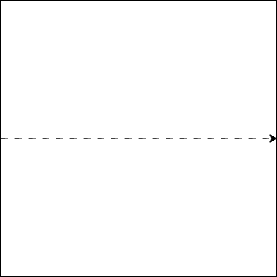
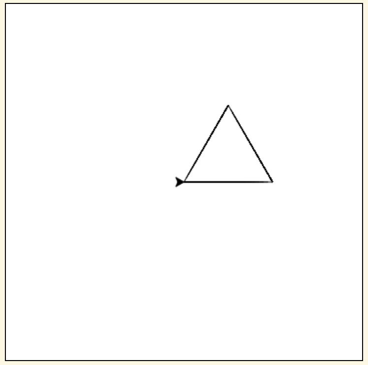
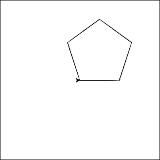
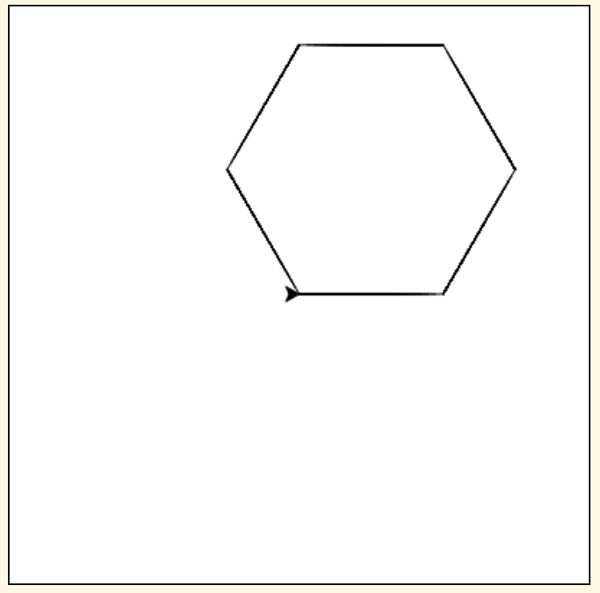
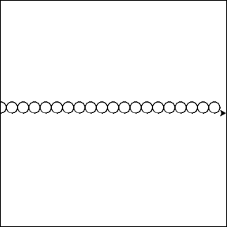
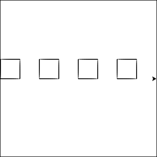
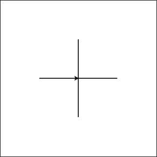
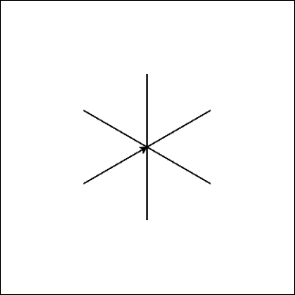

.. image:: ../img/Technovation-yellow-gradient-background.png
    :width: 500
    :align: center
    :alt: Technovation logo

Practice Makes Perfect
:::::::::::::::::::::::::::::::::::::::::::

.. parsonsprob:: pp-garden-plot

    -----
    import turtle
    =====
    # set the exterior dimensions, border width, and interior and border colors
    =====
    ext_length = 100
    ext_height = 150
    border_width = 20
    border_color = "tan"
    inter_color = "lightblue"
    =====
    # calculate the interior dimensions
    =====
    inter_length = ext_length - (2 * border_width)
    inter_height = ext_height - (2 * border_width)
    =====
    # calculate the areas of the interior and the border
    =====
    inter_area = inter_length * inter_height
    border_area = (ext_length * ext_height) - inter_area
    =====
    # draw the border
    =====
    turtle.up()
    x_coord = - (ext_length / 2)
    y_coord = - (ext_height / 2)
    turtle.goto(x_coord, y_coord)
    turtle.down()
    turtle.color(border_color)
    turtle.begin_fill()
    turtle.goto(x_coord + ext_length, y_coord)
    turtle.goto(x_coord + ext_length, y_coord + ext_height)
    turtle.goto(x_coord, y_coord + ext_height)
    turtle.goto(x_coord, y_coord)
    turtle.end_fill()
    =====
    # draw the interior
    =====
    turtle.up()
    x_coord = - (inter_length / 2)
    y_coord = - (inter_height / 2)
    turtle.goto(x_coord, y_coord)
    turtle.down()
    turtle.color(inter_color)
    turtle.begin_fill()
    turtle.goto(x_coord + inter_length, y_coord)
    turtle.goto(x_coord + inter_length, y_coord + inter_height)
    turtle.goto(x_coord, y_coord + inter_height)
    turtle.goto(x_coord, y_coord)
    turtle.end_fill()
    =====
    # write out the areas
    =====
    turtle.up()
    turtle.color("black")
    turtle.goto(x_coord - border_width, y_coord - 50)
    turtle.write("Border: " + str(border_area) + " sq. px.")
    turtle.goto(x_coord - border_width, y_coord - 70)
    turtle.write("Interior: " + str(inter_area) + " sq. px.")
    ======
    # hide the cursor
    turtle.hideturtle()

.. activecode:: command-review-wk2
   :language: python
   :nocodelens:

   import turtle

   # set the exterior dimensions, border width, and interior and border colors
   ext_length = 100
   ext_height = 150
   border_width = 20
   border_color = "tan"
   inter_color = "forestgreen"

   # calculate the interior dimensions
   inter_length = ext_length - (2 * border_width)
   inter_height = ext_height - (2 * border_width)

   # calculate the areas of the interior and the border
   inter_area = inter_length * inter_height
   border_area = (ext_length * ext_height) - inter_area

   # draw the border
   turtle.up()
   x_coord = - (ext_length / 2)
   y_coord = - (ext_height / 2)
   turtle.goto(x_coord, y_coord)
   turtle.down()
   turtle.color(border_color)
   turtle.begin_fill()
   turtle.goto(x_coord + ext_length, y_coord)
   turtle.goto(x_coord + ext_length, y_coord + ext_height)
   turtle.goto(x_coord, y_coord + ext_height)
   turtle.goto(x_coord, y_coord)
   turtle.end_fill()

   # draw the interior
   turtle.up()
   x_coord = - (inter_length / 2)
   y_coord = - (inter_height / 2)
   turtle.goto(x_coord, y_coord)
   turtle.down()
   turtle.color(inter_color)
   turtle.begin_fill()
   turtle.goto(x_coord + inter_length, y_coord)
   turtle.goto(x_coord + inter_length, y_coord + inter_height)
   turtle.goto(x_coord, y_coord + inter_height)
   turtle.goto(x_coord, y_coord)
   turtle.end_fill()

   # write out the areas
   turtle.up()
   turtle.color("black")
   turtle.goto(x_coord - border_width, y_coord - 50)
   turtle.write("Border: " + str(border_area) + " sq. px.")
   turtle.goto(x_coord - border_width, y_coord - 70)
   turtle.write("Interior: " + str(inter_area) + " sq. px.")

   # hide the cursor
   turtle.hideturtle()

|
|
|
| Let's take another look at drawing a square. How could we re-write it using a loop?

.. activecode:: square-loop
   :language: python
   :nocodelens:

   import turtle

   turtle.forward(100)
   turtle.left(90)

   turtle.forward(100)
   turtle.left(90)

   turtle.forward(100)
   turtle.left(90)

   turtle.forward(100)
   turtle.left(90)

|
|

| Let's use what we know about loops to draw a dashed line across the entire box!
| The code below draws two dashes. See if you can modify it to use a loop!

.. activecode:: dashed-line
   :language: python
   :nocodelens:

   import turtle

   # draw the first dash
   turtle.forward(10)

   # pick the pen up to leave white space between dashes
   turtle.penup()
   turtle.forward(10)

   # put the pen down and draw the second dash
   turtle.pendown()
   turtle.forward(10)

   turtle.penup()
   turtle.forward(10)

|
|

| Why stop with squares? Shapes with any number of sides can be drawn using a loop!
| Start with your code that draws a square. Then, change the number of times the loop
  repeats and the angle that you turn each time to see if you can draw these shapes.

.. activecode:: shapes-loop
   :language: python
   :nocodelens:

   import turtle

|
|

| Try converting you dashed line into a row of circles! Let's draw 20 circles, each with a radius of 10.

.. activecode:: circle-row
   :language: python
   :nocodelens:

   import turtle

|
|

| Try drawing a row of squares!

.. reveal:: square-row-hint
   :showtitle: Show hint
   :hidetitle: Hide hint

    For this problem, try using two loops! One to draw each square
    (same as in the first problem on this page), and another to draw
    the square *multiple times*

.. activecode:: square-row
   :language: python
   :nocodelens:

   import turtle

|
|

| Try drawing a plus sign using a loop!
| If you're not sure how to do it with a loop, try writing it out line by line first.
  Once you've got it drawing a plus sign, see if you can put any repeated code in a loop!

.. activecode:: plus
   :language: python
   :nocodelens:

   import turtle

|
|

| Now try modifying your code from the plus sign into an asterisk!
| Hint: you'll need to change the number of repetitions and the angle that you're turning each time

.. activecode:: asterisk
   :language: python
   :nocodelens:

   import turtle
