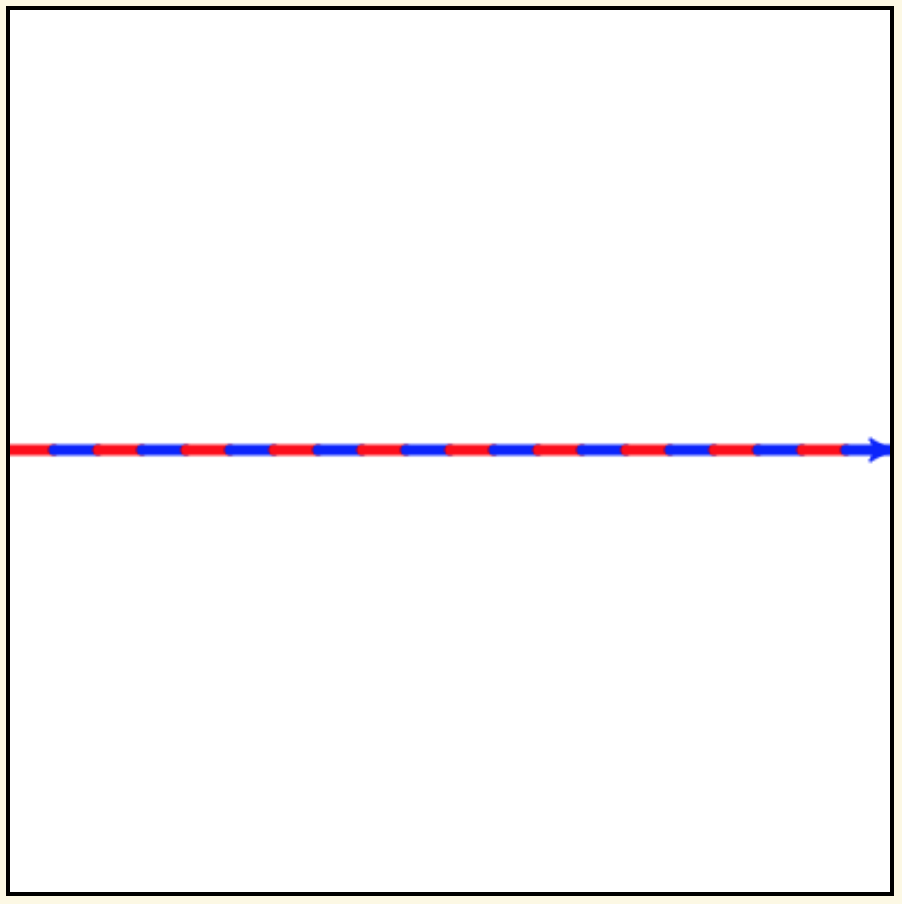

.. image:: ../img/Technovation-yellow-gradient-background.png
    :width: 500
    :align: center
    :alt: Technovation logo

Learning to Code |pumpkinMask|
:::::::::::::::::::::::::::::::::::::::::::

Variables and assignment 
-------------------------------------------

.. |pumpkinMask| image:: img/pumpkin-maskClipartLibraryDOTcomClipart-yTkaAqnTE.png
   :alt: Pumpkin mask from clipart-library.com
   :width: 90

A *variable* is a name that you use in your program to stand for a data object. 
You should choose meaningful names.
For example, you might use ``radius`` to stand for the length to make the radius
of a circle and ``area`` to stand for its area.
You use variables in your program to form *expressions*.
Informally, an expression is just code that an *interpreter* can evaluate to 
produce a data object.
For example, if ``radius`` stands for ``50``, then evaluating ``2 * radius``
produces ``100``--the diameter of a circle of radius ``50``.

In Python, a variable name must start with a letter (``a``--``z``, ``A``--``Z``) or
an underscore (``_``), and can contain only letters, digits (``0``--``9``) and 
underscores.

.. clickablearea:: variablenames
   :question: Click on the names that you could use for a variable in Python.
   :table:
   :correct: 1,1;1,2;1,3;2,2;3,1
   :incorrect: 2,1;2,3;3,2;3,3

   
   +------------+------------+------------+
   | x          | area51     | _square    |
   +------------+------------+------------+
   | l3.x       | Zero       | area-51    |
   +------------+------------+------------+
   | __16_      | a 1        | 6_dozen    |
   +------------+------------+------------+

An *assignment command* has the form ``var = expression``
where ``var`` stands for a variable name and ``expression`` stands for an expression.
Executing the assignment makes ``var`` stand for the data object produced
by evaluating ``expression``.
After the assignment, ``var`` can be used as a "stand in" for this data object.
The data object that a variable stands for is also called the
*value* of the variable.

A variable is like a label for a *container* (e.g., a file folder) 
that can hold just one object. 
In this analogy, an assignment to the variable is like putting something in 
this container.
The term "variable" is used because the value can change---since 
only one object fits in the container (variable), assigning it a new object
(value) replaces any object (value) already in it.

We illustrate this analogy using *Python Tutor*, 
a tool for visualizing how an interpreter executes a Python program. 
It lets you *step* through your program one line at a time and shows
you how the values of variables change.

Press the ``Next`` button below the code window and see how
Python Tutor shows what is going on in computer memory.

.. reveal:: re-abstraction-2-4-1
   :showtitle: Show more details for those who need to know 
   :hidetitle: Hide details 

    What's the deal with the appearance of ``pi`` in the memory
    diagram?
    In essence, the ``from math import pi`` command tells the interpreter
    to execute an assignment to a variable named ``pi``, which it
    can find in the ``math`` library that comes with Python.
    It would be a *run-time error* if there was no declaration for
    (assignment to) ``pi`` in this library.
    
    
    Of course, computer memory doesn't *really* consist of square
    containers with numeric values in them.
    Computer memory is just a bunch of circuits.
    Python Tutor is showing a *abstraction* of computer memory.
    Abstraction an important technique for helping organize complex
    information and algorithms in ways that people can understand.
    

.. codelens:: circle_calculations
   
   # Calculate the diameter,  
   # circumference and area of
   # a circle of radius 50
   
   # import pi from the math library
   from math import pi   
   
   radius = 50
   diameter = 2 * radius
   circumference = diameter * pi
   area = 2 * pi * radius * radius

You will learn a lot more about variables and assignment on
your programming journey.
But for today, we'll let Mike introduce you to one
other important notion---the *data type* of a value---and go
on to introducing loops.

.. raw:: html

   

      <iframe width="560" height="315" src="https://www.youtube.com/embed/m7szVmMta-o" frameborder="0" allow="accelerometer; autoplay; clipboard-write; encrypted-media; gyroscope; picture-in-picture" allowfullscreen></iframe>
   

One thing in this rap is different for Python: 
In Python, you declare a variable just by assigning a value to it---you don't 
indicate the datatype.
Rather, the interpreter figures out the datatype based on how the value is created.

We won't go into further details now since we can do a lot in Turtle Graphics
with just a basic understanding of these notions.

Loops
-----------------------

Do you ever get tired of repeating the same instructions over and over and over and over and over and ... over again? Or, after too many repetitions, do you start making mistakes?

One good thing about computers is that they don't! 
*Loops* are instructions that tell the interpreter to repeat a
section of code as many times as needed.
Python has two kinds of loop instructions--``for`` loops and ``while`` loops.

**The** ``for`` **loop**:

Recall the example program from last week to draw a square?
A skeleton versed in Python will mutter to itself...

.. image:: img/talkingSkeleton.png
   :alt: A skeleton saying "By golly… must be a new coder… somebody's got to teach ‘em about LOOPS!"
   :align: center
   :width: 300

Why? 
Because the code we wrote repeats the same two instructions four
times in a row.
A ``for`` loop is meant exactly for such situations.

Our skeleton would write this program as shown below.
Run this code to see that it draws a square.

.. activecode:: ac-for-loop-square
    :language: python
    :nocodelens:
    
    # draw a square of a given side length
    import turtle
    
    side_len = 100
    
    for i in range(4):
        turtle.forward(side_len)
        turtle.left(90)

The moral: If you can figure out the number of times the interpreter
should repeat some code, then use a ``for`` loop!

The simplest kind of ``for`` loop has the general form:

| ``for var in range(int_exp):``
|       ``loop_body_code``

where ``var`` stands for a variable, ``int_exp`` stands for an *integer
expression* (an expression that produces an integer when evaluated), 
and ``loop_body_code`` stands
for code that should be executed ``int_exp`` number of times.

Some important terminology and rules:

* The words ``for`` and ``in`` are called *keywords*.
  We'll learn lots more keywords in the meetings ahead.
  Never use a keyword for the name of a variable because the interpreter 
  uses keywords to figure out what kind of instruction you want it to execute.
  
* The code ``loop_body_code`` is called the *body* of the loop.
  It consists of one or more Python commands.
  Each command in the body *must* be indented 
  by the same number of spaces.
  The interpreter tells where the body of a loop
  starts and ends by the indentation.

  
**Code Along**
   
.. reveal:: re-turtle-2-4-2
   :showtitle: Show command summaries
   :hidetitle: Hide command summaries
   
   ``import turtle``

        Import the ``turtle`` module, which defines a ``turtle`` and
        all the ``turtle`` commands.
        
   ``turtle.speed(S)``
   
        Set the drawing speed to ``S`` (a number between 0 (slow) and 10 (fast)).
        
   ``turtle.color(C)``
   
        Set the pen color to be ``C`` (a color string or RBG number).
        
   ``turtle.pensize(T)``
   
        Set the pen thickness to ``T`` pixels.
        
   ``turtle.up()``
   
        Do not leave a trail when moving. 
        
   ``turtle.down()``
   
        Leave a trail when moving.

   ``turtle.forward(N)``

        Move forward ``N`` pixels.
        
   ``turtle.backward(N)``
   
        Move backward ``N`` pixels

   ``turtle.left(N)``

        Rotate towards the left (counter-clockwise) by ``N`` degrees.

   ``turtle.right(N)``

        Rotate towards the right (clockwise) by ``N`` degrees.

.. activecode:: ac-for-loop-triangle
   :language: python
   :nocodelens:
   
   Replace the last comment with a for-loop that 
   draws an equilateral triangle (with side-lenth 200 pixels).
   
   ~~~~
   
   # draw a triangle of side length 200 (pixels)
   
   import turtle
   
   side_length = 200
   
   # replace the comment with a for loop

   
.. parsonsprob:: pp-for-red-blue-line
   :adaptive:
   :language: python
   
   Use the code blocks on the left to construct a program 
   that draws the figure above. 
   Be careful of indentation.
   
   -----
   import turtle
   turtle.speed(10)
   turtle.pensize(5)
   =====
   turtle.up()
   =====
   turtle.goto(-200, 0)
   =====
   for i in range(10):
   =====
       turtle.down()
       turtle.color("red")
   =====
       turtle.forward(20)
   =====
       turtle.color("blue")
   =====
       turtle.forward(20)

.. reveal:: re-pp-strategy
   :showtitle: Show strategy suggestion
   :hidetitle: Hide suggestion
   
   After a failed attempt to solve the problem, 
   try entering the code that failed into the "sandbox" at the 
   bottom of this page
   and run it to see what it draws.
   The output from a failed run is likely to clue you into what
   is wrong and why.
   
   
.. image:: img/for-loop-blue-green-dashes.png
    :width: 250
    :align: center
    
.. parsonsprob:: pp-for-loop-dashes
   :adaptive:
   :language: python
   
   Use the code blocks on the left to construct a program 
   that draws the figure above. 
   -----
   import turtle
   turtle.speed(20)
   =====
   turtle.up()
   =====
   turtle.goto(-200, 0)
   =====
   for i in range(20):
       turtle.color("green")
   =====
       turtle.down()
       turtle.forward(10)
   =====
       turtle.up()
   =====
       turtle.left(90)
       turtle.forward(10)
   =====
       turtle.right(90)
       turtle.color("blue")
   =====
       turtle.down()
       turtle.forward(10)
   =====
       turtle.up()
   =====
       turtle.right(90)
       turtle.forward(10)
   =====
       turtle.left(90)

Additional important terminology and evaluation rules:
  
* ``range`` is the name of a Python *standard library function*.
  We'll learn about functions next week.
  For now, you just need to know that evaluation of ``range(int_exp)`` 
  produces a sequence of ``int_exp`` integers.
  Specifically, it produces the sequence:
  ``0``, ``1``, ``2``, ... , ``int_exp - 1``.
  (In computer science, it is convenient to start counting at ``0`` instead
  of ``1``.)
  
* The variable in the first line of a ``for`` loop is called the *loop variable*. 
  
* Each execution of the loop body is called an *iteration* of the loop.
  
* Just before each iteration, the
  interpreter assigns a value from ``range(int_exp)`` to ``var``, starting
  with ``0`` and in increasing order.
  
The last of these rules allows the commands in the loop body
to depend on the iteration being executed.
This next example illustrates this idea.

.. activecode:: ac-bulls-eye
   :language: python
   :nocodelens:
   
   # draw a "bull's eye" - three concentric cirles
   import turtle
   
   # the spacing (# of pixels) between circles
   spacing = 50
   
   for n in range(3):
   
       # set the radius for this iteration of the loop
       radius = (n+1) * spacing
       
       # get into position
       turtle.up()
       turtle.goto(0, -radius)
       
       # draw the circle
       turtle.down()
       turtle.circle(radius)

Check your understanding of this example by answering the following.

.. fillintheblank:: fb-for-loop-2-4-2-a

   The code editor numbers each line of code along the left side of 
   the window. 
   Use these numbers to indicate the first and last lines of the
   loop body in the spaces provided: First |blank|, Last |blank|
   
   - :7: Line 7 is the *loop header*, which is not considered part of the body. Try again.
     :8: The interpreter ignores blank lines. Try again.
     :9: Correct! The body of the loop starts at line 9.
     :x: Incorrect. Try again.
   - :18: Correct! The body of the loop ends at line 18.
     :x: Incorrect. Try again.
     
.. fillintheblank:: fb-for-loop-2-4-2-b

   How many iterations of the loop body are performed? |blank|
   
   - :3: Correct! The argument of ``range(3)`` is 3, so 3 iterations are performed.
     :x: Incorrect. Try 3.
     
.. fillintheblank:: fb-for-loop-2-4-2-c

   What value is assigned to ``radius`` the first time line 10 is
   executed? |blank|
     
   - :50: Correct! Evaluating ``range(3)`` produces the sequence ``0``, ``1``, ``2``.
          So ``n`` is assigned ``0`` on the first iteration of the loop. Because
          of this and the assignment of ``50`` to ``spacing``, 
          the expression ``(n+1) * spacing``
          evaluates as ``(0+1) * 50``, which produces ``50``.
     :x: Incorrect. Try 50.
     
     
.. fillintheblank:: fb-for-loop-2-4-2-d

   What value is assigned to ``radius`` the second time line 10 is
   executed? |blank|
     
   - :100: Correct! Evaluating ``range(3)`` produces the sequence ``0``, ``1``, ``2``.
           So ``n`` is assigned ``1`` on the second iteration. Because
           of this and the assignment of ``50`` to ``spacing``, 
           the expression ``(n+1) * spacing``
           evaluates as ``(1+1) * 50``, which produces ``100``.
     :x: Incorrect. Try 100.
     
     
.. ADD AN INCREMENTAL DEVELOPMENT SERIES. START WITH DRAWING A ROW OF ALTERNATING
   BLACK AND WHITE SQUARES. ADD LOGIC TO REPEAT THE ROW TO GET A ROW JUST ON
   TOP OF WHITE AND BLACK SQUARES. ADD LOGIC TO PROGRAM A CHESS BOARD.
   
   

**The Sandbox**

Use the active code window below as a *sandbox* in which to play
to learn more about coding. (Don't forget to import ``turtle``!)

.. activecode:: ac-stacked-circles
   :language: python
   :nocodelens:
   
   
   

   
   

