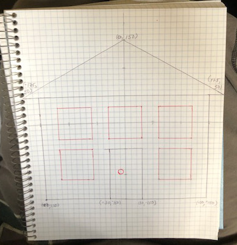
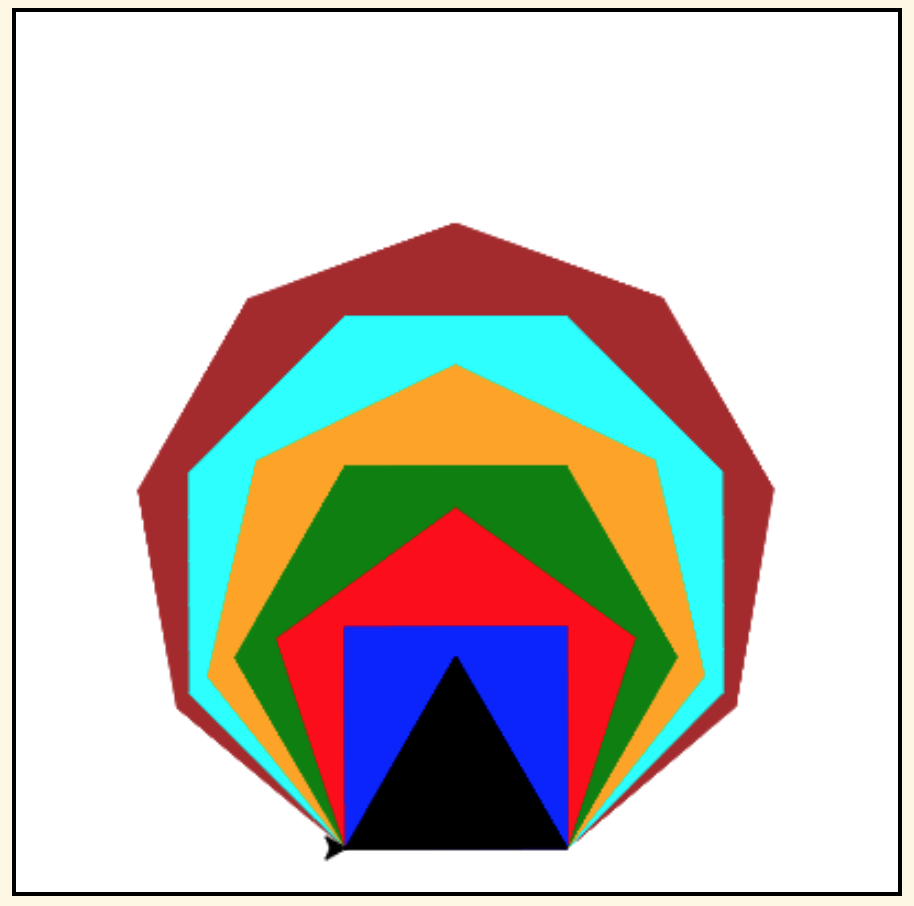
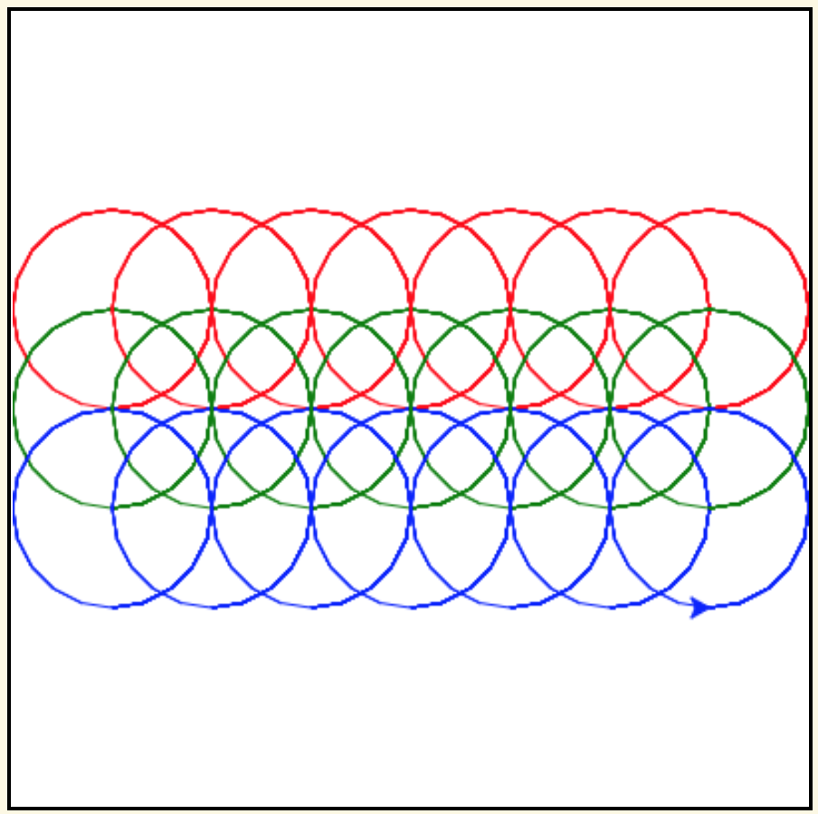

.. image:: ../img/Technovation-yellow-gradient-background.png
    :width: 500
    :align: center
    :alt: Technovation logo

Learning to Code: Functions
:::::::::::::::::::::::::::::::::::::::::::

If needed, you can see summaries of the ``turtle`` commands used in this section by
pressing the button below.

.. reveal:: re-turtle-commands-3-4
    :showtitle: Show a summary of commands
    :hidetitle: Hide the summary of commands
       
    ``import turtle``

        Import the ``turtle`` module, which defines a ``turtle`` and
        all of the ``turtle`` commands.
        
    ``turtle.speed(S)``
   
        Set the drawing speed to ``S``, a number between 0 (slow) and 10 (fast).
        
    ``turtle.color(C)``
   
        Set the pen color to be ``C``, a color string (https://trinket.io/docs/colors).
        
    ``turtle.setheading(A)``
    
        Set the direction of travel to ``A`` degrees (e.g., 0 = east, 90 = north,
        180 = west, 270 = south).
                
    ``turtle.hideturtle()``, ``turtle.showturtle()``
    
        Make the turtle invisible,
        make the turtle visible.
        
    ``turtle.begin_fill()``
    
        Begin drawing a shape to be filled.
    
    ``turtle.end_fill()``
    
        Fill the shape drawn since the last ``begin_fill()`` command.
        
    ``turtle.up()``,  ``turtle.down()``
   
        Do not leave a trail when moving,
        leave a trail when moving.
        
    ``turtle.goto(X, Y)``
    
        Move straight to the pixel with coordinates (``X``, ``Y``).
        
    ``turtle.forward(L)``, ``turtle.backward(L)``
    
        Move forward (in the direction of travel) by ``L`` pixels,
        move backward (opposite to the direction of travel) by ``L`` pixels
        
    ``turtle.left(D)``, ``turtle.right(D)``
    
        Rotate left (counter-clockwise) by ``D`` degrees, 
        rotate right (clockwise) by ``D`` degrees

    ``turtle.circle(R)``
    
        Move counter-clockwise in the direction of travel
        and in a circle of radius ``R`` pixels.
        

Run the code below to see what it draws.

.. activecode:: ac-house-no-funcs
    :language: python
    :nocodelens:
    
    import turtle
    turtle.speed(10)

    # draw the frame for house
    turtle.up()
    turtle.goto(-150,-150)
    turtle.down()

    turtle.color("blue")
    turtle.begin_fill()
    for i in range(2):
        turtle.forward(300)
        turtle.left(90)
        turtle.forward(200)
        turtle.left(90)
    turtle.end_fill()

    # draw the front door
    turtle.up()
    turtle.goto(-30, -150)
    turtle.down()

    turtle.color("brown")
    turtle.begin_fill()
    for i in range(2):
        turtle.forward(60)
        turtle.left(90)
        turtle.forward(100)
        turtle.left(90)
    turtle.end_fill()

    # draw the bottom right window
    turtle.up()
    turtle.goto(60, -110)
    turtle.down()

    turtle.color("white")
    turtle.begin_fill()
    for i in range(4):
        turtle.forward(60)
        turtle.left(90)
    turtle.end_fill()                  

    # draw the bottom left window
    turtle.up()
    turtle.goto(-120, -110)
    turtle.down()

    turtle.color("white")
    turtle.begin_fill()
    for i in range(4):
        turtle.forward(60)
        turtle.left(90)
    turtle.end_fill()                  

    # draw the top left window
    turtle.up()
    turtle.goto(-120, -30)
    turtle.down()

    turtle.color("white")
    turtle.begin_fill()
    for i in range(4):
        turtle.forward(60)
        turtle.left(90)
    turtle.end_fill()                  

    # draw the top middle window
    turtle.up()
    turtle.goto(-30, -30)
    turtle.down()

    turtle.color("white")
    turtle.begin_fill()
    for i in range(4):
        turtle.forward(60)
        turtle.left(90)
    turtle.end_fill()                  

    # draw the top right window
    turtle.up()
    turtle.goto(60, -30)
    turtle.down()

    turtle.color("white")
    turtle.begin_fill()
    for i in range(4):
        turtle.forward(60)
        turtle.left(90)
    turtle.end_fill()                  

    # draw the roof
    turtle.up()
    turtle.goto(-175, 50)
    turtle.down()

    turtle.color("gray")
    turtle.begin_fill()
    turtle.goto(175, 50)
    turtle.goto(0, 150)
    turtle.goto(-175, 50)
    turtle.end_fill() 

    # draw the door knob
    turtle.up()
    turtle.goto( -10, -100)
    turtle.down()

    turtle.color("black")
    turtle.begin_fill()
    turtle.circle(6)
    turtle.end_fill()

    # hide the turtle 
    turtle.hideturtle()

Before writing the code, we designed the house on a graph paper.
We counted each square as 10 pixels.

    
When writing the code, we added a comment at the start of the code that 
draws the different parts of the house---a frame, door,
windows, roof, and door knob---to help us remember how the code works.
Do you see how the hand-drawn design and
the sections of code match up?
    
.. shortanswer:: sa-compare-code-1
   :optional: 
   
   Compare the code that draws the frame of the house (lines 5--16) 
   with the code that draws the door (lines 19--30).
   What do you notice about these two sections of code?
   
   (Suggestion: Drag the bottom right corner of the code editor window
   down farther to see more of the program at a time.)
   
.. shortanswer:: sa-compare-code-2
   :optional:    
   
   Compare the code that draws the top left window (lines 57--66)
   with the code that draws the top middle window (lines 69--78). 
   What do you notice about these two sections of code?

Maybe you aren't surprised that these sections of code are so similar. 
The house and the door are both colored rectangles,
and the two windows are both colored squares,
so you might think the code to draw them would be almost the same.

But this might also make you wonder: 
Wouldn't code for drawing this house be much easier to write (and read)
if Python had commands for drawing colored rectangles, squares
and triangles?

*FUNCTIONS TO THE RESCUE:* 
You can create functions to teach the interpreter new commands!

A function is kind of like a recipe.
If you write down a recipe for making jelly from 
"fruit," "a sweetner," and some sort of "clear liquid,"
then you can use that recipe to create different kinds of fruit jellies.
You can make cherry jelly from a bushel of cherries, refined sugar, and tap water.
And you can also make blueberry jelly from a basket of blueberries,
unrefined sugar, and apple juice.
And so on.
When you follow the recipe, you use actual berries that you bought or
picked yourself where the recipe says "fruit" and the sugar you have on hand
where it says "a sweetener" and tap water or other (clear)
beverage where it says "clear liquid". 

.. activecode:: ac-func-warmup
    :language: python
    :nocodelens:
    
    To see how code can be like a recipe, run the program below.
    Then modify it to check out your answers to the questions that follow.
    
    ~~~~
    import turtle
    
    X = -150
    Y = -150
    W = 300
    H = 200
    C = "blue"
    
    turtle.up()
    turtle.goto(X, Y)
    turtle.down()

    turtle.color(C)
    turtle.begin_fill()
    for i in range(2):
        turtle.forward(W)
        turtle.left(90)
        turtle.forward(H)
        turtle.left(90)
    turtle.end_fill()
    

.. fillintheblank:: fb-recipe-1

    What values should you assign to the variables in the above program 
    to get it to draw a brown door (with no door knob) at the position and 
    size of the one in our drawing?
    
    X = |blank| 
    Y = |blank| 
    W = |blank| 
    H = |blank| 
    C = |blank|
    
    - :-30: Correct!
      :x: Incorrect. Run the code to see where the rectangle begins 
          if you use  this ``X`` value. 
          Then try another value.
    - :-150: Correct!
      :x: Incorrect. Run the code to see where the rectangle begins if you use  
          this ``Y`` value.
          Then try another value.
    - :60: Correct!
      :x: Incorrect. Run the code to see how wide the rectangle is if you use 
          this ``W`` value.
          Then try another value.
    - :100: Correct!
      :x: Incorrect. Run the code to see how high the rectangle is if you use 
          this ``H`` value.
          Then try another value.
    - :"brown": Correct!
      :x: Incorrect. This should be the fill color (``"brown"``).
          Don't forget the quotes.

.. fillintheblank:: fb-recipe-2

    What values should you assign to the variables in the above program 
    to get it to draw a purple square that is centered in the canvas
    and is 200 pixels on each side?
    
    X = |blank| 
    Y = |blank| 
    W = |blank| 
    H = |blank| 
    C = |blank|
    
    - :-100: Correct!
      :x: Incorrect. Run the code to see where the shape begins if you use this ``X`` value. 
          Then try another value.
    - :-100: Correct!
      :x: Incorrect. Run the code to see where the shape begins if you use  this ``Y`` value.
          Then try another value.
    - :200: Correct!
      :x: Incorrect. Run the code to see how wide the shape is if you use  this ``W`` value.
          Then try another value.
    - :200: Correct!
      :x: Incorrect. Run the code to see how high the shape is if you use  this ``H`` value.
          Then try another value.
    - :"purple": Correct!
      :x: Incorrect. This should be the fill color (``"purple"``).
          Don't forget the quotes.

 
So, in a way, the code

.. raw:: html
    
    

        <pre>
    turtle.up()
    turtle.goto(X, Y)
    turtle.down()

    turtle.color(C)
    turtle.begin_fill()
    for i in range(2):
        turtle.forward(W)
        turtle.left(90)
        turtle.forward(H)
        turtle.left(90)
    turtle.end_fill()
        </pre>
    

is like a recipe for 
drawing a colored rectangle, and values for the variables are 
like ingredients to use when following the recipe: 
If you indicate the ingredients to use (values for the variables) and
provide a recipe (*function definition*),
the interpreter can perform the assignments and then follow the recipe 
(execute code it finds in the function definition) to draw a rectangle.

The active code below contains an example of a function definition for 
a ``draw_rectangle`` command. 

.. activecode:: ac-draw-rect
    :language: python
    :nocodelens:
    
    Run this program to define a ``draw_rectangle`` function.
    
    ~~~~
    
    import turtle
    
    def draw_rectangle(X, Y, W, H, C):
        """draw a rectangle with lower left corner at (X, Y), width W, 
        height H, and color C"""
        
        turtle.up()
        turtle.goto(X, Y)
        turtle.down()

        turtle.color(C)
        turtle.begin_fill()
        for i in range(2):
            turtle.forward(W)
            turtle.left(90)
            turtle.forward(H)
            turtle.left(90)
        turtle.end_fill()
        
It doesn't *look like* running the program does anything.
*But it does!* Running the program teaches the interpreter a new command. 

To see this, add the following commands starting on line 20 in the code editor.
Be careful **not** to indent either command.
They both need to start in the first column.
These commands are called *function calls*.

.. raw:: html
    
    

        <pre>
    draw_rectangle(-150, -150, 300, 200, "blue")
    draw_rectangle(-30, -150, 60, 100, "brown")
        </pre>
    

    
Add five additional ``draw_rectangle`` function calls to draw the windows. 

Next, let's create a ``draw_isosceles_triangle`` command for
drawing the roof.
We'll start by deciding on variables to stand for the values
the coder will need to supply when calling ``draw_isosceles_triangle``. 
We'll use:

* ``X`` for the x-coordinate of the triangle's bottom-left pixel

* ``Y`` for the y-coordinate of the triangle's bottom-left pixel

* ``B`` for the length (in pixels) of the triangle's base

* ``H`` for the height (in pixels) of the triangle

* ``C`` for the color of the triangle

The sketch below shows how the values for these variables
can be used to determine
the coordinates for the vertices of the triangle.

.. image:: img/isos-triangle-sketch.jpg
    :width: 300
    :align: center

This drawing suggests the code below as a recipe for drawing an
isosceles triangle.
But before creating a function from the code, let's test it.

.. activecode:: ac-triangle-warmup
    :language: python
    :nocodelens:
    
    Replace the comment at the start of this code
    with assignments so that the code will draw
    the roof for a house.
    
    ~~~~
    
    import turtle
    
    # Replace this comment with the necessary assignments 
    
    turtle.up()
    turtle.goto(X, Y)
    turtle.down()

    turtle.color(C)
    turtle.begin_fill()
    turtle.goto(X + B, Y)
    turtle.goto(X + (B/2), Y + H)
    turtle.goto(X, Y)
    turtle.end_fill()
  
Now use this code to complete the definition
for a ``draw_isosceles_triangle`` function in the
program below.
Then add a call to the function to draw a roof.

.. activecode:: ac-triangle-function
    :language: python
    :nocodelens:
    
    Complete the function definition for ``draw_isosceles_triangle``
    and add a call to 
    the function to draw the roof. 
    
    (Suggestion: To see more of the program in the editor
    window, enlarge it by dragging
    down on the bottom-right corner.)
    
    ~~~~
    
    import turtle
    turtle.speed(10)
         
    def draw_rectangle(X, Y, W, H, C):
        """draw a rectangle with lower left corner at (X, Y), width W, 
        height H, and color C"""
        
        turtle.up()
        turtle.goto(X, Y)
        turtle.down()

        turtle.color(C)
        turtle.begin_fill()
        for i in range(2):
            turtle.forward(W)
            turtle.left(90)
            turtle.forward(H)
            turtle.left(90)
        turtle.end_fill()
    
    def draw_isosceles_triangle(X, Y, B, H, C):
        """draw an isosceles triangle with lower left corner at (X, Y), 
        base of length B, height H, and color C"""
           
        # replace with the function body

    # draw the frame of the house
    draw_rectangle(-150, -150, 300, 200, "blue")
    # draw the door
    draw_rectangle(-30, -150, 60, 100, "brown")
    
    # draw the bottom windows, from left to right
    draw_rectangle(-120, -110, 60, 60, "white")
    draw_rectangle(60, -110, 60, 60, "white")
    
    # draw the top windows, from left to right
    draw_rectangle(-120, -30, 60, 60, "white")
    draw_rectangle(-30, -30, 60, 60, "white")
    draw_rectangle(60, -30, 60, 60, "white")
    
    # draw the roof
    
 
The program should now draw everything except the door knob. 

.. reveal:: rv-function-terminology
    :showtitle: Show important terminology used with functions
    :hidetitle: Hide important terminology used with functions
    
    **Important Function Terminology**
    
    * The first line of a function definition is called the *function header* ---
      e.g., 
      
      ``def draw_rectangle(X, Y, W, H, C):``. 
 
      - ``def`` is a *key word*. 
        (Don't use a key word to name a variable because the interpreter uses it for 
        other purposes --- e.g., to 
        recognize a function definition.)
        
      - The name immediately after ``def`` is the *function name* --- e.g., ``draw_rectangle``. 
        
      - The variables in parentheses after the function name are called *parameters* --- e.g., 
        ``X``, ``Y``, ``W``, ``H``, ``C`` are the ``draw_rectangle`` parameters. 
        
      - **Don't forget the final semi-colon!**
        
    * The code indented beneath a function header is called the *function body*
      --- e.g., lines 6--20 in ac-triangle-function_ are the body of ``draw_rectangle``.

    * The triple-quoted string immediately after the function header is called a *doc string*.
      A doc string should briefly describe what the function does and the purpose of 
      each parameter.
    
    * A *function call* consists of a function name followed
      by a list of expressions, one for each parameter, separated by commas and
      enclosed in parenthesis --- e.g., 
      
      ``draw_rectangle(-120, -30, 60, 60, "white")``.
      
      The expressions in a function call are called *arguments* --- e.g., in the
      example call to ``draw_rectangle``, ``-120``
      is the first argument, ``-30`` is the second argument, etc.
      Parentheses are required even if a function call has no arguments.
      
    
    
**Some exercises to help solidify your understanding**

Arrange the code blocks below into a definition
for a function, called ``draw_poly``, that draws a
filled regular polygon.
Drawing should start at the current
location and use the current direction of travel of the ``turtle``.
The polygon should have ``N`` sides, each of length ``L``, and be
filled using color ``C``. 

To understand the calculation for ``turn_angle``, 
see the `explanation of the angles formed by a regular polygon`__ .
       
.. _PolygonExplanation: https://www.bbc.co.uk/bitesize/guides/zshb97h/revision/6

__ PolygonExplanation_

.. parsonsprob:: pp-draw-poly
    :adaptive:
    :language: python

    import turtle
    =====
    def draw_poly( N, L, C ):
    =====
        """filled N-sided polygon with side length L, pen color C"""
    =====
        turtle.color( C )    
        turn_angle = 360 / N
    =====
        turtle.begin_fill()
    =====
        for i in range( N ):
    =====
            turtle.forward( L )
            turtle.left( turn_angle )
    =====
        turtle.end_fill()
        

.. activecode:: ac-reg-poly
    :language: python
    :nocodelens:
    
    Finish the program below to draw a diagram like that shown above.
    Specifically, add a body for ``draw_poly`` and appropriate code after the
    comments.
    
    ~~~~
    
    import turtle
    turtle.speed(10)

    def draw_poly( N, L, C ):
        """Draw a N-sided regular polygon with lower left corner at (X, Y),
        side length L, and pen color C"""
        

    # move to the starting location
    
    
    # draw the polygons

    
    

The ``turtle.circle`` command can be tricky to use because the angle
of the ``turtle`` affects how the circle is drawn. 
For an example, run the following code.
In this example, all the circles are drawn starting at the
origin and with the same radius; 
but the direction the turtle is facing is
different. 
We use different colors to make it easier to match up the circles
with the commands that draw them.

.. activecode:: ac-circle-direction
    :language: python
    :nocodelens:
    
    import turtle
    
    turtle.color("blue")
    turtle.circle(50)
    
    turtle.color("green")
    turtle.left(180)
    turtle.circle(50)
    
    turtle.color("red")
    turtle.left(45)
    turtle.circle(50)
    

To simplify drawing circles, we can define a ``draw_circle`` function
with parameters that stand for the coordinates of the center of the circle, 
the radius, and the pen color.

    
    
.. parsonsprob:: pp-circles
    :adaptive:
    :language: python
   
    Arrange the code blocks into a program
    that defines and calls a ``draw_circle`` function and
    then draws the figure above.
    -----
    import turtle
    turtle.speed(10)
    =====
    def draw_circle(X, Y, R, C):
        "draw a circle with center at (X, Y), radius R, and pencolor C"
    =====
        turtle.setheading(0)
        turtle.up()
    =====
        turtle.goto(X, Y - R)
        turtle.color(C)
    =====
        turtle.down()
        turtle.circle(R)
    =====
    for i in range(7):
    =====
        draw_circle(-150 + i*50, 50, 50, "red")
        draw_circle(-150 + i*50, 0, 50, "green")
        draw_circle(-150 + i*50, -50, 50, "blue")
        
        

 
    
    
    

   

