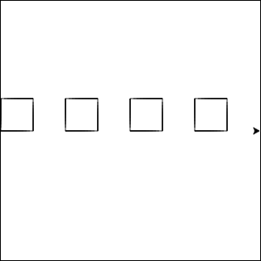
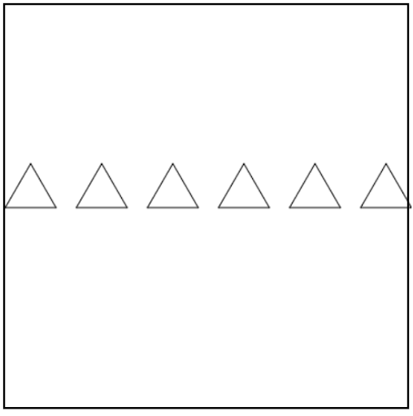
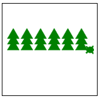
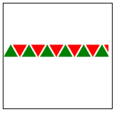

.. image:: ../img/Technovation-yellow-gradient-background.png
    :width: 500
    :align: center
    :alt: Technovation logo

Practice Makes Perfect
:::::::::::::::::::::::::::::::::::::::::::

.. table:: Here's a reminder of the commands we learned last week:
   :widths: auto
   :align: left

   ==========================  =========================
   Command                     What does it do?
   ==========================  =========================
   ``forward( distance )``     Move forward a specified distance
   ``backward( distance )``    Move backward a specified distance
   ``left(90)``                Turns 90 degrees to the left (you can use any angle, not just 90!)
   ``right(90)``               Turns 90 degrees to the right
   ``circle( radius )``        Draws a circle with the specified radius
   ``goto( x, y )``            Move straight to the position with coordinates (x, y). *Note: the center is (0, 0)*
   ``up()``                    Stop leaving a trail
   ``down()``                  Start drawing a trail
   ``color( c )``              Set the color to *c* (https://trinket.io/docs/colors)
   ``for i in range( n ):``    Repeat *n* times
   ==========================  =========================

|
|

.. table:: And here are the new commands we'll be learning this week!
   :widths: auto
   :align: left

   ==========================  =========================
   Command                     What does it do?
   ==========================  =========================
   ``begin_fill()``            Starts filling in drawn shapes
   ``end_fill()``              Stops filling in drawn shapes
   ``speed(number 0-10)``      Determines how quickly the turtle will move through commands
   ``def function_name():``    Creates and defines a new function
   ``function_name()``         Calls a function
   ==========================  =========================

|
|
|
| First, let's do a quick review of loops by drawing a square using a loop.
  Then, we can use that code to check out what these new commands do!

.. activecode:: square-loop-review
   :language: python
   :nocodelens:
   
   import turtle

|
|
|

| Let's combine what we know about loops with the square function 
  we wrote in the last exercise to draw a row of squares.

.. activecode:: square-row-func
   :language: python
   :nocodelens:
   
   import turtle

|
|
|

| Try modifying your code from the previous exercise to draw a row of triangles instead.
  Feel free to add color or fill in the triangles!

.. activecode:: triangle-row-func
   :language: python
   :nocodelens:
   
   import turtle

|
|
|

.. image:: img/stars.png
   :alt: Image of a yellow stars on a blue background drawn with Python Turtle
   :align: center
   :width: 300

| Let's take what we know about loops and functions to draw a starry night sky

.. reveal:: star-hint
   :showtitle: Show hint
   :hidetitle: Hide hint
    
   | To draw the star, you'll need to repeat the following actions 5 times:

   - move forward 50 pixels
   - turn left 144 degrees

.. activecode:: starry-night
   :language: python
   :nocodelens:
   
   import turtle

   def star():
       # put the commands to draw a star here

   # once you can draw one star, try moving around and adding more to the sky!
   star()

|
|
|

| How can we use what we know to draw a forest of pine trees?

- How might you draw a forest? Draw a bunch of pine trees!
- How might you draw a pine tree? Draw a stack of triangles!
- How might you draw a stack of triangles? Draw individual triangles offset in a loop!

.. reveal:: forest-hint
   :showtitle: Show hint
   :hidetitle: Hide hint
    
   | Follow these steps if you get stuck:
   | 1. Teach your turtle how to draw a ``triangle()`` using a for loop
   | 2. Teach your turtle how to draw a ``tree()`` by calling ``triangle()`` inside of a loop
   | 3. Teach your turtle how to draw a ``forest()`` by calling ``tree()`` inside of a loop
   | 4. Call your ``forest()`` function, and watch the magic happen!

.. activecode:: forest
   :language: python
   :nocodelens:
   
   import turtle

   # write a function to draw a triangle

   # write a function to draw a tree that calls your triangle function

   # write a function that draws a forest by calling your tree function

|
|
|

| Use the starter code below to draw a row of triangles!

.. activecode:: color-triangle-row
   :language: python
   :nocodelens:
   
   import turtle

   ##################### define your functions here ######################

   def up_triangle():
       turtle.color("green")   # try changing the colors!
       turtle.down()
       turtle.begin_fill()
       for i in range(3):
           # teach your turtle how to draw a right-side-up triangle!
       turtle.end_fill()
       turtle.up()
   
   def down_triangle():
       turtle.color("red")   # try changing the colors!
       turtle.down()
       turtle.begin_fill()
       # hint: turn 60 before you start looping to make it upside down!
       for i in range(3):
           # teach your turtle how to draw an upside-down triangle!
       # hint: turn 60 back the other way to reset the turtle on track!
       turtle.end_fill()
       turtle.up()
    
    ############################ main code ############################

   
   turtle.penup()
   turtle.setposition(-200, 0)

   for i in range(6):
       # tell the turtle to draw a right side up triangles then move forward
       # tell the turtle to draw an upside-down triangle then move forward

