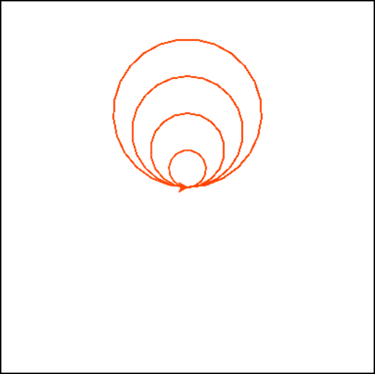

.. image:: ../img/Technovation-yellow-gradient-background.png
    :width: 500
    :align: center

Attendance
:::::::::::::::::::::::::::::::::::::::::::

.. raw:: html

    

        <iframe src="https://docs.google.com/forms/d/e/1FAIpQLScqnRHB8e83rjuBfDEZkNjmsX4wpxJRSAuY5Apv7JHRkWiqBA/viewform?embedded=true" width="640" height="2175" frameborder="0" marginheight="0" marginwidth="0">Loading…</iframe>
    

    

.. table:: Turtle Commands
   :widths: auto
   :align: left

   ============================  =========================
   Command                       What does it do?
   ============================  =========================
   ``forward( L )``              Moves forward ``L`` pixels
   ``backward( L )``             Moves backward ``L`` pixels
   ``left( D )``                 Turns ``D`` degrees to the left 
   ``right( D )``                Turns ``D`` degrees to the right
   ``circle( R )``               Draws a circle with radius ``R``
   ``goto( X, Y )``              Moves straight to the pixel with coordinates (``X``, ``Y``). *Note: the center is (0, 0)*
   ``up()``                      Stops leaving a trail
   ``down()``                    Starts drawing a trail
   ``color( C )``                Sets the color to ``C`` (https://trinket.io/docs/colors)
   ``for i in range( N ):``      Repeats ``N`` times
   ============================  =========================

|
|
|

.. image:: img/warmup-square.png
   :alt: Image of an orange square drawn with Python Turtle
   :width: 24 %
.. image:: img/warmup-shapes.PNG
   :alt: Image of four shapes drawn with Python Turtle
   :width: 24 %

.. image:: img/warmup-flower.PNG
   :alt: Image of circles forming a flower drawn with Python Turtle
   :width: 24 %

|
| Try using the commands above to draw something cool!
  If you need some inspiration, try drawing some of these shapes!
|

.. activecode:: wk4-warmup
   :language: python
   :nocodelens:
   
   import turtle
   
   # try drawing something cool!