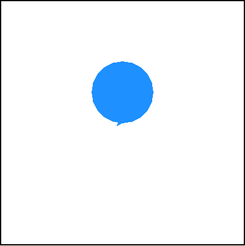
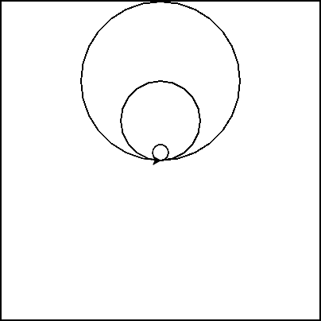
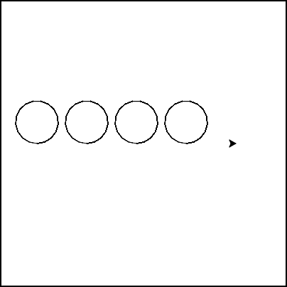
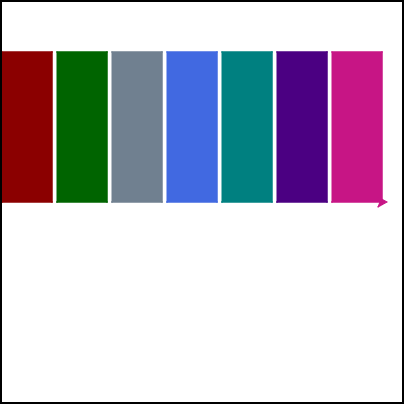

.. image:: ../img/Technovation-yellow-gradient-background.png
    :width: 500
    :align: center
    :alt: Technovation logo

Practice Makes Perfect
:::::::::::::::::::::::::::::::::::::::::::

.. table:: Here's a reminder of the drawing commands we've learned so far:
   :widths: auto
   :align: left

   ==========================  =========================
   Drawing commands             What does it do?
   ==========================  =========================
   ``forward( distance )``     Move forward a specified distance
   ``backward( distance )``    Move backward a specified distance
   ``left(90)``                Turns 90 degrees to the left (you can use any angle, not just 90!)
   ``right(90)``               Turns 90 degrees to the right
   ``circle( radius )``        Draws a circle with the specified radius
   ``goto( x, y )``            Move straight to the position with coordinates (x, y). *Note: the center is (0, 0)*
   ``up()``                    Stop leaving a trail
   ``down()``                  Start drawing a trail
   ``color( c )``              Set the color to *c* (https://trinket.io/docs/colors)
   ``begin_fill()``            Starts filling in drawn shapes
   ``end_fill()``              Stops filling in drawn shapes
   ``speed(number 0-10)``      Determines how quickly the turtle will move through commands
   ==========================  =========================

|

.. table:: Functions and Loops
   :widths: auto
   :align: left

   ==========================  =========================
   Drawing commands             What does it do?
   ==========================  =========================
   ``for i in range( n ):``    Repeat *n* times
   ``def function_name():``    Creates and defines a new function
   ``function_name()``         Calls a function
   ==========================  =========================

|

.. table:: And here are the new commands we'll be learning this week!
   :widths: auto
   :align: left

   ===============================  =========================
   Command                          What does it do?
   ===============================  =========================
   ``print( message )``             Output the message
   ``variable = value``             Stores the value in your variable
   ``variable = input( message )``  Takes user input and stores it in your variable
   ===============================  =========================

|
|
| What are *variables* and *user input* all about?
|
|

.. raw:: html

    

        <iframe src="https://docs.google.com/presentation/d/e/2PACX-1vQ5Fjx7Z3YBTJ5I0C_rweTub6V-oQOPznzKHjNEVx8rxM9FiQ_PCpbrZ8bv8m7tmej7K0JlfsRcma9-/embed?start=false&loop=false&delayms=3000" frameborder="0" width="700" height="400" allowfullscreen="true" mozallowfullscreen="true" webkitallowfullscreen="true"></iframe>
    

|
|
| Let's test out how to use variables! Use the code below or
 `python tutor <http://pythontutor.com/visualize.html#mode=edit>`_
  to walk through some examples.
|
|

.. activecode:: variables-code-along
   :language: python
   :nocodelens:
   
   import turtle

   # our variable 'x' is a container that can hold different values.
   # any time we say 'x = ...', we're telling our computer what to put in the container.

   x = 10
   print(x)
   x = 20
   print(x)

   x = input('Enter a value for x')
   print(x)

|
|

| How could you use variables and user input to draw different colored circles?

.. activecode:: color-input
   :language: python
   :nocodelens:
   
   import turtle

   # start by drawing a regular filled in circle in a color of your choice
   # then modify your code to get the color from the user

|
|

| How could you use variables and user input to draw different *sized* circles?
  Run the code below to see how you can use variables with turtle commands.
  Try changing the radius variable to see what it does!
| Then try drawing a third cirlce that gets the radius value from the user!

.. activecode:: radius-input
   :language: python
   :nocodelens:
   
   import turtle

   radius = 50
   turtle.circle(radius)

   radius = 100
   turtle.circle(radius)

|
|

| How could we repeat code as many times as the user wants?
| Let's combine what we know about user input with what we know about loops!

.. activecode:: loop-input
   :language: python
   :nocodelens:
   
   import turtle

   # start writing a loop that draws three circles
   # Add a line that asks the user how many times to repeat
   # Use the input to tell the loop how many times to repeat!

|
|

| How could you use variables and user input to draw a *library*?
| Every library must have books - could you define a function to draw a book?
| Then, could you take user input to set the color of each book?
| Give it a try!

.. activecode:: colorful-library
   :language: python
   :nocodelens:
   
   import turtle
   import sys
   sys.setExecutionLimit(60000)

   def book():
       # define a function that draws one book

   
   
   book()

   # once you can successfully draw one book, add a loop that draws the books
   # in your loop, add code that asks the user for a color, then uses their input to set the color
