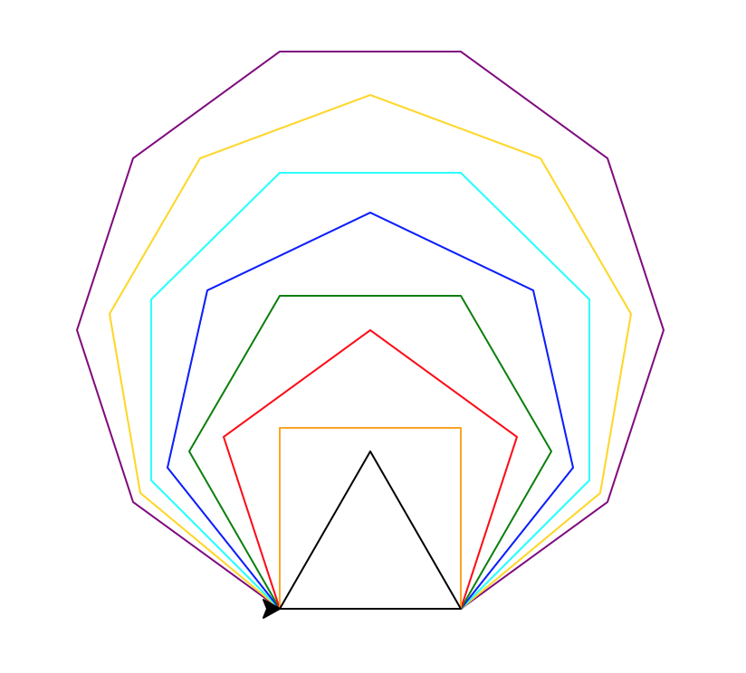
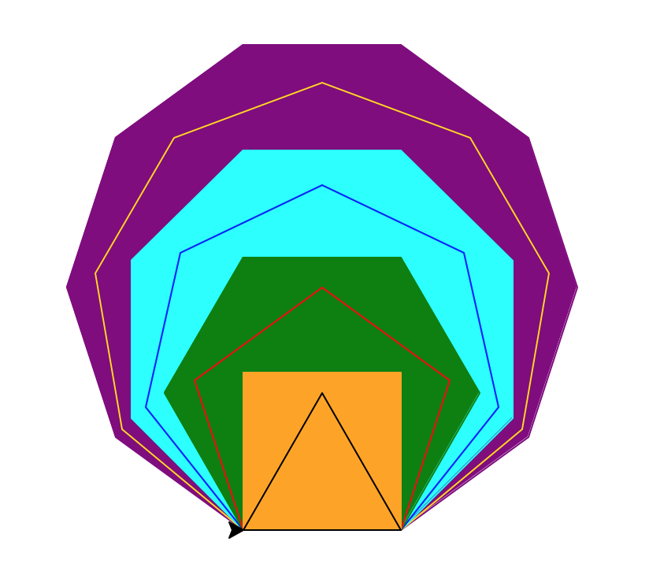

.. image:: ../img/Technovation-yellow-gradient-background.png
    :width: 500
    :align: center
    :alt: Technovation logo

Learning to Code: If Commands
:::::::::::::::::::::::::::::::::::::::::::

Making code interactive
-------------------------

Remember user input last week? 
We can let the user decide what the turtle will draw
by introducing an *if command*.  
Making a program interactive makes it a lot more fun! 

For example, the code in the box below lets the user say if the
``turtle`` should draw a circle or not. 

.. activecode:: first_if
    :language: python
    :nocodelens:

    Run the code below twice.
    Enter ``yes`` at the prompt on one of the runs, and something else on the other.
    (After running it once, if you are not able to press the ``Run`` button, try
    refreshing the page.)
    ~~~~
    # an example interactive program

    import turtle

    answer = input("Would you like me to draw a circle?\nEnter 'yes' or 'no': ")
    
    if answer == "yes":
        turtle.circle(50)

.. reveal:: re-first_if
    :showtitle: Show a line-by-line explanation of this code
    :hidetitle: Hide the line-by-line explanation

    ``import turtle``

        *Import* the code from the ``turtle`` module (a Python library program). 
        Importing a module allows you to use objects (functions, variables, etc.) 
        from that module in writing your own program.

    ``answer = input("Would you like me to draw a circle?\nEnter 'yes' or 'no': ")``

        Prompt the user to enter ``yes`` or ``no``, and save the answer in the variable 
        named ``answer``. 
        Remember variables from before? 
        The variable ``answer`` is like a container. 
        The label on the outside of the container is ``answer``,
        and inside the container is the string of characters that the user typed. 
        If the user typed ``yes``,
        then ``answer`` is equal to ``"yes"``, 
        and if the user typed ``no``, then ``answer`` is equal to ``"no"``. 
        
        The ``\n`` in the string is called a ``control character``. Specifically,
        it prints as a *new line*, like you get when you press the
        ``enter`` key on your keyboard. It causes the prompt in the input
        box to print on two lines.
        
        In a string, the *backslash* character (``\``) *escapes* the character that immediately follows it.
        The backslash and the following character make up a single, special character.
        Some useful control characters in Python include:
        
        * ``\n`` -- new line
        
        * ``\t`` -- horizontal tab
        
        * ``\b`` -- backspace
        
        * ``\\`` -- a single backslash
        
        * ``\'`` -- a single quote (``'``) 
        
        * ``\"`` -- a double quote (``"``)
        
        

    ``if answer == "yes":``

        The double equals operator checks to see if the value on its left and 
        the value on its right are equal. 
        So, if the user typed ``yes``, then the indented code is executed. 
        If the user didn't type ``yes`` then the indented code is skipped over. 
    

.. mchoice:: mc-first_if
    :random:

    What happens if you change line number 7 to say ``if answer == "no":``?
    Mark all the answers that are correct.
    (Hint: Try it!)
    
    - If you run the modified code and enter ``yes`` into the input box, 
      the ``turtle`` draws a circle.
      
      - No. The indented code is not executed
        since ``answer`` is not equal to ``"no"`` (it's equal to ``"yes"``).
        So the program terminates without drawing anything.
        
    - If you run the modified code and enter ``no`` into the input box, 
      the ``turtle`` draws a circle.
      
      + Yes. The ``turtle`` will execute the indented code since ``answer`` equals ``"no"``.

    - If you run the modified code and enter ``yes`` into the input box, 
      the program ends without drawing anything.
      
      + Yes. The indented code is not executed
        since ``answer`` is not equal to ``"no"`` (it's equal to ``"yes"``).
        So the program terminates without drawing anything.

    - If you run the modified code and enter ``no`` into the input box, 
      the program ends without drawing anything.
      
      - No. The ``turtle`` will execute the indented code since ``answer`` equals ``"no"``.
        So it will draw a circle and then terminate.

    - If you run the modified code and enter ``No`` into the input box, 
      the program ends without drawing anything.
      
      + Yes. The indented code is not executed
        since ``answer`` is not equal to ``"no"`` (it's equal to ``"No"``).
        So the program terminates without drawing anything.

For the activity below, 
arrange the code blocks into a program that does the following, in order:
    
* defines a ``draw_centered_circle`` function as described by the 
  docstring in the definition.
    
* defines a ``draw_centered_square`` function as described by the 
  docstring in the definition.
    
* requests the user to enter either ``square`` or ``circle``
    
* checks if the user entered ``circle`` and, if so, draws a circle 
    
* checks if the user entered ``square`` and, if so, draws a square
    
* prints an error message if the user did not enter either ``circle`` or ``square``

.. parsonsprob:: pp-simple-if
    :language: python

    import turtle
    turtle.speed(10)
    =====
    def draw_centered_circle( R ):
        """Draw a circle of radius R and centered around the origin"""
    =====
        turtle.up()
        turtle.goto(0, -R)
        turtle.setheading(0)
        turtle.down()
    =====
        turtle.circle(R)

    =====
    def draw_centered_square( L ):
        """Draw a square with side-length L and centered around the origin"""
    =====
        turtle.up()
        turtle.goto(-L/2, -L/2)
        turtle.setheading(0)
        turtle.down()
    =====
        for i in range(4):
            turtle.forward(L)
            turtle.left(90)

    =====
    PROMPT = "Should the turtle draw a circle or a square? "
    answer = input(PROMPT)
    =====
    if answer == "circle":
    =====
        draw_centered_circle(100)
    =====
    if answer == "square":
    =====
        draw_centered_square(100)
    =====
    if answer != "circle" and answer != "square":
    =====
        print("Error. You entered '" + answer + \
              "' instead of 'circle' or 'square'.")

        
Making functions interactive
-----------------------------

Recall the ``draw_poly`` function from the lesson on functions?
Let's revisit it to see how we can use the ``if`` command to make the 
``draw_poly`` function both more interactive and more useful.

.. activecode:: ac-if-poly
    :nocodelens:
    :language: python

    The definition of ``draw_poly`` from the lesson on functions appears
    below. 
    Read over the function definition and the program that calls it. 
    Then run the code.
    ~~~~
    import turtle
    turtle.speed(10)

    def draw_poly( N, L, C ):
        """Draw a N-sided regular polygon with lower left corner at (X, Y),
        side length L, and pen color C"""

        turtle.color( C )    
        turn_angle = 360 / N

        turtle.begin_fill()
        
        for i in range( N ):
            turtle.forward( L )
            turtle.left( turn_angle )

        turtle.end_fill()
    
    # move to the start position without leaving a trail
    turtle.up()
    turtle.goto( -50, -150 )
    turtle.down()
    
    draw_poly( 10, 100, "purple")  
    draw_poly( 9, 100, "gold")
    draw_poly( 8, 100, "aqua")
    draw_poly( 7, 100, "blue")
    draw_poly( 6, 100, "green")
    draw_poly( 5, 100, "red")
    draw_poly( 4, 100, "orange")
    draw_poly( 3, 100, "black") 

To check your understanding, answer the questions below.
Ask your mentor any questions (after unmuting)
or type them into the chat. 

.. fillintheblank:: fb-draw-poly1

    During execution of the call ``draw_poly( 8, 100, "aqua")``:
    
    * What is the value of ``N``? |blank|
    
    * What is the value of ``L``? |blank|
    
    * What is the value of ``turn_angle``? |blank|
    
    * How many times is the body of the loop executed? |blank|
    
    - :8: Yes, the first argument (8) is assigned to the first parameter (``N``)
      :x: No, because ``N`` is the first parameter, it is assigned the value of the first argument, which is 8.
    - :100: Yes, the second argument (100) is assigned to the second parameter (``L``)
      :x: No, because ``L`` is the second parameter, it is assigned the value of the second argument, which is 100.
    - :45(.0)?: Yes, at line 10, ``N`` is ``8``, which makes ``360/N`` equal to ``45.0``; thus, line 10 assigns ``45.0`` to ``turn_angle``.
      :x: No, what is ``360/N`` in line 10.
    - :8: Yes, since ``N`` equals ``8``.
      :x: No, what is the value of ``N``?

Now suppose that we don't want the polygons to be filled:

    
Or suppose we want some filled, but not others:

We *could* define another function that draws unfilled polygons and then call it instead
of ``draw_poly`` when an unfilled polygon is needed.
But that will create two functions that are almost identical, which is frowned on
in coding.
A better solution is to redefine function ``draw_poly`` to have a fourth parameter: 
a boolean value that indicates if the polygon should be filled or not.
Say, we call this parameter ``F``.
We can then use if-commands so that ``turtle.begin_fill()`` and ``turtle.end_fill()``
commands are executed only if ``F`` equals ``True``. 
This strategy will mean that the calls to ``draw_poly`` will need a fourth argument,
either ``True``, to draw a filled polygon, or ``False``, to draw an unfilled
polygon---e.g., 

   ``draw_poly( 10, 100, "purple", True)``.

.. activecode:: ac-draw-poly2
    :nocodelens"
    :language: python
    
    We have started you out with a header for the new ``draw_poly`` definition below.
    
    Add a body that uses the strategy described above.
    (Hint: Start with a copy of the old ``draw_poly`` body and replace the lines
    that call ``turtle.begin_fill()`` and ``turtle.end_fill()`` with if-commands.)
    
    Once you have tested ``draw_poly`` and believe it is correct, 
    use it to create the example diagrams above.
    ~~~~
    import turtle
    turtle.speed(10)
    
    def draw_poly( N, L, C, F ):
        """Draw a N-sided regular polygon with side length L; pen color C;
        filled, if F == True, or unfilled, if F == False """
        

More advanced if-commands
-----------------------------

The if-command comes in several varieties.
We've been using the simplest version, which has the form,

.. code:: python

    if cond:
        command1
        command2
        ...
        commandN
        
where *cond* stands for a *boolean expression*, or an expression that is either
``True`` or ``False`` and *command1*, *command2*, ..., *commandN* stand for the
commands that should be executed if *cond* equals ``True``.

