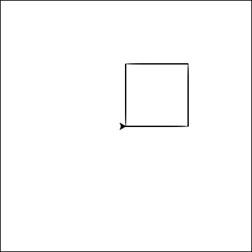
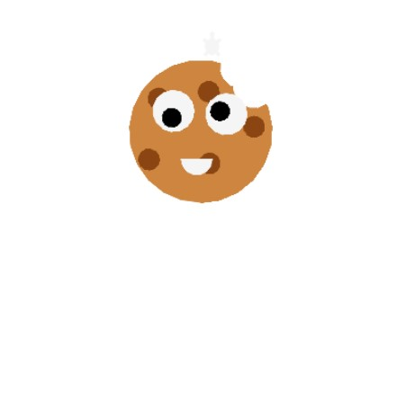
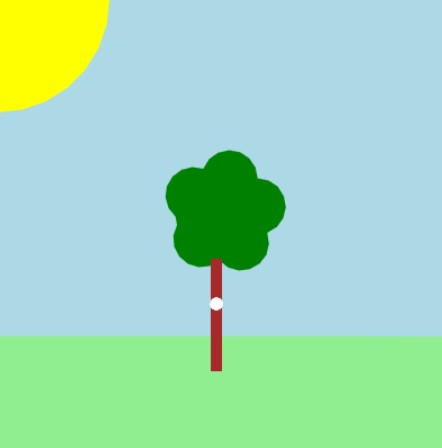
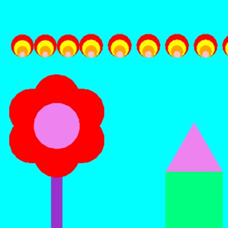
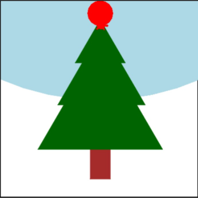
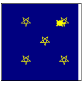
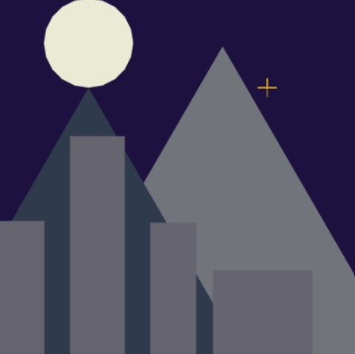

.. image:: ../img/Technovation-yellow-gradient-background.png
    :width: 500
    :align: center
    :alt: Technovation logo

Practice Makes Perfect
:::::::::::::::::::::::::::::::::::::::::::

.. table:: Here's a reminder of the drawing commands we've learned so far:
   :widths: auto
   :align: left

   ==========================  =========================
   Drawing commands             What does it do?
   ==========================  =========================
   ``forward( distance )``     Move forward a specified distance
   ``backward( distance )``    Move backward a specified distance
   ``left(90)``                Turns 90 degrees to the left (you can use any angle, not just 90!)
   ``right(90)``               Turns 90 degrees to the right
   ``circle( radius )``        Draws a circle with the specified radius
   ``goto( x, y )``            Move straight to the position with coordinates (x, y). *Note: the center is (0, 0)*
   ``up()``                    Stop leaving a trail
   ``down()``                  Start drawing a trail
   ``color( c )``              Set the color to *c* (https://trinket.io/docs/colors)
   ``begin_fill()``            Starts filling in drawn shapes
   ``end_fill()``              Stops filling in drawn shapes
   ``speed(number 0-10)``      Determines how quickly the turtle will move through commands
   ==========================  =========================

|

.. table:: Functions and Loops
   :widths: auto
   :align: left

   ==========================  =========================
   Drawing commands             What does it do?
   ==========================  =========================
   ``for i in range( n ):``    Repeat *n* times
   ``def function_name():``    Creates and defines a new function
   ``function_name()``         Calls a function
   ==========================  =========================

|

.. table:: Variables
   :widths: auto
   :align: left

   ===============================  =========================
   Command                          What does it do?
   ===============================  =========================
   ``variable = value``             Stores the value in your variable
   ``variable = input( message )``  Takes user input and stores it in your variable
   ===============================  =========================

|

Quick review of variables:
-----------------------------

- A **variable** is a container that stores a value
- You can access that value by calling your variable by its name
- You can change the value that's stored in a variable with the equal sign "="

|
| Take a look at the example below that draws 3 circles in a row that are the same size
  *without* a variable versus *with* a variable.

.. activecode:: variables-review
   :language: python
   :nocodelens:
   
   import turtle

   # move the turtle to the starting position
   turtle.speed(10)
   turtle.up()
   turtle.backward(150)
   turtle.down()

   # draw three circles WITHOUT a variable
   turtle.circle(50)
   turtle.forward(100)
   turtle.circle(50)
   turtle.forward(100)
   turtle.circle(50)

   # move to next starting position
   turtle.up()
   turtle.goto(-150, -150)
   turtle.down()

   # use a variable to define the radius of your next three circles
   rad = 30
   turtle.circle(rad)
   turtle.forward(100)
   turtle.circle(rad)
   turtle.forward(100)
   turtle.circle(rad)

   # try adding a second variable to that last block of code for the distance forward

|
|
| Building off of this idea, can we draw a square that uses a variable for the length of its sides?

.. activecode:: variables-square
   :language: python
   :nocodelens:
   
   import turtle

   side_length = 50

   # draw your square using the side_length variable here

|
|
| 

Parameters
----------
| Parameters allow us to use variables to make functions more customizable.
  When we call :code:`turtle.circle(50)` we give it a value for the radius of the circle.
  We can do this when we define our own functions too.
|
|
| Let's try it out by writing a function that draws a square with a side length of our choice.
  Use your code from the previous exercise as a starting point.

.. activecode:: parameters-square
   :language: python
   :nocodelens:
   
   import turtle

   def square():
       # draw your square here

| Once you've got the above code working, try adding a second parameter that sets the color of the square!
|
|
|
|

.. image:: img/triangle.png
   :alt: Image of a triangle drawn with Python Turtle
   :width: 24 %

.. image:: img/pentagon.png
   :alt: Image of a pentagon drawn with Python Turtle
   :width: 24 %
.. image:: img/hexagon.png
   :alt: Image of a hexagon drawn with Python Turtle
   :width: 24 %

| How else can we use parameters? Let's define a :code:`shape()` function that
  has a parameter for the number of sides for the shape. (So :code:`shape(3)` 
  draws a triangle, :code:`shape(4)` draws a square, etc)

.. activecode:: shape-parameter
   :language: python
   :nocodelens:
   
   import turtle

   def shape(sides):
       # draw the shape here

   
   # this draws a triangle
   shape(3)

   # this draws a square
   shape(4)

|
|
| 

Have Some Fun!
--------------
| With what time we have left, take what you've learned and have some fun 
  experimenting with drawing something cool! If you need some inspiration,
  check out the examples below! And, as always, ask a mentor if you get stuck
  or need any tips!

.. image:: img/flower_ex.png
   :alt: Image of a triangle drawn with Python Turtle
   :width: 24 %
.. image:: img/forest_ex.png
   :alt: Image of a square drawn with Python Turtle
   :width: 24 %

|

.. activecode:: exploration
   :language: python
   :nocodelens:
   
   import turtle

   # have fun! :)