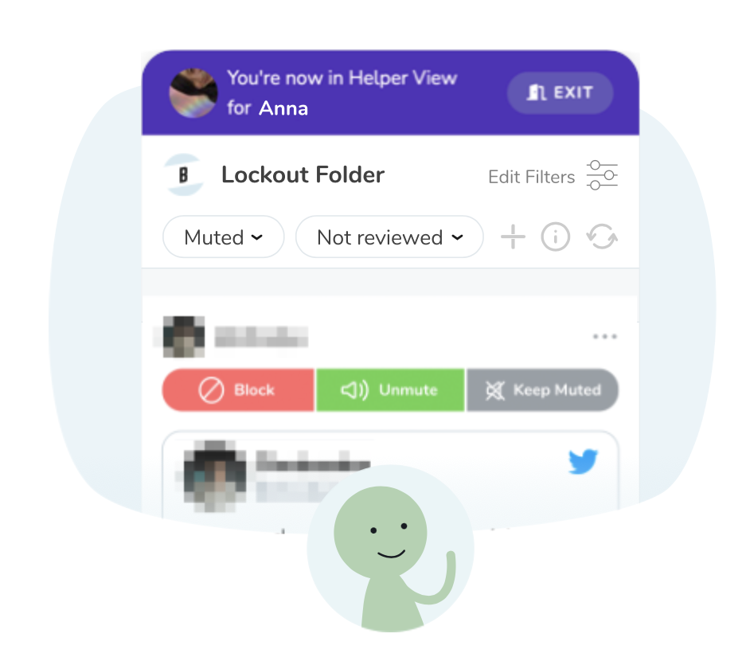

.. image:: ../img/Technovation-yellow-gradient-background.png
    :width: 500
    :align: center
    :alt: Technovation logo

Spotlight: Tracy Chou
:::::::::::::::::::::::::::::::::::::::::::

Like many people around the world, software deveolper Tracy Chou was obsessed with social media. Although social media allows the world to be connected and learn with the click of a button, there are also a ton of negatives that come with it. Chou found herself surrounded by hate and bullying constantly. As Chou grew a following on the social media Twitter, she recieved more hate and bullying. Chou decided that she wanted to solve this problem for everyone.

.. image:: img/tracychou.png
    :width: 400px
    :align: center
    :alt: Tracy Chou's profile picture

In 2021, Chou launched "Block Party". "Block Party" is an application that allows users to implent filters on Twitter to filter out abuse. Chou plans to expand her application to all social media platforms to create safe a safe online enviornment everywhere.

Think abou the questions below:

1. Do you use social media?
2. What do you think of Chou's app?
3. What else do you think could be done to make social media a safer place for everyone?

