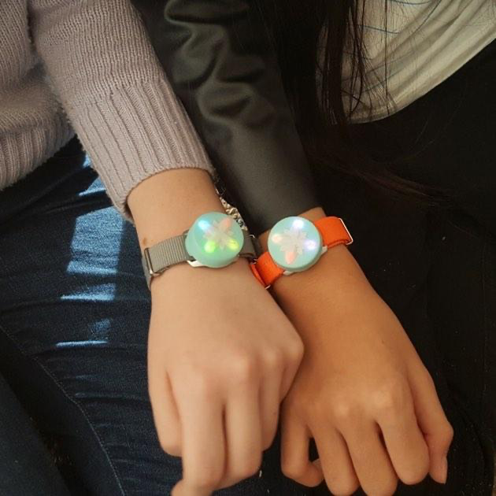

.. image:: ../img/Technovation-yellow-gradient-background.png
    :width: 500
    :align: center
    :alt: Technovation logo

Spotlight: Sara Chipps
:::::::::::::::::::::::::::::::::::::::::::

Sara Chipps has spent many years teaching teenage girls to code and to really shine light on how cool it can be! Below, Sara talks about her thoughts and experiences with, and as being, a woman who codes:

“I’ve been spending a lot of time and effort thinking about the role of teenage girls in the future of software and the future of technology, and how usually at the age where they hit puberty we lose a lot of them from the math and sciences. In fact, with our user testing we’ve seen so much of this, where before age ten they’re super into it, and then afterwards they’re a little too cool or ‘it’s not really my jam,’ and stuff like that.

One thing about that age is you’re not too keen on things that adults simply tell you are important. I got into software when I was 12 because i wanted to make friends, and I learned that—through my computer—I could do it, and that’s why I learned how to code…It had nothing to do with the fact that someone thought engineering was a good career for me.”

Sara is the co-founder of the brand, Jewelbots. Jewelbots attempts to remove the stigma by offering programmable friendship bracelets. She hopes that offering fun intreactive crafts to young girls will keep them interested in STEM!

