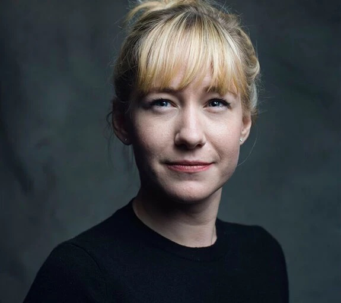
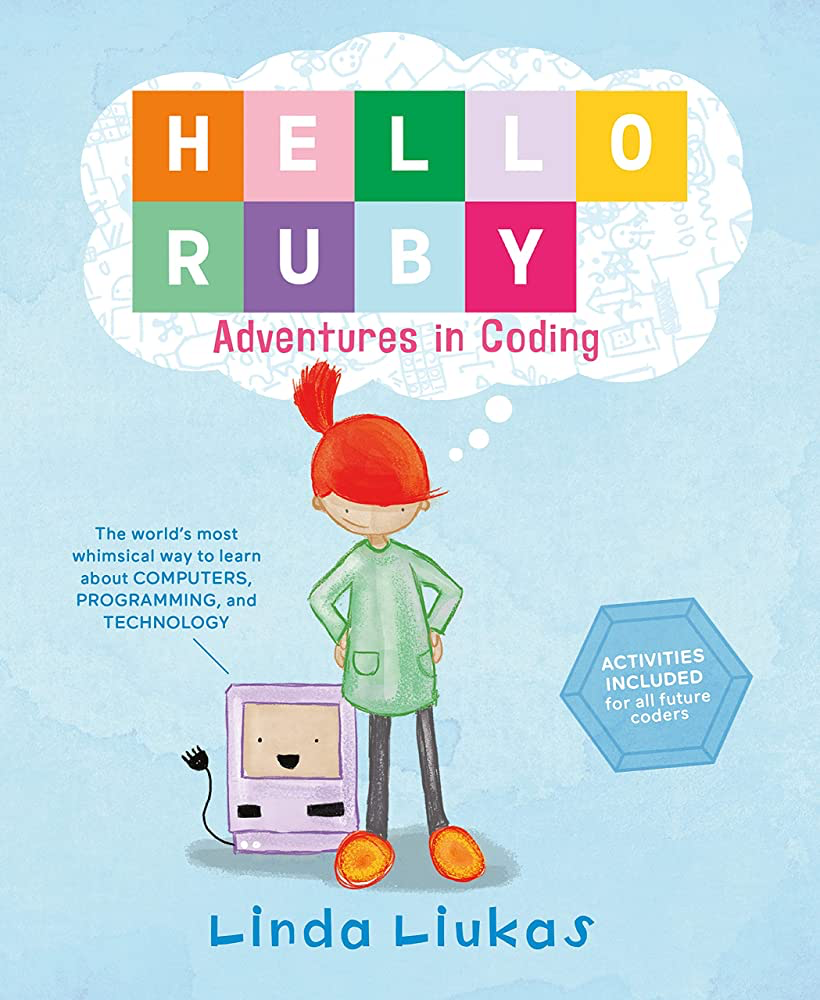

.. image:: ../img/Technovation-yellow-gradient-background.png
    :width: 500
    :align: center
    :alt: Technovation logo

Spotlight: Linda Liukas
:::::::::::::::::::::::::::::::::::::::::::

Linda Liukas found herself interested in coding when she was 13. She played around with creating a website but she persued a career in a different field. Over 10 years later, Liukas decided she wanted to lear the coding language "Ruby". She delt with the challenges of learning a new lanugage by drawing out pictures that included a little girl named "Ruby". Liukas then came up with an idea.

Inspired by the drawings Liukas created while learning a coding language, she wrote the childrens book, "Hello Ruby". This children's book is one of the only children's book that is focused on code! The goal of this novel is to promote the learning of code to every child and make it a fun expereince!

