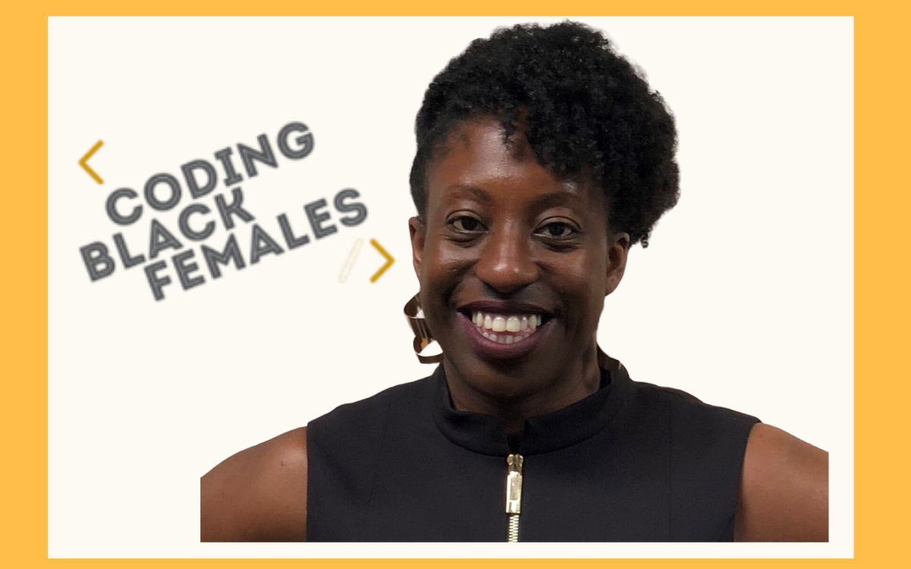

.. image:: ../img/Technovation-yellow-gradient-background.png
    :width: 500
    :align: center
    :alt: Technovation logo

Spotlight: Charlene Hunter
:::::::::::::::::::::::::::::::::::::::::::

Charlene Hunter realized she was interested in coding at a young age. During school break times, Hunter would spend her time playing with computers. Hunter did not go to colleage for coding, but a math degree. She wanted to have many oportunites in the work force and decided she wanted to reconnect with coding again and recieved a masters in computer science. Immediently after graduating and receiving her first job, Hunter noticed there were not many other black woman within the tech force. Soon, after, Hunter decided to create "Coding Black Females".

"Coding Black Females" is a nonprofit organization founded in 2017. This organization provides the oportunity for black female deveolpers to network, receive support, and support relationships with regular meetups.

.. image:: img/codingblackfemales.png
    :width: 400px
    :align: center
    :alt: Photo from a Coding Black Females meet up
